# LLM Agents

Over the last few weeks, I have been imparting in a full fledged course on LLMs at my job at oga.ai. It is a fast-pace, deep dive consisting on eight lessons of two hours each, and covers much of the current landscape of LLMs in the industry. This has been the first time I have done something like this, and considering I have prepared it fully on my own and that the alumni are professional engineers and data scientists I really am proud of the results.

The fifth module of the course is about LLM agents, and it has been the most exciting one to prepare and teach, with the seventh about large multimodal models (LMMs) being a close second. Agents truly are a striking application of technology and the results that they can achieve are truly impressive. Even tough they are in beginning phase of development and they commit many errors and are difficult to control, so much so that there are few agents on production environment, they really shine with potential.

The course is in Spanish, and with it being internal to the company I can not freely share the videos and materials on my own. Still, I want to write about LLM agents in a series of blog posts.

In this first post, I will cover the basics of agents, how they work and how to implement them, along with a few examples. It will be fairly technical at the beginning, but once the basics are covered we can go on to the practical part.

In the following couple posts, I plan to write and explain in depth one or two agents. I have already implemented a ReAct agent in pure python (we will see in this post what these are), and I will probably implement a more complex one using a framework like langchain or autogen.

Finally, I want to use an agent to expand my [Torch-Tracer Project](https://mvazquez.ai/blog/output/2024-11-12-torch-tracing-01/content.html), with the objective that it needs the least amount of human input as possible.

# What are agents?

Artificial Intelligence: A Modern Approach defines an **"agent"** as[^1]

> _"Anything that can be viewed as perceiving its environment through sensors and acting upon that environment through actuators"_

This definition gives a general idea of what agents do, but it is way too broad, since a simple thermostat has sensors and actuators. A smarter definition is the one of a **"rational agent"** [^1]

> _"For each possible percept sequence, a rational agent should select an action that is expected to maximize its performance measure, given the evidence provided by the percept sequence and whatever built-in knowledge the agent has."_

<p align="center">
  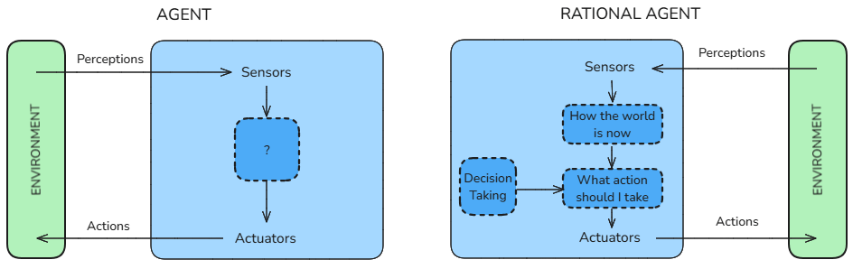
</p>

<p style="text-align:center; font-style: italic;">Agent Definitions.</p>

This means that a rational agent will try to accomplish an objective as defined by the performance measure. This is what we want, to tell our agent to do something and that it tries, to the best of its abilities, to follow the orders. Here is where the LLM part comes into play.

A **"LLM agent"** is one that uses a LLM as its _brain_ to reason. The central idea is that they use a language model to choose what **actions** they take to **accomplish an objective** given a current **state** or environment.

If you are familiar with prompt chains, as the ones used in langchain and in Retrieval Augmented Generation (RAG), they have many things in common with agents, but agents are more flexible and can show more complex behavior as it chooses what action to take at each moment by itself, while in chaining the possible workflow of the actions is fixed, rigidly specified in code.

### Agentic workflows

An analogy that I find illustrative to understand LLM agents can be made with the writing of an essay. This analogy comes from Andrew Ng[^2].

In a regular LLM workflow you ask the LLM to write an essay about some topic X. Since they are autoregressive models, they will write it directly from the beginning to the end without ever going back to fix errors or improve any section, or stopping to reflect and research more about topic X. This task would be very difficult for most humans, and yet LLMs are surprisingly good at it.

<p align="center">
  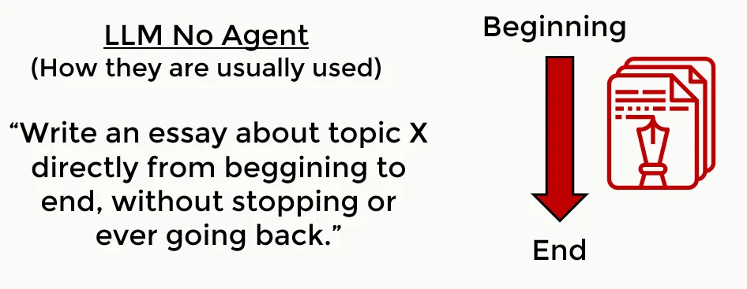
</p>

<p style="text-align:center; font-style: italic;">Regular LLM workflow to write an essay. </p>

In an agentic workflow, you remove all those restrictions. The agent will be able to reason to take actions to better write the essay. It could decide to start by specifying the essay's structure and researching about the topic in a external data storage (data bases, documents, the internet...). Then it may decide to write a first draft and iteratively improve it until it is finished. At any point of the process it can reflect about what is the best action to take among the set of possible actions, which gives it all these capabilities. Obviously, this workflow will often give better results that the first direct approach.

<p align="center">
  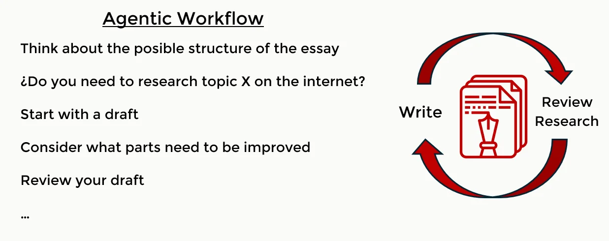
</p>

<p style="text-align:center; font-style: italic;">Agentic LLM workflows allow to take to choose what actions to take to get the best results. </p>

LLM agents are based on the chain-of-thought. By dividing a complex problem in simpler subproblems, it can solve them sequentially to reach the final answer.

1. **Plan** what action to take to get closer to its objective.
2. Perform an **action** and **observe** its consequences.
3. Iterate until reaching the objective _"LLM in a loop"_

<p align="center">
  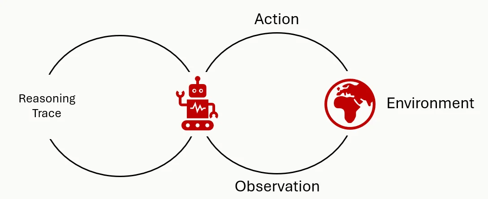
</p>

<p style="text-align:center; font-style: italic;">Agentic LLM workflows as loop: Plan, Act, Observe. </p>

As a simple example, consider the common case of a software developer that uses chatGPT to write a code program. They start stating the problem and asking the model to "think step by step". The agent **plans** the actions it should take. Then it **writes** the code. The developer copies that code, pastes it in the script and runs the program. If it fails, they paste the **error trace** to chatgpt to fix it, and if it **works** then the task is finished.

If you automatize this in a loop, it becomes a simple agentic workflow, where the words in bold font correspond to planning, acting and observing.

All the text that is generated by the model during a task is called the **reasoning trace**.

### ReAct agents

You might have noticed that the planning step is not strictly necessary. An agent could just observe the environment and act, and in fact the first agents based on LLMs did just that, but they did not work too well. In 2022 in the ReAct paper[^3] Yao, Shunyu, et al. introduced the Reason + Act framework and showed that it works better than just acting.

The setup is an agent with access to three different actions that leverage a "simple Wikipedia web API: (1)**search**\[entity] returns the first 5 sentences from the corresponding _entity_ wiki page if it exists, or else suggests top-5 similar entities from the Wikipedia search engine, (2)**lookup**\[string], which returns the next sentence in the page containing _string_ simulating a ctrl+F command, and (3)**finish**\[answer] which would finish the current task with _answer_."[^3]

With this environment they compare four different approaches: standard zero-shot, chain of thought prompting, act-only agent and Reason + Act agent. The following example from the paper shows how they try to solve a question about the Apple Remote device. Let's review the first three approaches first.

<p align="center">
  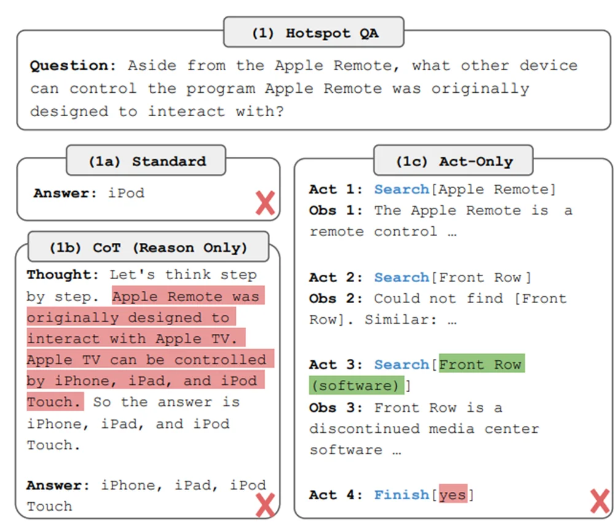
</p>

<p style="text-align:center; font-style: italic;">Example of standard zero-shot, chain of thought prompting, act-only from the ReAct paper. </p>

In (1a) zero-shot the LLM just answers directly and gets it wrong. With (1b) chain-of-thought the LLM is prompted to "think step by step before answering", a technique that improves accuracy of language models[^4], but still gets it wrong. In (1c) we have a simple agentic workflow that acts and observes, and allows to use the Wikipedia tools. This time it actually gets close the answer, but ends up returning "yes" as its final answer. The problem with this approach is that the model cannot reflect on what tool to use, how to use it or plan how to get the final answer. The only possibility is to act, stating the action and its argument. ReAct is created to fight this problem.

<p align="center">
  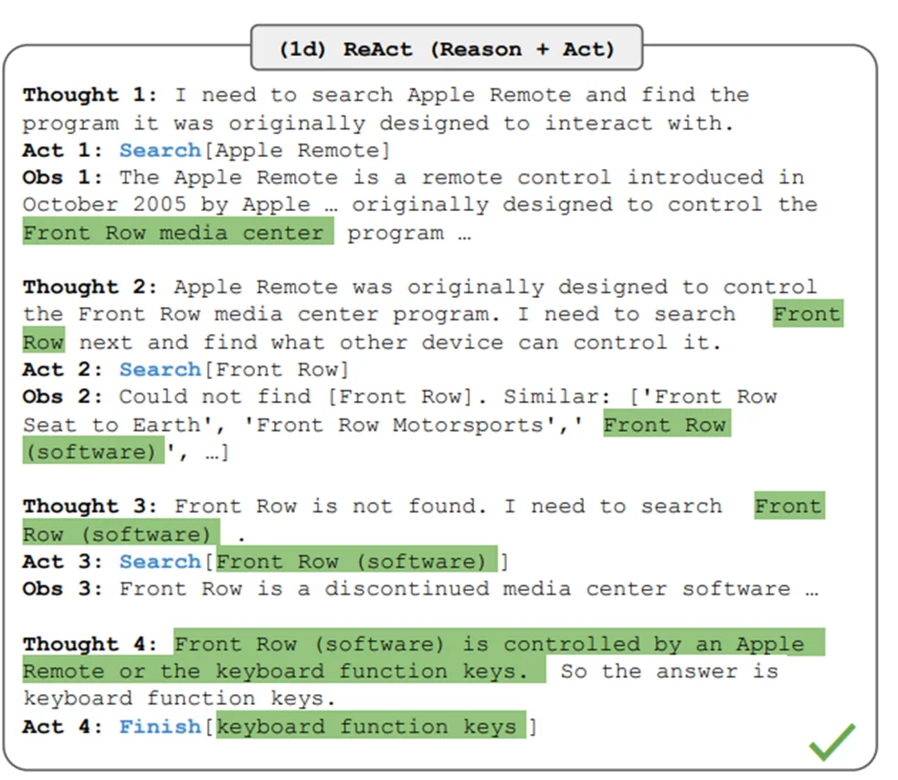
</p>

<p style="text-align:center; font-style: italic;">Example of a ReAct agent from the ReAct paper. In this case it manages to get the right answer.</p>

In this last case the agent follows a loop of reason-act-observe that overcomes the previously stated limitations, and it actually gets the correct answer: "keyboard function keys". This example showcases how the model is able plan and reason about the result of its actions. This is a simple yet extremely powerful workflow, and most state of the art agents follow it, with improvements in the reasoning step and an increase in freedom to act. It leverages the powerful large language models by using them as the "brain" of the agent.

### Actions as tools

To implement agents we need to define a **set of possible actions for the agent to take**, among which the agent will have to decide in each iteration. For example it could have access to the following:

-   Ask the user for information.
-   Search the web.
-   Using an external database.
-   Using a calculator or symbolic programming.
-   Using a python code interpreter.

This possible actions are commonly referred as **tools**, and the a set of actions is a **tool box**.

As an example, chatGPT has access to three different tools.

<p align="center">
  
</p>

<p style="text-align:center; font-style: italic;">The gpt-4o model from the chatGPT web UI has access to web browsing, Dall-e image generator, and code interpreter. </p>

At the time of writing gpt-4o has the knowledge cut date of October 2024. That means that the pretraining has data until that date, and it knows nothing that happened thereafter. If I ask it about events posterior to that dat, it will use a web search tool to retrieve the necessary information.

<p align="center">
  
</p>

<p style="text-align:center; font-style: italic;">GPT does not know the democratic candidate of 2024, so it uses web search tool to answer . </p>

In this [conversation](https://chatgpt.com/share/e/6734e362-6720-800a-ad98-0fe320703b3a) I make chatGPT use the code interpreter tool to generate a plot to showcase it. As of the moment I am writing this post, it is not possible to share conversations in which dall-e is used to generate images, but you can guess how it works: you ask chatgpt to generate an image of a puppy and it decides to call dall-e, writing the image prompt by itself.

Another example is the [langchain tools](https://python.langchain.com/docs/integrations/tools/). These are implemented in the langchain library to be used by language models, and there is a great number and variety of them: several web search providers and code interpreters, a few productivity tools like github, jira or gmail; tools to access databases and even more.

## Agent Showcase

Let's proceed with an agent full workflow as an example. In this case we have an agent, let's call him JARVIS, that assist the user with data queries.

<p align="center">
  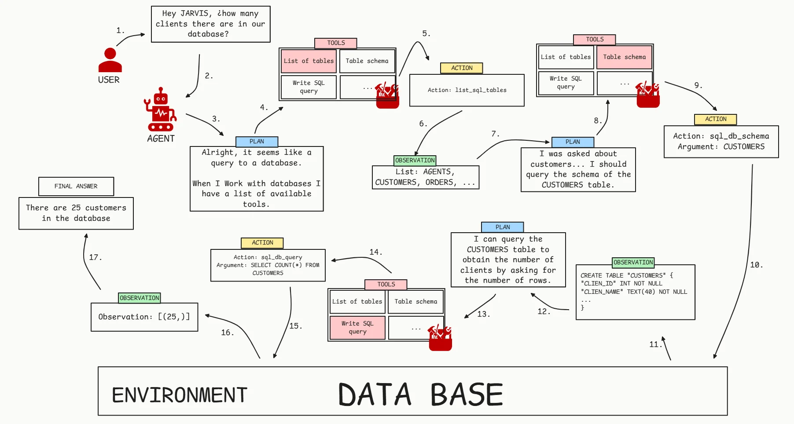
</p>

<p style="text-align:center; font-style: italic;">Jarvis helps the user to get the total number of customers in the database. </p>

When the user asks JARVIS to find out how many clients are in the database, the agent has to figure out the best course of action to get the information. Let’s walk through the sequence step by step to see how JARVIS accomplishes this seemingly simple task:

### Breaking Down the Workflow

The user starts by asking, **"Hey JARVIS, how many clients are there in our database?"** This is the initial input that sets the whole process in motion. Even though this question seems straightforward, there are several steps involved before reaching the final answer.

1. **Understanding the Query**:

    - JARVIS recognizes that it needs to interact with a database to fulfill the user’s request. The initial plan involves listing out the tools available to it, which include accessing tables and querying information.

2. **Exploring the Environment**:

    - To proceed, JARVIS needs to understand what data it has access to. It starts by using a tool to **list all the tables** in the database. The agent observes that there are tables named `AGENTS`, `CUSTOMERS`, `ORDERS`, among others.

3. **Focusing on Relevant Information**:

    - Since the user is asking specifically about clients, JARVIS infers that the relevant information should be in the `CUSTOMERS` table. However, before it can query this table, it needs to understand its structure.

4. **Querying the Table Schema**:

    - JARVIS retrieves the schema of the `CUSTOMERS` table to see what fields are available. It finds that the table includes columns like `CLIENT_ID` and `CLIENT_NAME`.

5. **Formulating a Plan to Extract Information**:

    - Now that JARVIS knows the structure of the table, it formulates a plan to count the entries. The goal is to determine how many rows (i.e., clients) are present in the table.

6. **Executing the SQL Query**:

    - JARVIS constructs a simple SQL query:

        ```sql
        SELECT COUNT(*) FROM CUSTOMERS
        ```

        This query will return the total number of rows in the `CUSTOMERS` table, which corresponds to the number of customers.

7. **Interpreting the Results**:

    - The query is executed, and JARVIS receives the result: `[(25,)]`, indicating there are 25 customers in the database.

8. **Delivering the Final Answer**:

    - With the result in hand, JARVIS returns to the user with the final answer:
      **"There are 25 clients in the database."**

### Key Takeaways from This Example

This workflow showcases a **classic agentic pattern** where JARVIS uses a loop of **planning, acting, and observing**:

-   **Planning**: At multiple steps, JARVIS formulates a plan to achieve the desired outcome. It doesn’t jump straight to querying the database without first understanding the environment.
-   **Acting**: It uses tools effectively to explore the environment, fetch the schema, and run the SQL query.
-   **Observing**: After each action, it observes the output to decide on the next step.

The diagram above reflects how even seemingly simple tasks require agents to break down problems into smaller actions, reflect on the information available, and decide on the best next step. The flexibility of this approach is what makes LLM agents so powerful.

### Reasoning Trace

Trough all this process the LLM generates text that is recursively added to the prompt. This generated text is the reasoning trace.

<p align="center">
  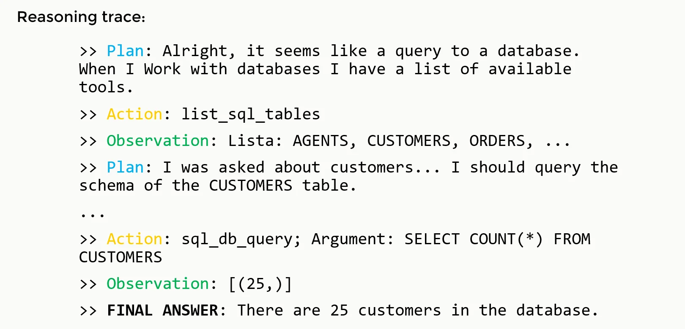
</p>

<p style="text-align:center; font-style: italic;">Reasoning trace generated in the example agentic workflow.</p>

There are only two ways for a language model to access information: weight updates and prompts (in context learning). Since we are only using inference during an agentic task, this means all information about the conversation with the user and the current state that is needed to accomplish the objective must be passed through the prompt for every call. This makes prompt management a crucial aspect of agents.

The simplest approach to accomplish this is to paste all the user interaction and the reasoning trace for every call to the model. This works well for simple tasks that do not generate much text, that does not need access to big quantities of external data and that do not depend on previous interactions with the same or other users. For other tasks a more complex and customized prompt management strategy must be implemented. Trough this post many agent design patterns that can be useful will be explained.

### Code Implementation

I will now show a simple implementation of the example using langchain. I will use the OpenAI api for the language model.

Fist we build a sample database.

```python
# 01_create_and_fill_database.py
import sqlite3
import os

# File path
database_file_path = "./sql_lite_database.db"

# Check if database file exists and delete if it does
if os.path.exists(database_file_path):
    os.remove(database_file_path)
    message = "File 'sql_lite_database.db' found and deleted."
else:
    message = "File 'sql_lite_database.db' does not exist."

# Step 1: Connect to the database or create it if it doesn't exist
conn = sqlite3.connect(database_file_path)

# Step 2: Create a cursor
cursor = conn.cursor()

# Step 3: Create tables
create_table_query1 = """
                        CREATE TABLE IF NOT EXISTS   "AGENTS"
                        (
                            "AGENT_CODE" CHAR(6) NOT NULL PRIMARY KEY,
                            "AGENT_NAME" CHAR(40),
                            "WORKING_AREA" CHAR(35),
                            "COMMISSION" NUMBER(10,2),
                            "PHONE_NO" CHAR(15),
                            "COUNTRY" VARCHAR2(25)
                            );
                        """
create_table_query2 = """
                        CREATE TABLE IF NOT EXISTS   "CUSTOMER"
                        ( "CUST_CODE" VARCHAR2(6) NOT NULL PRIMARY KEY,
                            "CUST_NAME" VARCHAR2(40) NOT NULL,
                            "CUST_CITY" CHAR(35),
                            "WORKING_AREA" VARCHAR2(35) NOT NULL,
                            "CUST_COUNTRY" VARCHAR2(20) NOT NULL,
                            "GRADE" NUMBER,
                            "OPENING_AMT" NUMBER(12,2) NOT NULL,
                            "RECEIVE_AMT" NUMBER(12,2) NOT NULL,
                            "PAYMENT_AMT" NUMBER(12,2) NOT NULL,
                            "OUTSTANDING_AMT" NUMBER(12,2) NOT NULL,
                            "PHONE_NO" VARCHAR2(17) NOT NULL,
                            "AGENT_CODE" CHAR(6) NOT NULL REFERENCES AGENTS
                        );
                        """

create_table_query3 = """
                        CREATE TABLE IF NOT EXISTS "ORDERS"
                        (
                            "ORD_NUM" NUMBER(6,0) NOT NULL PRIMARY KEY,
                            "ORD_AMOUNT" NUMBER(12,2) NOT NULL,
                            "ADVANCE_AMOUNT" NUMBER(12,2) NOT NULL,
                            "ORD_DATE" DATE NOT NULL,
                            "CUST_CODE" VARCHAR2(6) NOT NULL REFERENCES CUSTOMER,
                            "AGENT_CODE" CHAR(6) NOT NULL REFERENCES AGENTS,
                            "ORD_DESCRIPTION" VARCHAR2(60) NOT NULL
                        );
                        """

queries = [create_table_query1, create_table_query2, create_table_query3]
# queries = [create_table_query1, create_table_query2]

for query in queries:
    # execute queries
    cursor.execute(query)

# Step 4: Insert data into tables Agents, Orders and Customers
# For space reasons I will omit most of the rows.
insert_query = """
INSERT INTO AGENTS VALUES ('A007', 'Ramasundar', 'Bangalore', '0.15', '077-25814763', '');
INSERT INTO AGENTS VALUES ('A003', 'Alex ', 'London', '0.13', '075-12458969', '');
...

INSERT INTO CUSTOMER VALUES (
  'C00013', 'Holmes', 'London', 'London', 'UK', '2', '6000.00', '5000.00', '7000.00', '4000.00', 'BBBBBBB', 'A003'
);
INSERT INTO CUSTOMER VALUES (
  'C00001', 'Micheal', 'New York', 'New York', 'USA', '2', '3000.00', '5000.00', '2000.00', '6000.00', 'CCCCCCC', 'A008'
);
...

INSERT INTO ORDERS VALUES('200100', '1000.00', '600.00', '2024-08-01', 'C00013', 'A003', 'SOD');
INSERT INTO ORDERS VALUES('200110', '3000.00', '500.00', '2024-04-15', 'C00019', 'A010', 'SOD');
...
"""

for row in insert_query.splitlines():
    try:
        cursor.execute(row)
    except sqlite3.Error as e:
        print(f"An error occurred: {e}")
        print(row)

# Step 5: Fetch data from tables
list_of_queries = []
list_of_queries.append("SELECT * FROM AGENTS")
list_of_queries.append("SELECT * FROM CUSTOMER")
list_of_queries.append("SELECT * FROM ORDERS")

# execute queries
for query in list_of_queries:
    cursor.execute(query)
    data = cursor.fetchall()

    print(f"--- Data from tables ({query}) ---")
    for row in data:
        print(row)

# Step 7: Close the cursor and connection
cursor.close()
conn.commit()
conn.close()
```

<p align="center">
  
</p>

<p style="text-align:center; font-style: italic;">Sample database schema.</p>

Now let's implement a simple agent using langchain. First we need to import the necessary libraries and set up our database connection and language model:

```python
from langchain.utilities import SQLDatabase
from langchain.agents.agent_types import AgentType
from langchain.agents.agent_toolkits import SQLDatabaseToolkit
from langchain.agents import create_sql_agent
from langchain_community.llms.openai import OpenAI

# define the database we want to use for our test
db = SQLDatabase.from_uri("sqlite:///sql_lite_database.db")

# choose llm model, in this case the default OpenAI model
llm = OpenAI(
    temperature=0,
    verbose=True,
    openai_api_key=os.getenv("OPENAI_API_KEY"),
)
```

With our database and language model ready, we can create the agent. We'll use langchain's SQL toolkit and the ReAct agent type:

```python
# setup agent
toolkit = SQLDatabaseToolkit(db=db, llm=llm)
agent_executor = create_sql_agent(
    llm=llm,
    toolkit=toolkit,
    verbose=True,
    agent_type=AgentType.ZERO_SHOT_REACT_DESCRIPTION,
)

# define the user's question
question = "How many customers do we have in our database?"
agent_executor.invoke(question)
```

The output shows the agent's reasoning trace as it works through the problem. Let's analyze what's happening:

1. First, it lists the available tables using sql_db_list_tables
2. Then it examines the schema of the CUSTOMER table using sql_db_schema
3. Finally, it executes a simple COUNT query using sql_db_query

The agent concludes that there are 25 customers in the database.

```python
> Entering new SQL Agent Executor chain...
Action: sql_db_list_tables
Action Input: AGENTS, CUSTOMER, ORDERS I should query the schema of the CUSTOMER table to see how many customers are in the database.
Action: sql_db_schema
Action Input: CUSTOMER
CREATE TABLE "CUSTOMER" (
	"CUST_CODE" TEXT(6) NOT NULL,
	"CUST_NAME" TEXT(40) NOT NULL,
	"CUST_CITY" CHAR(35),
	"WORKING_AREA" TEXT(35) NOT NULL,
	"CUST_COUNTRY" TEXT(20) NOT NULL,
	"GRADE" NUMERIC,
	"OPENING_AMT" NUMERIC(12, 2) NOT NULL,
	"RECEIVE_AMT" NUMERIC(12, 2) NOT NULL,
	"PAYMENT_AMT" NUMERIC(12, 2) NOT NULL,
	"OUTSTANDING_AMT" NUMERIC(12, 2) NOT NULL,
	"PHONE_NO" TEXT(17) NOT NULL,
	"AGENT_CODE" CHAR(6) NOT NULL,
	PRIMARY KEY ("CUST_CODE"),
	FOREIGN KEY("AGENT_CODE") REFERENCES "AGENTS" ("AGENT_CODE")
)

/*
3 rows from CUSTOMER table:
CUST_CODE	CUST_NAME	CUST_CITY	WORKING_AREA	CUST_COUNTRY	GRADE	OPENING_AMT	RECEIVE_AMT	PAYMENT_AMT	OUTSTANDING_AMT	PHONE_NO	AGENT_CODE
C00013	Holmes	London	London	UK	2.0000000000	6000.00	5000.00	7000.00	4000.00	BBBBBBB	A003
C00001	Micheal	New York	New York	USA	2.0000000000	3000.00	5000.00	2000.00	6000.00	CCCCCCC	A008
C00020	Albert	New York	New York	USA	3.0000000000	5000.00	7000.00	6000.00	6000.00	BBBBSBB	A008
*/ I should query the CUSTOMER table and count the number of rows to get the total number of customers.
Action: sql_db_query
Action Input: SELECT COUNT(*) FROM CUSTOMER[(25,)] I now know the final answer.
Final Answer: 25
```

This example demonstrates how the agent breaks down the problem into logical steps and uses the available tools to reach the correct answer, following the ReAct pattern we discussed earlier.

Here langchain does most of the work for us with the `create_sql_agent` function, which allows us to have our ReAct agent in few lines of code. In the next blog post I will implement a similar agent from python, since this post is already getting long.

### AgentGPT

As a second showcase of an agent I want to mention [AgentGPT](https://agentgpt.reworkd.ai/). I recommend you create a free account and give it some task. For example, ask it to _Parse the data of the current season of the Spanish football league's first division and export it in a csv file_. It will search the web for the appropriate data, initialize a python environment with some libraries, write a web scraping script and run it, and finally return the .csv file to the user. From a free account it will run out of iterations before achieving it, but it still is a good showcase of what a simple agent is able to do.

## Why use agents?

By this point I hope to have delivered an initial idea of what agents are. If you are still not convinced on their power, by the end of this post you will be. For now I want to clearly explain some of their best attributes in this section.

The first thing to understand is that agents can _augment_ anything a LLM already does. In any task, you can improve the zero-shot performance by implementing an agentic workflow. For example this are the best scores achieved by GPT-3.5 and GPT-4 in HumanEval[^5], a coding benchmark. Their 48.1 and 67 pass@1 original scores increase hugely by using agents, with the best implementation og GPT-4 reaching close to a 100% pass.

<p align="center">
  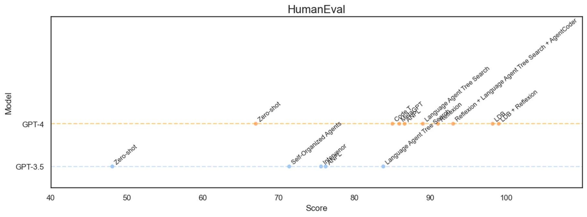
</p>

<p style="text-align:center; font-style: italic;">Humaneval score comparison of zero-shot LLMs vs agentic implementations.</p>

Other advantages of agents are:

-   They are highly autonomous.
-   They are able to recover from errors.
-   They can perform complex workflows without having to explicitly program them like you would in prompt chaining.

For example, let's consider a SQL Rag system that:

1. Takes a natural language query as input.
2. Transforms the query into SQL.
3. Retrieves the results of the query from the database.
4. Communicates results back to the user.

This is a rag workflow that works for simple tasks, but what happens if the SQL query returns an error? Or the retrieved data is different from what was expected? Or if the user's query is complex and needs to query several tables to return the correct answer?

These limitations of RAG systems are effectively addressed by agents.

## Memory in Agents

The last basic component of agents that we need to talk about is **memory**. Earlier in the post I teased the question when talking about the reasoning trace. Large Language Memory do not have _memory_ of past interactions: all information for a call must passed through the prompt.

So how do we implement the memory in our agent? The truth is that there is not a stablished solution yet, and it depends heavily on the system that is being built.

What we do have are some design patterns that have recently emerged as more advanced agentic applications are being built. In a recent paper about cognitive architectures for language agents[^6], Sumers, Theodore R., et al propose several memory patterns that are becoming standard in the field. They are analogies to different classes of human memory, as studied by psychologists.

### Types of Memory

<p align="center">
  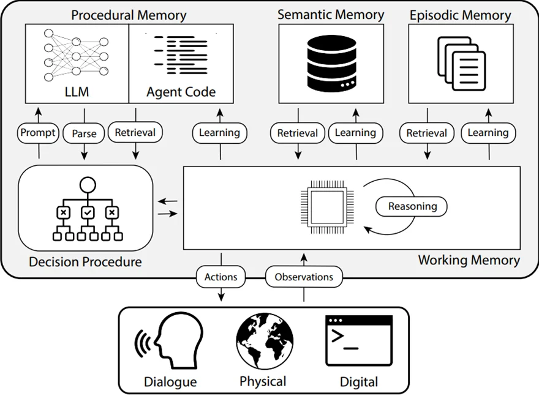
</p>

<p style="text-align:center; font-style: italic;">Memory types found in humans and agents. From the CoALA[^6] paper.</p>

**Procedural Memory** represents the agent's core capabilities encoded in its model weights and implementation code. Just like humans don't consciously think about the mechanics of riding a bike, agents leverage their pre-trained knowledge and coded functions automatically. This includes the language model's understanding of syntax, reasoning patterns, and the defined tools and functions the agent can use. The procedural memory is typically fixed during inference, only changing through model updates or code modifications.

**Semantic Memory** acts as the agent's knowledge base, implemented through external data sources like vector stores, graph databases, or traditional SQL databases. This allows agents to access and reference factual information beyond their training data, similar to how humans draw upon learned knowledge from education and experience. By connecting to these data stores, agents can query relevant information, verify facts, and ground their reasoning in accurate, up-to-date data rather than relying solely on their pre-trained knowledge.

**Episodic Memory** maintains a record of the agent's past experiences and interactions, which can include conversation history, previous task attempts, or user preferences. This memory type helps agents maintain context across multiple interactions and learn from past successes or failures. For example, an agent might remember a user's preferred format for data visualization from earlier conversations, or recall specific approaches that worked well for similar tasks in the past. This can be implemented through conversation logs, task histories, or specialized databases tracking agent-user interactions.

**Working Memory** is the agent's active computational space, primarily manifested in the reasoning trace and the immediate context window of the language model. Like a human's short-term memory holding information for immediate use, working memory contains the current task state, recent observations, and immediate plans. This is typically implemented through prompt engineering and context management, carefully balancing the amount of information kept in the immediate context to avoid overwhelming the model while maintaining task coherence.

### Memory Updates

Memory updates can be performed at different frequencies, each with its own tradeoffs between knowledge freshness and system performance.

<p align="center">
  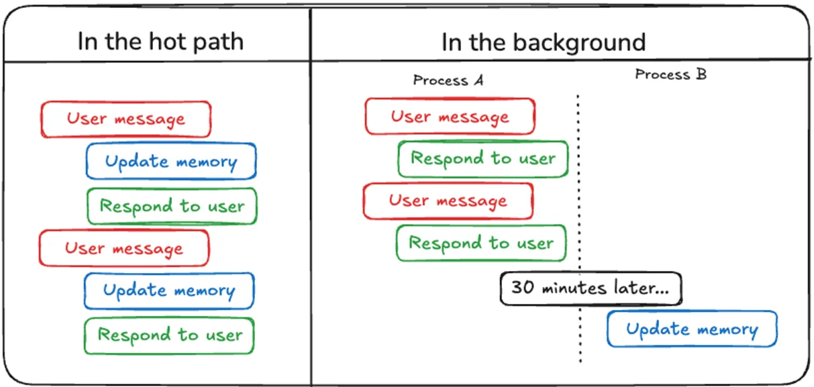
</p>

<p style="text-align:center; font-style: italic;">Two methods to update the memory state.</p>

**In the hot path** updates occur in real-time during each agent loop iteration. This ensures the agent always works with the latest information but introduces latency overhead that can impact response times, particularly in conversational applications.

**In the background** performs updates asynchronously at scheduled intervals. This approach maintains system responsiveness by avoiding update-related delays, though the agent may occasionally work with slightly outdated information.

## Schema of an Agent

By now, we've explored how agents can leverage planning, acting, and observing to solve complex tasks iteratively. However, an agent's full potential lies in integrating these components seamlessly within a cohesive architecture. Let’s revisit the diagram we’ve been building towards.

<p align="center"> 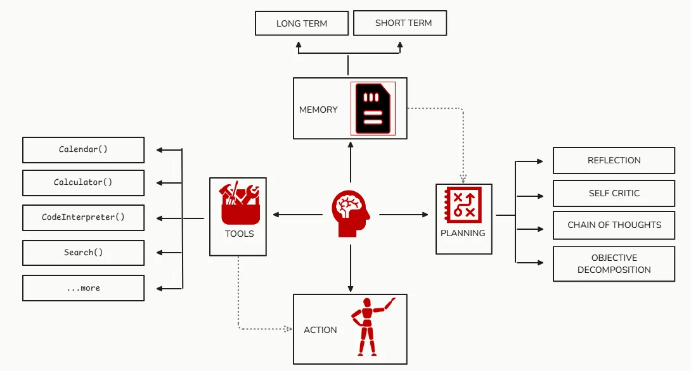 </p> 
<p style="text-align:center; font-style: italic;">General schema of an LLM Agent workflow.</p>
As shown above, the core architecture revolves around four primary components: Memory, Planning, Tools, and Action. Each part plays a crucial role in enabling the agent to operate autonomously:

**Memory** serves as the knowledge backbone of the agent. By leveraging both long-term and short-term memory, agents can recall past interactions, user preferences, and contextual information to maintain coherence across sessions. This is akin to the way humans draw upon their experiences and knowledge when solving new problems. For instance, episodic memory might store a detailed conversation history, while semantic memory allows the agent to access databases or other factual sources dynamically.

**Planning** involves breaking down high-level objectives into actionable steps. Here, the agent employs reasoning techniques like reflection, self-critique, and objective decomposition to optimize its approach. By continuously evaluating its progress through chain-of-thought processes, the agent can refine its actions and adapt to changing circumstances or new information. This enables it to move beyond rigid workflows, making it more resilient in real-world scenarios where uncertainty is the norm.

**Tools** extend the agent's capabilities beyond text generation, granting it access to specialized functions like database queries, web searches, or even code execution. This is where LLM agents distinguish themselves from traditional LLM applications—they can dynamically interact with their environment to gather new data, calculate results, or even automate tasks. The toolbox concept allows for modularity, where new tools can be added or swapped out as the agent's needs evolve.

Finally, **Action** is where plans come to fruition. Here, the agent executes the chosen actions, whether it's retrieving data, generating responses, or invoking external tools. By observing the results of its actions, it learns iteratively, adjusting its strategy in the next cycle if needed. This feedback loop—Plan, Act, Observe—is crucial for agents to handle complex, open-ended tasks effectively.

# Agent Design Patterns

LLM agents are an emerging technology still in its early stages. While many companies and talented developers are actively exploring applications powered by agents, these projects are largely still in their infancy. This is evident from the limited number of agents currently deployed in production environments. However, the remarkable potential and versatility of agents have sparked rapid development, leading to the emergence of several innovative design patterns. In this section, I’ll introduce some of the most notable ones shaping the future of agent-based systems.

## Reflection

The concept of reflection in LLM agents is centered around enabling the agent to iteratively evaluate and improve its own output. Think of it as an agent working towards a goal while continuously critiquing itself until the desired outcome is achieved.

Imagine you prompt a coding agent to write a function to accomplish a specific task. Initially, the agent drafts a solution and then immediately shifts to a self-evaluation mode. In this mode, it reviews the code it just generated, checking for correctness, efficiency, and coding style. If the agent identifies any issues—be it logical errors, inefficiencies, or stylistic inconsistencies—it provides feedback and attempts to improve the function.

<p align="center">
  
</p>

<p style="text-align:center; font-style: italic;">Example of reflection in an agent.</p>

This iterative loop of generation, reflection, and revision continues until the agent is confident that the final result meets all specified requirements. By incorporating this self-critical process, agents can significantly improve their outputs, reducing errors and producing more robust solutions.

## Tool Use

We’ve previously discussed the concept of tools in LLM agents, enabling models to interact with external resources like databases, APIs, or search engines to extend their capabilities. Now, let's explore what happens when this concept is pushed to its limits through the Gorilla[^7] model.

**Gorilla** is a fine-tuned LLaMA-based model specifically designed to excel at generating precise API calls. This system surpasses even GPT-4 in the accuracy of writing API invocations, demonstrating that specialized finetuning can lead to significant performance improvements over general-purpose LLMs.

The core idea behind Gorilla is integrating **document retrieval**. By combining the model with a retrieval mechanism, Gorilla can dynamically access the latest API documentation at test time, ensuring that the generated API calls are not only accurate but also aligned with the most current information.

<p align="center">
  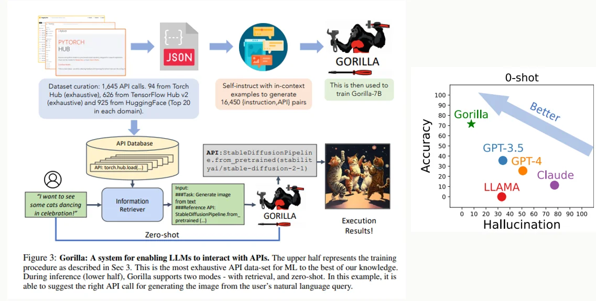
</p>

<p style="text-align:center; font-style: italic;">Image from Gorilla: Gorilla model significantly outperforms other LLMs in accuracy while reducing hallucinations.</p>

#### How Gorilla Works

The process begins with curating a dataset comprising **1,645 API calls** from popular sources like HuggingFace, Torch Hub, and TensorFlow Hub. Using this extensive dataset, the team generated **16,450 (instruction, API) pairs** through self-instruct techniques. This set of examples was then used to fine-tune a LLaMA-based model, resulting in Gorilla-7B.

When a user submits a natural language query (e.g., “Generate an image of dancing cats”), Gorilla first retrieves relevant documentation from its **API Database** using an information retriever. The retrieved context helps the model to understand which API is best suited for the task and how to properly call it. This retrieval step significantly reduces hallucinations by grounding the model's responses in real, authoritative documentation.

The result is a system that can adapt to API changes and updates. As demonstrated in the example above, Gorilla can accurately generate API calls like `StableDiffusionPipeline.from_pretrained()` to achieve its objective.

You can explore a live demo of Gorilla [here](https://gorilla.cs.berkeley.edu/leaderboard.html#api-explorer) and experiment with it yourself using their [Colab notebook](https://colab.research.google.com/drive/1DEBPsccVLF_aUnmD0FwPeHFrtdC0QIUP?usp=sharing).

## Planning

To solve complex tasks with agents it is fundamental that they are able to plan a series of simpler steps. Planning capabilities in LLM agents can range from simple task decomposition to sophisticated hierarchical planning systems. More advanced approaches like Tree of Thoughts extend chain-of-thought prompting by exploring multiple reasoning paths simultaneously, evaluating them, and selecting the most promising one to pursue. Some agents even employ meta-planning, where they not only plan the steps to solve a task but also strategize about how to plan effectively, considering factors like resource constraints and potential failure points.

An illustrative example is the HuggingGPT paper[^8], which uses planning in order to leverage other machine learning models found in web communities (e.g. Hugging Face) to solve AI tasks. Specifically, they use ChatGPT to conduct task planning when receiving a user request, select models according to their function descriptions available in Hugging Face, execute each subtask with the selected AI model, and summarize the response according to the execution results.

<p align="center">
  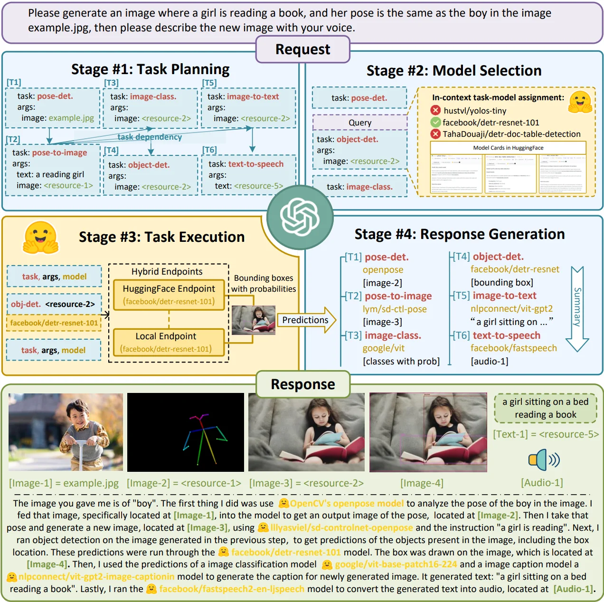
</p>

<p style="text-align:center; font-style: italic;">Overview of HuggingGPT. With an LLM (e.g., ChatGPT) as the core controller and the expert models as the executors, the workflow of HuggingGPT consists of four stages: 1) Task planning: LLM parses the user request into a task list and determines the execution order and resource dependencies among tasks; 2) Model selection: LLM assigns appropriate models to tasks based on the description of expert models on Hugging Face; 3) Task execution: Expert models on hybrid endpoints execute the assigned tasks; 4) Response generation: LLM integrates the inference results of experts and generates a summary of workflow logs to respond to the user. Image from [^8]</p>

## Multi-Agent Systems

Some complex use cases might be too much for a single agent to solve. In multi-agent systems a set of agents interact with each other and with the environment to achieve the objectives, trough a collaborative, competitive or hybrid effort.

These systems can be as simple as two agents performing the same tasks as a single agent divided between them, which simplifies the prompt and state managements as well as allowing for a more intuitive system design with specified roles and tasks, or as complex as a multitudinary swarm of agents with complex and differentiated behaviors which can show emergence of new properties.

<p align="center">
  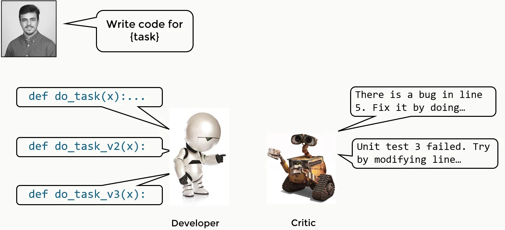
</p>
<p style="text-align:center; font-style: italic;">Simple multi-agentic system that replicates the reflection example, with two agents with differentiated roles.</p>

In _ChatDev: Communicative Agents for Software Development_[^9] Qian, Chen, et al. develop "a chat-powered software development framework in which specialized agents driven by large language models (LLMs) are guided in what to communicate (via chat chain) and how to communicate (via communicative dehallucination). These agents actively contribute to the design, coding, and testing phases through unified language-based communication, with solutions derived from their multi-turn dialogues. We found their utilization of natural language is advantageous for system design, and communicating in programming language proves helpful in debugging. This paradigm demonstrates how linguistic communication facilitates multi-agent collaboration, establishing language as a unifying bridge for autonomous task-solving among LLM agents."

<p align="center">
  
</p>
<p style="text-align:center; font-style: italic;">ChatDev, a chat-powered software development framework, integrates LLM agents with various social roles, working autonomously to develop comprehensive solutions via multi-agent collaboration. </p>

A cool demonstration video of ChatDev can be found in their [GitHub repository](https://github.com/OpenBMB/ChatDev?tab=readme-ov-file#-what-can-chatdev-do).

In "Improving factuality and reasoning in language models through multiagent debate." Du, Yilun, et al. evaluate the performance of multi-agent systems in a diverse set of tasks and compare them with single-model solutions, and they show that the former consistently outperform the latter.

<p align="center">
  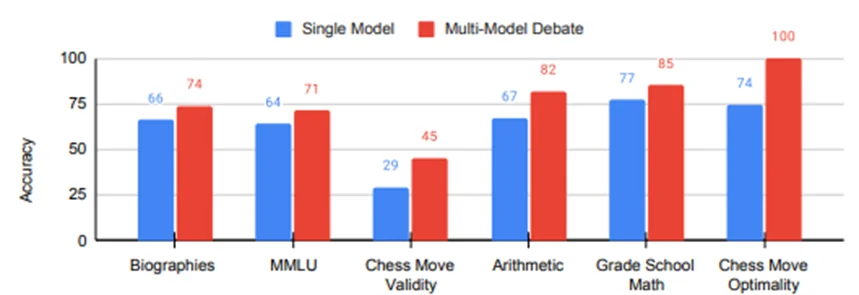
</p>
<p style="text-align:center; font-style: italic;">Accuracy of traditional inference and our multi-agent debate over six benchmarks. </p>

Overall, multi-agent systems demonstrate superior performance compared to single agents across various tasks. However, this improved capability comes with some trade-offs: increased latency due to multiple agent interactions, higher computational and API costs from running multiple models, and greater system complexity. These factors must be weighed when deciding between single and multi-agent architectures for a specific application.

Multi-agent systems can be classified in many ways:

-   **Cooperative**: they collaborate with each other. E.g. chatdev's team working together on a software project.

-   **Competitive**: they have conflicting objectives. E.g. stock brokers that compete to have the best investment portfolio, each trying to outperform the others.

-   **Hybrid**: sometimes they collaborate, other times they compete. E.g. a group of researchers sharing data but competing for funding.

-   **Centralized/orchestrated**: one agent controls and organizes the others. E.g. a project manager coordinating tasks among team members.

-   **Decentralized**: they make decisions locally without a central controller. E.g. a group of open-source contributors working independently on different features.

-   **Hierarchical**: some agents have greater authority or coordination capabilities over others. E.g. a corporate structure where managers oversee teams of employees.

-   **Homogeneous**: all agents are the same. E.g. a swarm of drones programmed to perform identical tasks.

-   **Heterogeneous**: there are differences in roles, tools, etc. E.g. a team of engineers, designers, and marketers each using their specialized skills and tools.

## Execution Termination

In autonomous workflows, it's crucial to clearly define termination conditions, as if they are too lax the loops could keep running and wasting resources, and if they are too strict the loops could be terminated before enough effort has been put into the task. There are several approaches to determine when an agent should stop executing:

### Parameter-Based Limits

The simplest approach is setting hard limits on execution parameters:

-   Maximum number of tokens generated
-   Maximum number of turns or iterations
-   Maximum number of actions performed
-   Time-based limits
-   Cost/budget constraints

These limits act as safety guards to prevent infinite loops or excessive resource consumption.

### Agent-Determined Completion

A more flexible approach lets the agent determine when to finish:

-   Self-evaluation: The agent assesses if it has achieved its objective.
-   External validator: A separate agent reviews and validates the completion.
-   Confidence threshold: The agent continues until reaching a certain confidence level.
-   Failure recognition: The agent can determine if the task is impossible and gracefully terminate.

### Problem-Specific Conditions

Some tasks have natural completion criteria based on their domain:

-   A development agent finishes when all automated tests pass.
-   A data scientist agent stops when reaching a specified accuracy threshold.
-   A search agent terminates upon finding the target information.
-   A game-playing agent concludes when winning or losing.

### Hybrid Approaches

In practice, most systems combine multiple termination conditions:

```python
def agent_execution():
    max_iterations = 100
    while iterations < max_iterations:
        if agent.objective_achieved():
            return SUCCESS
        if agent.is_impossible():
            return FAILURE
        if cost > budget:
            return BUDGET_EXCEEDED

        agent.execute_next_action()
        iterations += 1

    return MAX_ITERATIONS_REACHED
```

This ensures both task completion and system safety while maintaining flexibility in the execution flow.

### Human-in-the-Loop

While agents can operate autonomously, there are scenarios where human intervention is necessary or beneficial. Human-in-the-loop (HITL) is a design pattern where human operators are integrated into the agent's workflow as a special type of tool.

Some key scenarios where HITL is valuable:

-   **Critical Decisions**: When actions have significant consequences (e.g., financial transactions, medical decisions)
-   **Verification**: Validating agent outputs before implementation
-   **Guidance**: Providing additional context or clarification when the agent is uncertain
-   **Learning**: Using human feedback to improve agent performance
-   **Safety**: Acting as a safeguard against potential harmful actions

Humans can be thought of as a AGI tool - they have general problem-solving capabilities and can provide input that helps agents overcome their limitations.

#### Implementation Approaches

There are several ways to implement HITL in agent systems:

```python
# Example of a simple human-in-the-loop tool
class HumanInputTool:
    def run(self, query: str) -> str:
        """Get input from human operator"""
        print(f"\nHuman input needed: {query}")
        return input("Your response: ")

# Example usage in an agent workflow
if confidence_score < THRESHOLD:
    human_input = human_tool.run(
        "I'm uncertain about this step. Should I proceed with action X?"
    )
    if human_input.lower() != 'yes':
        return alternative_action()
```

Langchain provides an already implemented human tool.

```python
from langchain.agents import AgentType, initialize_agent, load_tools
from langchain_openai import ChatOpenAI, OpenAI

llm = ChatOpenAI(temperature=0.0)
math_llm = OpenAI(temperature=0.0)
tools = load_tools(
    ["human", "llm-math"],
    llm=math_llm,
)

agent_chain = initialize_agent(
    tools,
    llm,
    agent=AgentType.ZERO_SHOT_REACT_DESCRIPTION,
    verbose=True,
)

agent_chain.run("What's my friend Eric's surname?")
```

#### Balancing Autonomy and Oversight

The key is finding the right balance between agent autonomy and human oversight:

-   **Selective Intervention**: Only involve humans for critical decisions
-   **Asynchronous Review**: Queue non-urgent decisions for batch human review
-   **Confidence Thresholds**: Use human input when agent confidence is low
-   **Progressive Autonomy**: Gradually reduce human involvement as agent reliability improves

By incorporating HITL effectively, agents can leverage human expertise while maintaining efficient operation. This creates a symbiotic system where both automated and human intelligence work together to achieve optimal results.

# Agent Development Ecosystem

The landscape of LLM agent development has rapidly evolved, giving rise to a rich ecosystem of frameworks, tools, and applications. While it's possible to build agents from scratch using basic LLM APIs, modern development frameworks provide abstractions and pre-built tools that significantly accelerate the development process. These frameworks handle common challenges like prompt management, tool integration, and memory systems, allowing developers to focus on their specific use cases.

In this section, we'll explore the major frameworks powering agent development today, examine notable examples of successful agent implementations, and look at some of the emerging products and applications in this space. Whether you're building a simple task-specific agent or a complex multi-agent system, understanding this ecosystem will help you choose the right tools and approaches for your needs.

## Development Frameworks

Several frameworks have emerged to facilitate the development of LLM agents, each with its own strengths and trade-offs:

### OpenAI Assistants

The OpenAI Assistants API provides the most polished out-of-the-box experience for building agents. The framework comes with comprehensive built-in capabilities for function calling and tool use, allowing developers to quickly integrate custom actions into their agents. It features robust file handling and retrieval systems, making it easy to work with documents and data. Additionally, it includes a powerful code interpreter for executing Python code and advanced image analysis capabilities. The framework also handles conversation management through its thread system, maintaining context across multiple interactions seamlessly.

However, it's limited to OpenAI's models and has less flexibility in customization compared to other frameworks.

### LangChain

LangChain is the most comprehensive and widely-used framework for building LLM applications. The framework stands out for its extensive integration ecosystem, supporting a wide range of LLM providers and external tools. Its flexible architecture provides powerful abstractions for building complex workflows, while maintaining clarity and modularity. The vibrant community has contributed numerous components and extensions, creating a rich ecosystem of ready-to-use solutions. LangChain offers sophisticated memory management with support for various types of memory and storage solutions, and includes a comprehensive set of pre-built agents and tools for common use cases.

The framework's flexibility makes it suitable for both simple chatbots and complex multi-agent systems, though this versatility can come with a steeper learning curve.

### AutoGen

AutoGen specializes in building multi-agent systems with a focus on simplicity and scalability. The framework provides a streamlined API that makes agent-to-agent communication intuitive and efficient, while supporting parallel execution for improved performance. Its conversation management system is specifically designed for complex multi-agent interactions, handling message routing and context maintenance automatically. AutoGen integrates naturally with popular development tools, making it easy to incorporate into existing workflows. The framework particularly shines in scenarios requiring group chat-like interactions between agents, with built-in support for various conversation patterns.

While more focused than LangChain, AutoGen excels in scenarios requiring multiple cooperating agents.

### CrewAI

CrewAI emphasizes human-like collaboration patterns in multi-agent systems. The framework implements a role-based architecture that mirrors real-world team structures, making it intuitive to design complex agent interactions. Its process-oriented task management system helps organize and coordinate work between agents effectively. CrewAI provides access to a vast ecosystem of pre-built agent templates, significantly reducing development time for common use cases. The framework seamlessly integrates with popular development tools and emphasizes hierarchical team structures, making it particularly suitable for business applications.

While only partially open-source, CrewAI offers powerful abstractions for building collaborative agent systems.

The choice of framework often depends on specific requirements like model flexibility, deployment constraints, and complexity of the intended agent system.

-   Choose **OpenAI Assistants** for quick prototypes and production-ready single agents
-   Use **LangChain** for maximum flexibility and complex custom solutions
-   Pick **AutoGen** when building systems with multiple interacting agents
-   Select **CrewAI** for business processes that mirror human team structures

## Notable Open Source Agent Projects

The open source community has been at the forefront of LLM agent innovation, producing several groundbreaking projects that push the boundaries of what's possible with this technology. From autonomous agents that can learn and explore virtual environments to collaborative systems that mimic human research teams, these projects serve as both technical demonstrations and foundations for future development.

Let's explore some of the most influential open source agent projects that have emerged in recent years. Each of these implementations showcases unique approaches to agent architecture, demonstrates novel capabilities, and has contributed valuable insights to the field.

### BabyAGI

BabyAGI[^9] represents one of the earliest and most influential autonomous agent projects, with its latest iteration BabyAGI 2o focusing on self-building capabilities. Unlike traditional agents with fixed toolsets, BabyAGI 2o can dynamically create and register new tools as needed to complete user-defined tasks. The agent analyzes tasks, determines what tools it needs, writes the code for those tools, and executes them - all without human intervention.

Key features that make BabyAGI notable:
- Dynamic tool creation and updating based on task requirements
- Automatic package management and dependency handling
- Iterative error handling and self-improvement
- Support for multiple LLM backends through litellm
- Ability to handle diverse tasks from web scraping to image generation

For example, BabyAGI 2o can autonomously create tools to scrape news headlines, analyze images, or even generate creative content by combining multiple APIs. This flexibility and self-improving nature has made it an important reference architecture for autonomous agent development.

You can explore BabyAGI 2o through these resources:
- [BabyAGI 2o GitHub Repository](https://github.com/yoheinakajima/babyagi-2o)
- [Demo: BabyAGI 2o creating tools for news analysis](https://x.com/yoheinakajima/status/1847160880674623762)
- [Original BabyAGI announcement and demo](https://x.com/yoheinakajima/status/1839398354364838366)

### Generative Agents

Generative Agents[^11] is a fascinating research project that explores how LLM-powered agents can simulate believable human behavior in interactive environments. Created by researchers at Stanford, this project places 25 autonomous agents in a sandbox world inspired by The Sims, where they live, work, and interact with each other naturally.

Key features of the architecture:
- **Memory Stream**: A comprehensive database that records agents' experiences in natural language, including both direct observations and inter-agent communications
- **Retrieval System**: Surfaces relevant context based on three factors:
  - Recency: Prioritizes recent events
  - Importance: Distinguishes between mundane and core memories
  - Relevance: Considers relationship to current situation
- **Reflection Mechanism**: Synthesizes memories into higher-level inferences that guide future behavior
- **Planning & Reaction**: Translates reflections and environmental information into actions, considering relationships between agents

<p align="center">
  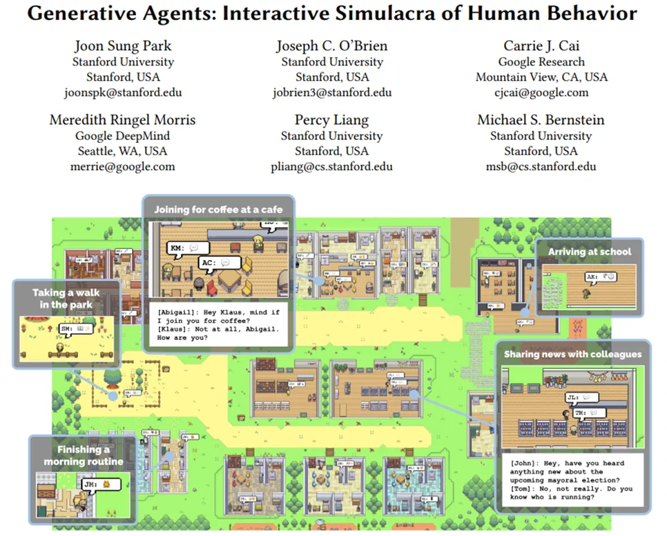
</p>
<p style="text-align:center; font-style: italic;">Generative Agents places LLMs in a virtual environment simulating a town where they can freely interact with each other. </p>

The simulation demonstrates emergent social behaviors like:
- Information spreading through the community
- Relationship memory (agents continuing previous conversations)
- Spontaneous social event organization
- Development of opinions and preferences based on experiences

For example, agents wake up, cook breakfast, and head to work; artists create while authors write; they form opinions, notice each other, and initiate conversations. They can remember past interactions and use them to plan future activities, creating a rich tapestry of simulated social life.

This project showcases how LLM agents can create complex, believable behaviors through the combination of memory, planning, and social interaction systems. The emergent behaviors demonstrate the potential for using such systems to study human social dynamics or create more realistic NPCs in games.

### ChatDev

ChatDev is an innovative open-source project that simulates a virtual software company powered by LLM agents. The system creates a collaborative environment where multiple specialized agents work together to develop software from natural language descriptions, similar to how human teams operate in real software companies.

Key features:
- **Role-Based Architecture**: Includes specialized agents like CEO, CTO, Programmers, Reviewers, and Testers
- **Natural Communication**: Agents collaborate through natural language discussions to design, implement and test software
- **Comprehensive Development Process**: Handles the complete software lifecycle from requirements analysis to testing
- **Customizable Framework**: Allows defining custom roles, development processes, and tool integrations
- **Multi-Agent Collaboration**: Leverages different agent perspectives and expertise to produce better solutions

<p align="center">
  
</p>
<p style="text-align:center; font-style: italic;">ChatDev integrates LLM agents with various social roles, working autonomously to develop comprehensive software solutions via multi-agent collaboration.</p>

For example, when given a task to create a game, the CEO agent might first analyze requirements and create a project plan, the CTO would design the technical architecture, programmers would implement the code, reviewers would check for issues, and testers would verify functionality - all coordinating through natural language conversations.

The project demonstrates how structured multi-agent systems can tackle complex creative tasks by breaking them down into specialized roles and facilitating effective communication between agents. You can explore ChatDev through:
- [GitHub Repository](https://github.com/OpenBMB/ChatDev)
- [Interactive Demo Platform](https://chatdev.toscl.com/)

### ChemCrow

ChemCrow[^12] is a specialized LLM agent designed for complex chemistry tasks across organic synthesis, drug discovery, and materials design. Rather than relying on general chemistry knowledge, ChemCrow integrates 18 expert-designed chemistry tools that enable it to perform sophisticated chemical analysis and planning.

Key features:
- **Comprehensive Toolset**: Includes tools for molecular analysis, safety checks, reaction prediction, and literature search
- **Safety-First Design**: Automated checks for chemical weapons, explosives, and general safety considerations
- **Multi-Step Planning**: Can design and validate complex synthesis pathways
- **Literature Integration**: Combines web search and scientific paper analysis for up-to-date information
- **Python Integration**: Built-in REPL for computational chemistry tasks

The tools are organized into four main categories:
1. **General Tools**: Web search, literature search, Python REPL
2. **Molecule Tools**: Structure analysis, pricing, patent checking, similarity comparison
3. **Safety Tools**: Chemical weapon checks, explosive detection, safety summaries
4. **Chemical Reaction Tools**: Reaction naming, prediction, and synthesis planning

<p align="center">
  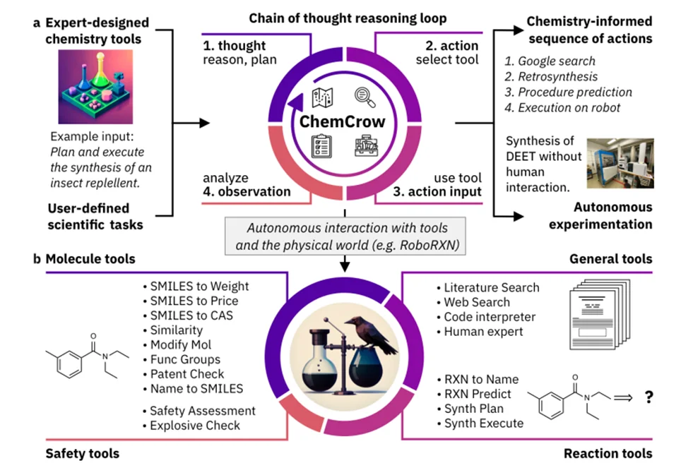
</p>
<p style="text-align:center; font-style: italic;">ChemCrow's workflow combines expert tools with LLM reasoning for chemistry tasks</p>

ChemCrow follows a "Thought, Action, Action Input, Observation" workflow where it:
1. Reasons about the current state and goal
2. Selects appropriate chemistry tools
3. Executes actions and observes results
4. Iterates until reaching the solution

The system can integrate with robotic lab systems like IBM's RoboRXN for physical synthesis execution, bridging the gap between computational and experimental chemistry.

<p align="center">
  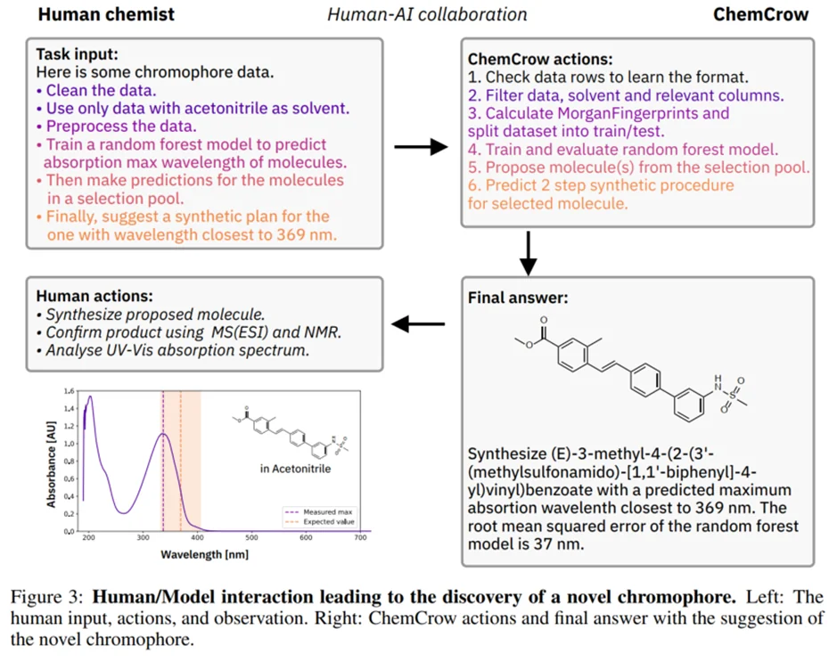
</p>
<p style="text-align:center; font-style: italic;">ChemCrow is designed to collaborate with human chemists, combining AI capabilities with expert oversight</p>

[Source: In Silico Chemistry](https://www.insilicochemistry.io/tutorials/foundations/gpt-4-for-chemistry#h.vb7wz0s6qbcr)


### Voyager

Voyager[^13] is a groundbreaking LLM-powered agent that demonstrates autonomous learning and exploration in Minecraft. Unlike traditional game AI that follows predefined objectives, Voyager continuously explores its environment, develops new skills, and makes discoveries without human intervention.

Key components:
- **Automatic Curriculum**: Generates exploration goals based on current skills and world state
- **Skill Library**: Stores and retrieves executable code for complex behaviors
- **Iterative Prompting**: Refines code through environment feedback and self-verification

<p align="center">
  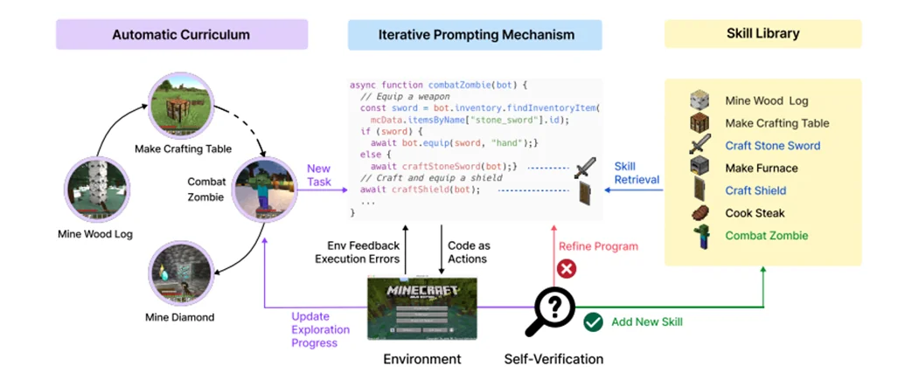
</p>
<p style="text-align:center; font-style: italic;">Voyager's curriculum generation process adapts to the agent's current capabilities and environment</p>

The agent demonstrates impressive capabilities:
- Discovers 3.3x more unique items than previous approaches
- Traverses 2.3x longer distances across diverse terrains
- Unlocks tech tree milestones up to 15.3x faster than prior methods
- Successfully transfers skills to new worlds and tasks

<p align="center">
  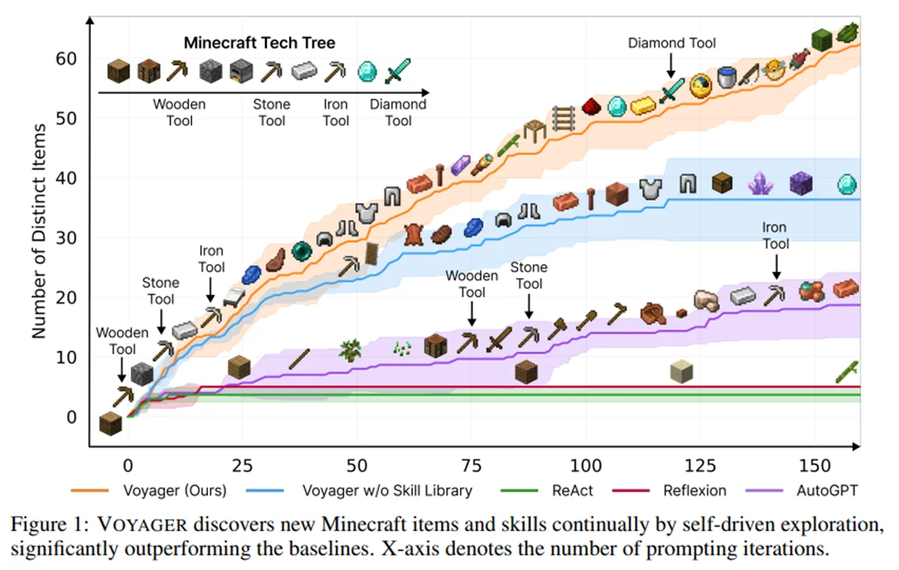
</p>
<p style="text-align:center; font-style: italic;">Voyager progressively discovers new technologies and crafting abilities through autonomous exploration</p>

For example, if Voyager finds itself in a desert, it will prioritize learning to harvest sand and cactus before pursuing iron collection. The agent continuously refines its skills based on environmental feedback and stores mastered behaviors in its skill library for future use, much like how human players learn and adapt to the game.

You can explore Voyager through the [project website](https://voyager.minedojo.org/), which includes detailed documentation, examples, and research findings.

## Commercial Agent Applications & Products

The transition from research to production has begun, with companies deploying agent technology in real-world applications. These implementations often combine multiple advanced capabilities like code generation, tool use, and multi-agent collaboration into cohesive products that showcase what's currently possible with LLM agents.

### OS-Copilot

OS-Copilot[^14] breaks new ground by creating a generalist computer agent that can interact with entire operating systems. Its FRIDAY agent interfaces with comprehensive OS elements including the web, terminals, files, and third-party applications through a three-component architecture of Planner, Configurator, and Actor.

<p align="center">
  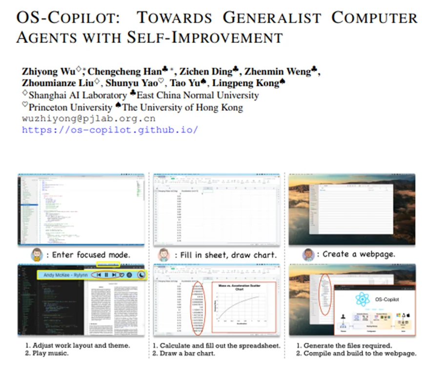
</p>
<p style="text-align:center; font-style: italic;">OS-Copilot's architecture enables comprehensive interaction with operating system components through self-improving capabilities</p>

The system implements working, declarative, and procedural memory inspired by human cognition, allowing it to learn from experience. When encountering new tasks, it can generate Python tools on demand and verify their success, storing working solutions for future use. This approach has led to impressive results on the GAIA benchmark and enabled mastery of complex applications like Excel and PowerPoint.

You can explore more through their [project website](https://os-copilot.github.io/).

### Devin

Devin represents the next evolution in AI coding assistants by functioning as a complete development environment. Unlike traditional coding assistants that only suggest snippets, Devin operates autonomously with its own integrated terminal, editor, and browser.

<p align="center">
  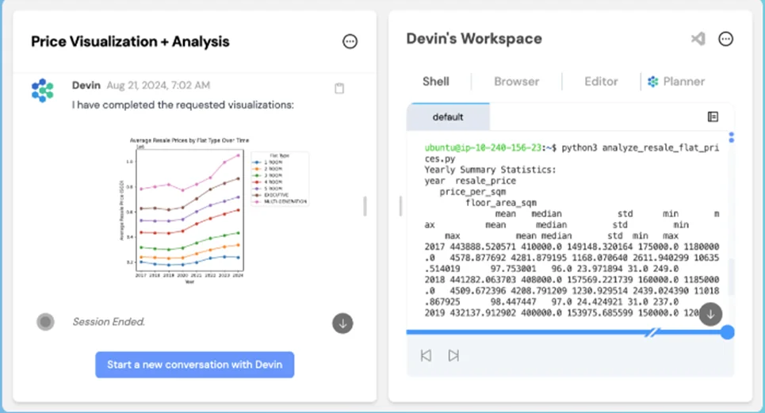
</p>
<p style="text-align:center; font-style: italic;">Devin's integrated development environment includes a terminal, editor, and browser for autonomous coding</p>

The system handles diverse engineering tasks from code migrations to CI/CD pipeline management, learning from codebases and adapting to team-specific workflows. For instance, when setting up a Next.js repository, Devin can autonomously clone the repo, understand setup instructions, install dependencies, and resolve any issues that arise.

Learn more at [devin.ai](https://devin.ai/).

### Open-Interpreter

Open-Interpreter takes a different approach by providing a natural language interface to your computer's local capabilities. Unlike cloud-based solutions, it runs code directly on your machine with full system access.

<p align="center">
  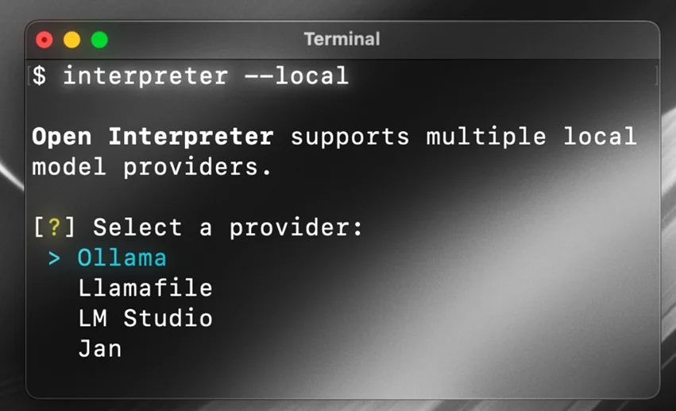
</p>
<p style="text-align:center; font-style: italic;">Open-Interpreter provides a natural language interface to your computer's capabilities through local code execution</p>

The system supports multiple programming languages and shell commands, with built-in safety controls through a code review system. Its flexibility enables diverse applications from data analysis to system administration, all through a ChatGPT-like terminal interface. With over 55,000 GitHub stars, it has demonstrated significant community adoption.

Explore the project through their [GitHub repository](https://github.com/OpenInterpreter/open-interpreter).

### Claude Computer Use

Claude 3.5 Sonnet introduces a novel approach to computer interaction by enabling direct control of screens, cursors, and keyboards through visual understanding. This allows Claude to interact with any application through its graphical interface, rather than requiring specific API integrations.

<p align="center">
  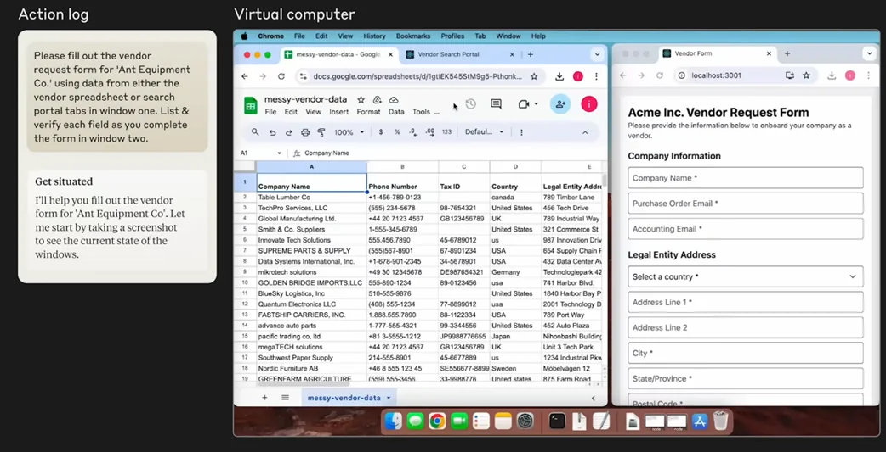
</p>
<p style="text-align:center; font-style: italic;">Claude can interact with computers through visual understanding and direct control of mouse and keyboard</p>

The system outperforms other AI systems on the OSWorld benchmark, scoring 14.9% in screenshot-only tasks compared to the next best system's 7.8%. When given more steps, it achieves 22.0% accuracy. The capability is currently in beta and available through Anthropic's API, as detailed in their [announcement](https://www.anthropic.com/news/3-5-models-and-computer-use) and [documentation](https://docs.anthropic.com/en/docs/build-with-claude/computer-use).

### Replit Agent

Replit Agent integrates AI assistance directly into their cloud development environment, enabling end-to-end application development from natural language descriptions to production deployment.

<p align="center">
  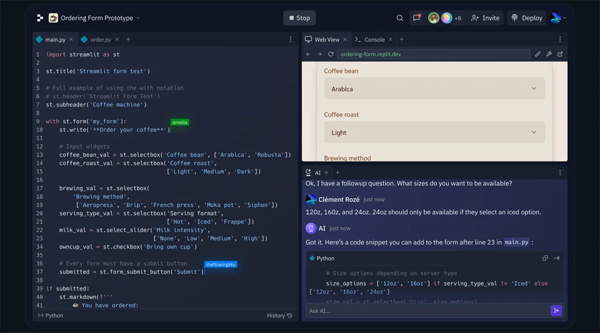
</p>
<p style="text-align:center; font-style: italic;">Replit Agent can develop and deploy web applications from natural language descriptions</p>

The system has already enabled impressive real-world applications, from custom health dashboards to interactive campus maps. Available to Replit Core subscribers, it maintains project context across development sessions and even supports mobile development through their app.

Full details are available in their [announcement](https://blog.replit.com/introducing-replit-agent) and [documentation](https://docs.replit.com/replitai/agent).

### AIDE (AI Data Engineer)

AIDE pushes the boundaries of automated data science through its innovative Solution Space Tree Search (SSTS) approach. Unlike linear workflows, AIDE explores multiple solution paths simultaneously while iteratively refining promising approaches.

<p align="center">
  
</p>
<p style="text-align:center; font-style: italic;">AIDE's Solution Space Tree Search explores multiple solution paths simultaneously</p>

The system has achieved impressive results, reaching top 1% performance on multiple Kaggle competitions while generating novel feature engineering approaches. Its comprehensive pipeline handles everything from data preprocessing to model selection, producing clean, maintainable code throughout the process.

More details can be found in their [technical report](https://www.weco.ai/blog/technical-report).


## References

[^1]: Russell, S., & Norvig, P. (2020). _Artificial Intelligence: A Modern Approach_ (4th ed.). Pearson.
[^2]: [What's next for AI agentic workflows ft. Andrew Ng of AI Fund](https://www.youtube.com/watch?v=sal78ACtGTc)
[^3]: Yao, Shunyu, et al. "React: Synergizing reasoning and acting in language models." arXiv preprint arXiv:2210.03629 (2022). [https://arxiv.org/abs/2210.03629](https://arxiv.org/abs/2210.03629)
[^4]: Wei, Jason, et al. "Chain-of-thought prompting elicits reasoning in large language models." Advances in neural information processing systems 35 (2022): 24824-24837. [https://arxiv.org/abs/2201.11903](https://arxiv.org/abs/2201.11903)
[^5]: [HumanEval Benchmark in paperswithcode](https://paperswithcode.com/sota/code-generation-on-humaneval)
[^6]: CoALA: Cognitive Architectures for Language Agents. Sumers, Theodore R., et al Transactions on Machine Learning Research (oct 2024). [https://arxiv.org/abs/2309.02427](https://arxiv.org/abs/2309.02427)
[^7]: Patil, Shishir G., et al. "Gorilla: Large language model connected with massive apis." arXiv preprint arXiv:2305.15334 (2023). [https://arxiv.org/abs/2305.15334](https://arxiv.org/abs/2305.15334)
[^8]: Shen, Yongliang, et al. "Hugginggpt: Solving ai tasks with chatgpt and its friends in hugging face." Advances in Neural Information Processing Systems 36 (2024). [https://arxiv.org/abs/2303.17580](https://arxiv.org/abs/2303.17580)
[^9]: Qian, Chen, et al. "Communicative agents for software development." arXiv preprint arXiv:2307.07924 6 (2023). [https://arxiv.org/abs/2307.07924](https://arxiv.org/abs/2307.07924)
[^10]: Du, Yilun, et al. "Improving factuality and reasoning in language models through multiagent debate." arXiv preprint arXiv:2305.14325 (2023).
[^11]: Park, Joon Sung, et al. "Generative agents: Interactive simulacra of human behavior." Proceedings of the 36th annual acm symposium on user interface software and technology. 2023.
[^12]: Bran, Andres M., et al. "ChemCrow: Augmenting large-language models with chemistry tools." arXiv preprint arXiv:2304.05376 (2023). [https://arxiv.org/abs/2304.05376](https://arxiv.org/abs/2304.05376)
[^13]: Wang, Guanzhi, et al. "Voyager: An open-ended embodied agent with large language models." arXiv preprint arXiv:2305.16291 (2023). [https://arxiv.org/abs/2305.16291](https://arxiv.org/abs/2305.16291)^
[^14]: OS-Copilot: Towards Generalist Computer Agents with Self-Improvement. [https://arxiv.org/abs/2402.07456](https://arxiv.org/abs/2402.07456)
