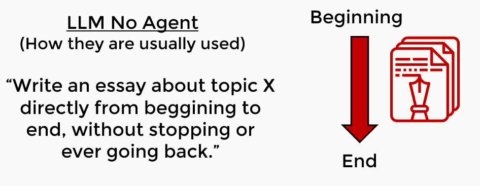
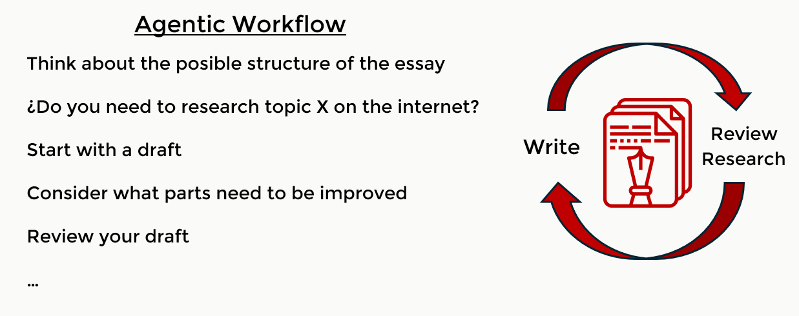
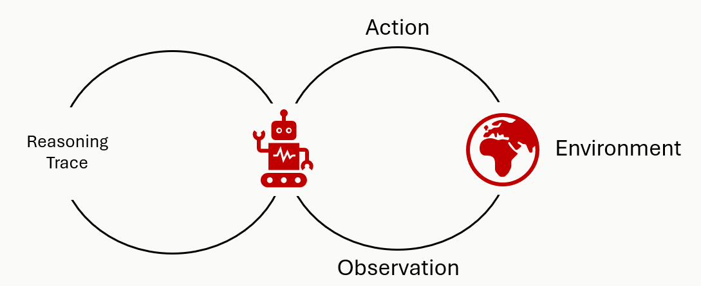
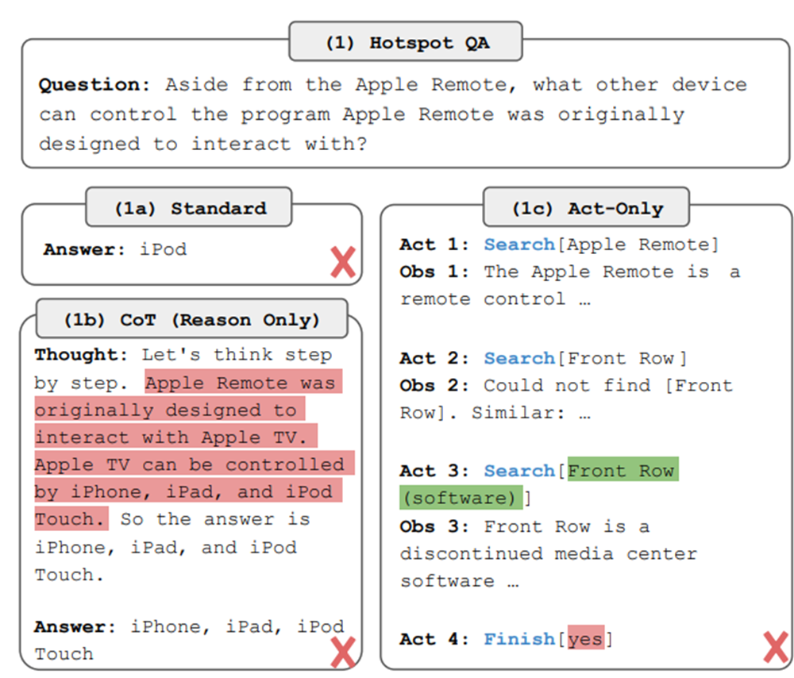
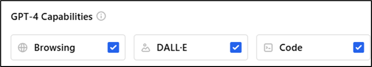
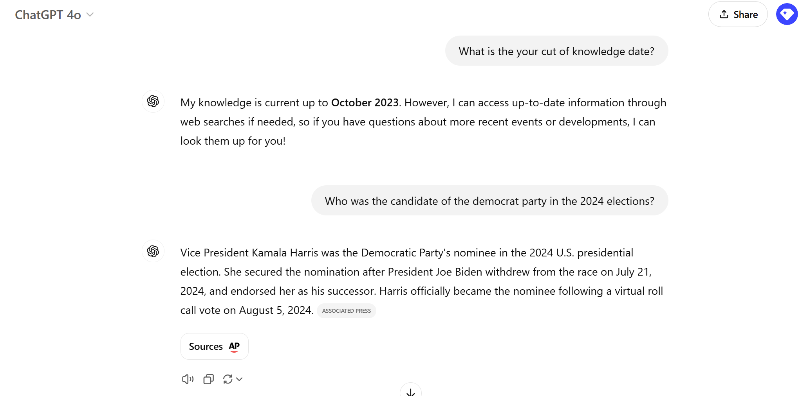
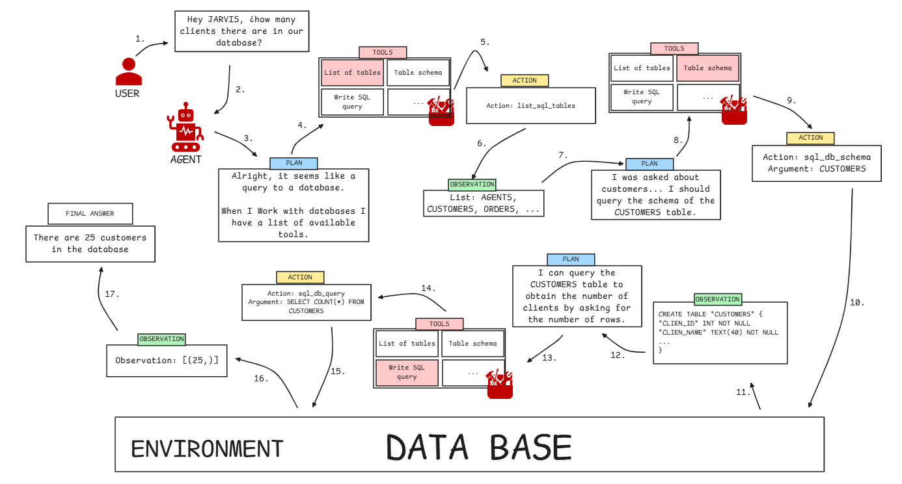

# LLM Agents

Over the last few weeks, I have been imparting in a full fledged couse on LLMs at my job at oga.ai. It is a fast-pace, deep dive consisting on eight lessons of two hours each, and covers much of the current landscape of LLMs in the industry. This has been the first time I have done something like this, and considering I have prepared it fully on my own and that the alumni are professional engineers and data scientists I really am proud of the results.

The fifth module of the course is about LLM agents, and it has been the most exciting one to prepare and teach, with the seventh about large multimodal models (LMMs) being a close second. Agents truly are a striking application of technology and the results that they can achieve are truly impressive. Even tough they are in beginning phase of development and they commit many errors and are difficult to control, so much so that there are few agents on production environment, they really shine with potential.

The course is in Spanish, and with it being internal to the company I can not freely share the videos and materials on my own. Still, I want to write about LLM agents in a series of blog posts.

In this first post, I will cover the basics of agents, how they work and how to implement them, along with a few examples. It will be fairly technical at the beginning, but once the basics are covered we can go on to the practical part.

In the following couple posts, I plan to write and explain in depth one or two agents. I have already implemented a ReAct agent in pure python (we will see in this post what these are), and I will probably implement a more complex one using a framework like langchain or autogen.

Finally, I want to use an agent to expand my [Torch-Tracer Project](https://mvazquez.ai/blog/output/2024-11-12-torch-tracing-01/content.html), with the objective that it needs the least amount of human input as possible.

## What are agents?

Artificial Intelligence: A Modern Approach defines an **"agent"** as[^1]

> _"Anything that can be viewed as perceiving its environment through sensors and acting upon that environment through actuators"_

This definition gives a general idea of what agents do, but it is way too broad, since a simple thermostat has sensors and actuators. A smarter definition is the one of a **"rational agent"** [^1]

> _"For each possible percept sequence, a rational agent should select an action that is expected to maximize its performance measure, given the evidence provided by the percept sequence and whatever built-in knowledge the agent has."_

<p align="center">
  
</p>

<p style="text-align:center; font-style: italic;">Agent Definitions.</p>

This means that a rational agent will try to accomplish an objective as defined by the performance measure. This is what we want, to tell our agent to do something and that it tries, to the best of its abilities, to follow the orders. Here is where the LLM part comes into play.

A **"LLM agent"** is one that uses a LLM as its _brain_ to reason. The central idea is that they use a language model to choose what **actions** they take to **accomplish an objective** given a current **state** or environment.

If you are familiar with prompt chains, as the ones used in langchain and in Retrieval Augemented Generation (RAG), they have many things in common with agents, but agents are more flexible and can show more complex behavior as it chooses what action to take at each moment by itself, while in chaining the possible workflow of the actions is fixed, rigidly specified in code.

### Agentic workflows

An analogy that I find illustrative to understand LLM agents can be made with the writing of an essay. This analogy comes from Andrew Ng[^2].

In a regular LLM workflow you ask the LLM to write an essay about some topic X. Since they are autoregressive models, they will write it directly from the beginning to the end without ever going back to fix errors or improve any section, or stopping to reflect and research more about topic X. This task would be very difficult for most humans, and yet LLMs are surprisingly good at it.

<p align="center">
  
</p>

<p style="text-align:center; font-style: italic;">Regular LLM workflow to write an essay. </p>

In an agentic workflow, you remove all those restrictions. The agent will be able to reason to take actions to better write the essay. It could decide to start by specifyng the essay's structure and researching about the topic in a external data storage (data bases, documents, the internet...). Then it may decide to write a first draft and iteratively improve it until it is finished. At any point of the process it can reflect about what is the best action to take among the set of possible actions, which gives it all these capabilities. Obviously, this workflow will often give better results that the first direct approach.

<p align="center">
  
</p>

<p style="text-align:center; font-style: italic;">Agentic LLM workflows allow to take to choose what actions to take to get the best results. </p>

LLM agents are based on the chain-of-thought. By dividing a complex problem in simpler subproblems, it can solve them secuentially to reach the final answer.

1. **Plan** what action to take to get closer to its objective.
2. Perform an **action** and **observe** its consequences.
3. Iterate until reaching the objective _"LLM in a loop"_

<p align="center">
  
</p>

<p style="text-align:center; font-style: italic;">Agentic LLM workflows as loop: Plan, Act, Observe. </p>

As a simple example, consider the common case of a software developer that uses chatGPT to write a code program. They start stating the problem and asking the model to "think step by step". The agent **plans** the actions it should take. Then it **writes** the code. The developer copies that code, pastes it in the script and runs the program. If it fails, they paste the **error trace** to chatgpt to fix it, and if it **works** then the task is finished.

If you automatize this in a loop, it becomes a simple agentic workflow, where the words in bold font correspond to planning, acting and observing.

All the text that is generated by the model during a task is called the **reasoning trace**.

### ReAct agents

You might have noticed that the planning step is not strictly necessary. An agent could just observe the environment and act, and in fact the first agents based on LLMs did just that, but they did not work too well. In 2022 in the ReAct paper[^3] Yao, Shunyu, et al. introduced the Reason + Act framework and showed that it works better than just acting.

The setup is an agent with access to three different actions that leverage a "simple Wikipedia web API: (1)**search**\[entity] returns the first 5 sentences from the corresponding _entity_ wiki page if it exists, or else suggests top-5 similar entities from the Wikipedia search engine, (2)**lookup**\[string], which returns the next sentence in the page containing _string_ simulating a ctrl+F command, and (3)**finish**\[answer] which would finish the current task with _answer_."[^3]

With this environment they compare four different approaches: standard zero-shot, chain of thought prompting, act-only agent and Reason + Act agent. The following example from the paper shows how they try to solve a question about the Apple Remote device. Let's review the fisrt three approaches first.

<p align="center">
  
</p>

<p style="text-align:center; font-style: italic;">Example of standard zero-shot, chain of thought prompting, act-only from the ReAct paper. </p>

In (1a) zero-shot the LLM just answers directly and gets it wrong. With (1b) chain-of-thought the LLM is prompted to "think step by step before answering", a technique that improves accuracy of language models[^4], but still gets it wrong. In (1c) we have a simple agentic workflow that acts and observes, and allows to use the Wikipedia tools. This time it actually gets close the answer, but ends up returning "yes" as its final answer. The problem with this approach is that the model cannot reflect on what tool to use, how to use it or plan how to get the final answer. The only possibility is to act, stating the action and its argument. ReAct is created to fight this problem.

<p align="center">
  
</p>

<p style="text-align:center; font-style: italic;">Example of a ReAct agent from the ReAct paper. In this case it manages to get the right answer.</p>

In this last case the agent follows a loop of reason-act-observe that overcomes the previously stated limitations, and it actually gets the correct answer: "keyboard function keys". This example showcases how the model is able plan and reason about the result of its actions. This is a simple yet extremely powerful workflow, and most state of the art agents follow it, with improvements in the reasoning step and an increase in freedom to act. It leverages the powerful large language models by using them as the "brain" of the agent.

### Actions as tools

To implement agents we need to define a **set of possible actions for the agent to take**, among which the agent will have to decide in each iteration. For example it could have access to the following:

-   Ask the user for information.
-   Search the web.
-   Using an external database.
-   Using a calculator or symbolic programming.
-   Using a python code interpreter.

This possible actions are commonly referred as **tools**, and the a set of actions is a **tool box**.

As an example, chatGPT has access to three different tools.

<p align="center">
  
</p>

<p style="text-align:center; font-style: italic;">The gpt-4o model from the chatGPT web UI has access to web browsing, dall-e image generator, and code interpreter. </p>

At the time of writting gpt-4o has the knowledge cut date of October 2024. That means that the pretraining has data until that date, and it knows nothing that happened thereafter. If I ask it about events posterior to that dat, it will use a web search tool to retrieve the necessary information.

<p align="center">
  
</p>

<p style="text-align:center; font-style: italic;">GPT does not know the democratic candidate of 2024, so it uses web search tool to answer . </p>

In this [conversation](https://chatgpt.com/share/e/6734e362-6720-800a-ad98-0fe320703b3a) I make chatGPT use the code interpreter tool to generate a plot to showcase it. As of the moment I am writing this post, it is not possible to share conversations in which dall-e is used to generate images, but you can guess how it works: you ask chatgpt to generate an image of a puppy and it decides to call dall-e, writting the image prompt by itself.

Another example is the [langchain tools](https://python.langchain.com/docs/integrations/tools/). These are implemented in the langchain library to be used by language models, and there is a great number and variety of them: several web search providers and code interpreters, a few productivity tools like github, jira or gmail; tools to access databases and even more.

## Agent Showcase

Let's proceed with an agent full workflow as an example. In this case we have an agent, let's call him JARVIS, that assist the user with data queries.

<p align="center">
  
</p>

<p style="text-align:center; font-style: italic;">Jarvis helps the user to get the total number of customers in the database. </p>

When the user asks JARVIS to find out how many clients are in the database, the agent has to figure out the best course of action to get the information. Let’s walk through the sequence step by step to see how JARVIS accomplishes this seemingly simple task:

### Breaking Down the Workflow

The user starts by asking, **"Hey JARVIS, how many clients are there in our database?"** This is the initial input that sets the whole process in motion. Even though this question seems straightforward, there are several steps involved before reaching the final answer.

1. **Understanding the Query**:

    - JARVIS recognizes that it needs to interact with a database to fulfill the user’s request. The initial plan involves listing out the tools available to it, which include accessing tables and querying information.

2. **Exploring the Environment**:

    - To proceed, JARVIS needs to understand what data it has access to. It starts by using a tool to **list all the tables** in the database. The agent observes that there are tables named `AGENTS`, `CUSTOMERS`, `ORDERS`, among others.

3. **Focusing on Relevant Information**:

    - Since the user is asking specifically about clients, JARVIS infers that the relevant information should be in the `CUSTOMERS` table. However, before it can query this table, it needs to understand its structure.

4. **Querying the Table Schema**:

    - JARVIS retrieves the schema of the `CUSTOMERS` table to see what fields are available. It finds that the table includes columns like `CLIENT_ID` and `CLIENT_NAME`.

5. **Formulating a Plan to Extract Information**:

    - Now that JARVIS knows the structure of the table, it formulates a plan to count the entries. The goal is to determine how many rows (i.e., clients) are present in the table.

6. **Executing the SQL Query**:

    - JARVIS constructs a simple SQL query:
        ```sql
        SELECT COUNT(*) FROM CUSTOMERS
        ```
        This query will return the total number of rows in the `CUSTOMERS` table, which corresponds to the number of customers.

7. **Interpreting the Results**:

    - The query is executed, and JARVIS receives the result: `[(25,)]`, indicating there are 25 customers in the database.

8. **Delivering the Final Answer**:
    - With the result in hand, JARVIS returns to the user with the final answer:  
      **"There are 25 clients in the database."**

### Key Takeaways from This Example

This workflow showcases a **classic agentic pattern** where JARVIS uses a loop of **planning, acting, and observing**:

-   **Planning**: At multiple steps, JARVIS formulates a plan to achieve the desired outcome. It doesn’t jump straight to querying the database without first understanding the environment.
-   **Acting**: It uses tools effectively to explore the environment, fetch the schema, and run the SQL query.
-   **Observing**: After each action, it observes the output to decide on the next step.

The diagram above reflects how even seemingly simple tasks require agents to break down problems into smaller actions, reflect on the information available, and decide on the best next step. The flexibility of this approach is what makes LLM agents so powerful.

### Reasoning Trace

### Code Implementation

## References

[^1]: Russell, S., & Norvig, P. (2020). _Artificial Intelligence: A Modern Approach_ (4th ed.). Pearson.
[^2]: [What's next for AI agentic workflows ft. Andrew Ng of AI Fund](https://www.youtube.com/watch?v=sal78ACtGTc)
[^3]: Yao, Shunyu, et al. "React: Synergizing reasoning and acting in language models." arXiv preprint arXiv:2210.03629 (2022). [https://arxiv.org/abs/2210.03629](https://arxiv.org/abs/2210.03629)
[^4]: Wei, Jason, et al. "Chain-of-thought prompting elicits reasoning in large language models." Advances in neural information processing systems 35 (2022): 24824-24837. [https://arxiv.org/abs/2201.11903](https://arxiv.org/abs/2201.11903)
