# Agent Development Ecosystem

The landscape of LLM agent development has rapidly evolved, giving rise to a rich ecosystem of frameworks, tools, and applications. While it's possible to build agents from scratch using basic LLM APIs, modern development frameworks provide abstractions and pre-built tools that significantly accelerate the development process. These frameworks handle common challenges like prompt management, tool integration, and memory systems, allowing developers to focus on their specific use cases.

In this section, we'll explore the major frameworks powering agent development today, examine notable examples of successful agent implementations, and look at some of the emerging products and applications in this space. Whether you're building a simple task-specific agent or a complex multi-agent system, understanding this ecosystem will help you choose the right tools and approaches for your needs.

## Development Frameworks

Several frameworks have emerged to facilitate the development of LLM agents, each with its own strengths and trade-offs:

### OpenAI Assistants

The OpenAI Assistants API provides the most polished out-of-the-box experience for building agents. The framework comes with comprehensive built-in capabilities for function calling and tool use, allowing developers to quickly integrate custom actions into their agents. It features robust file handling and retrieval systems, making it easy to work with documents and data. Additionally, it includes a powerful code interpreter for executing Python code and advanced image analysis capabilities. The framework also handles conversation management through its thread system, maintaining context across multiple interactions seamlessly.

However, it's limited to OpenAI's models and has less flexibility in customization compared to other frameworks.

### LangChain

LangChain is the most comprehensive and widely-used framework for building LLM applications. The framework stands out for its extensive integration ecosystem, supporting a wide range of LLM providers and external tools. Its flexible architecture provides powerful abstractions for building complex workflows, while maintaining clarity and modularity. The vibrant community has contributed numerous components and extensions, creating a rich ecosystem of ready-to-use solutions. LangChain offers sophisticated memory management with support for various types of memory and storage solutions, and includes a comprehensive set of pre-built agents and tools for common use cases.

The framework's flexibility makes it suitable for both simple chatbots and complex multi-agent systems, though this versatility can come with a steeper learning curve.

### AutoGen

AutoGen specializes in building multi-agent systems with a focus on simplicity and scalability. The framework provides a streamlined API that makes agent-to-agent communication intuitive and efficient, while supporting parallel execution for improved performance. Its conversation management system is specifically designed for complex multi-agent interactions, handling message routing and context maintenance automatically. AutoGen integrates naturally with popular development tools, making it easy to incorporate into existing workflows. The framework particularly shines in scenarios requiring group chat-like interactions between agents, with built-in support for various conversation patterns.

While more focused than LangChain, AutoGen excels in scenarios requiring multiple cooperating agents.

### CrewAI

CrewAI emphasizes human-like collaboration patterns in multi-agent systems. The framework implements a role-based architecture that mirrors real-world team structures, making it intuitive to design complex agent interactions. Its process-oriented task management system helps organize and coordinate work between agents effectively. CrewAI provides access to a vast ecosystem of pre-built agent templates, significantly reducing development time for common use cases. The framework seamlessly integrates with popular development tools and emphasizes hierarchical team structures, making it particularly suitable for business applications.

While only partially open-source, CrewAI offers powerful abstractions for building collaborative agent systems.

The choice of framework often depends on specific requirements like model flexibility, deployment constraints, and complexity of the intended agent system.

-   Choose **OpenAI Assistants** for quick prototypes and production-ready single agents
-   Use **LangChain** for maximum flexibility and complex custom solutions
-   Pick **AutoGen** when building systems with multiple interacting agents
-   Select **CrewAI** for business processes that mirror human team structures

## Notable Open Source Agent Projects

The open source community has been at the forefront of LLM agent innovation, producing several groundbreaking projects that push the boundaries of what's possible with this technology. From autonomous agents that can learn and explore virtual environments to collaborative systems that mimic human research teams, these projects serve as both technical demonstrations and foundations for future development.

Let's explore some of the most influential open source agent projects that have emerged in recent years. Each of these implementations showcases unique approaches to agent architecture, demonstrates novel capabilities, and has contributed valuable insights to the field.

### BabyAGI

BabyAGI[^9] represents one of the earliest and most influential autonomous agent projects, with its latest iteration BabyAGI 2o focusing on self-building capabilities. Unlike traditional agents with fixed toolsets, BabyAGI 2o can dynamically create and register new tools as needed to complete user-defined tasks. The agent analyzes tasks, determines what tools it needs, writes the code for those tools, and executes them - all without human intervention.

Key features that make BabyAGI notable:
- Dynamic tool creation and updating based on task requirements
- Automatic package management and dependency handling
- Iterative error handling and self-improvement
- Support for multiple LLM backends through litellm
- Ability to handle diverse tasks from web scraping to image generation

For example, BabyAGI 2o can autonomously create tools to scrape news headlines, analyze images, or even generate creative content by combining multiple APIs. This flexibility and self-improving nature has made it an important reference architecture for autonomous agent development.

You can explore BabyAGI 2o through these resources:
- [BabyAGI 2o GitHub Repository](https://github.com/yoheinakajima/babyagi-2o)
- [Demo: BabyAGI 2o creating tools for news analysis](https://x.com/yoheinakajima/status/1847160880674623762)
- [Original BabyAGI announcement and demo](https://x.com/yoheinakajima/status/1839398354364838366)

### Generative Agents

Generative Agents[^2] is a fascinating research project that explores how LLM-powered agents can simulate believable human behavior in interactive environments. Created by researchers at Stanford, this project places 25 autonomous agents in a sandbox world inspired by The Sims, where they live, work, and interact with each other naturally.

Key features of the architecture:
- **Memory Stream**: A comprehensive database that records agents' experiences in natural language, including both direct observations and inter-agent communications
- **Retrieval System**: Surfaces relevant context based on three factors:
  - Recency: Prioritizes recent events
  - Importance: Distinguishes between mundane and core memories
  - Relevance: Considers relationship to current situation
- **Reflection Mechanism**: Synthesizes memories into higher-level inferences that guide future behavior
- **Planning & Reaction**: Translates reflections and environmental information into actions, considering relationships between agents

  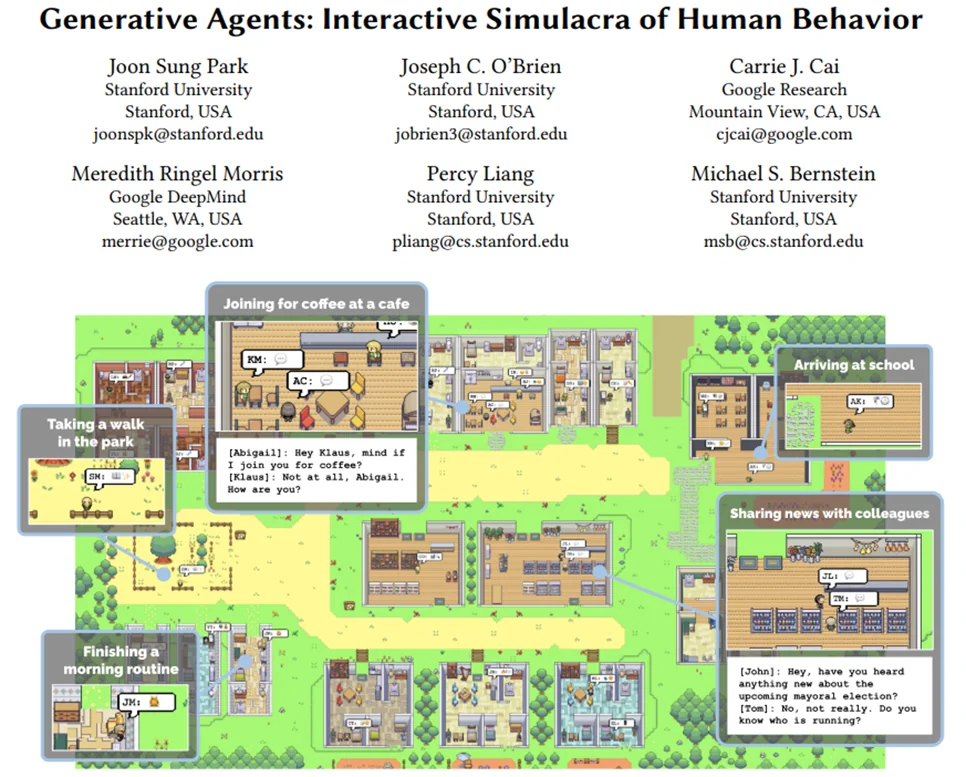

Generative Agents places LLMs in a virtual environment simulating a town where they can freely interact with each other. 

The simulation demonstrates emergent social behaviors like:
- Information spreading through the community
- Relationship memory (agents continuing previous conversations)
- Spontaneous social event organization
- Development of opinions and preferences based on experiences

For example, agents wake up, cook breakfast, and head to work; artists create while authors write; they form opinions, notice each other, and initiate conversations. They can remember past interactions and use them to plan future activities, creating a rich tapestry of simulated social life.

This project showcases how LLM agents can create complex, believable behaviors through the combination of memory, planning, and social interaction systems. The emergent behaviors demonstrate the potential for using such systems to study human social dynamics or create more realistic NPCs in games.

### ChatDev

ChatDev is an innovative open-source project that simulates a virtual software company powered by LLM agents. The system creates a collaborative environment where multiple specialized agents work together to develop software from natural language descriptions, similar to how human teams operate in real software companies.

Key features:
- **Role-Based Architecture**: Includes specialized agents like CEO, CTO, Programmers, Reviewers, and Testers
- **Natural Communication**: Agents collaborate through natural language discussions to design, implement and test software
- **Comprehensive Development Process**: Handles the complete software lifecycle from requirements analysis to testing
- **Customizable Framework**: Allows defining custom roles, development processes, and tool integrations
- **Multi-Agent Collaboration**: Leverages different agent perspectives and expertise to produce better solutions

  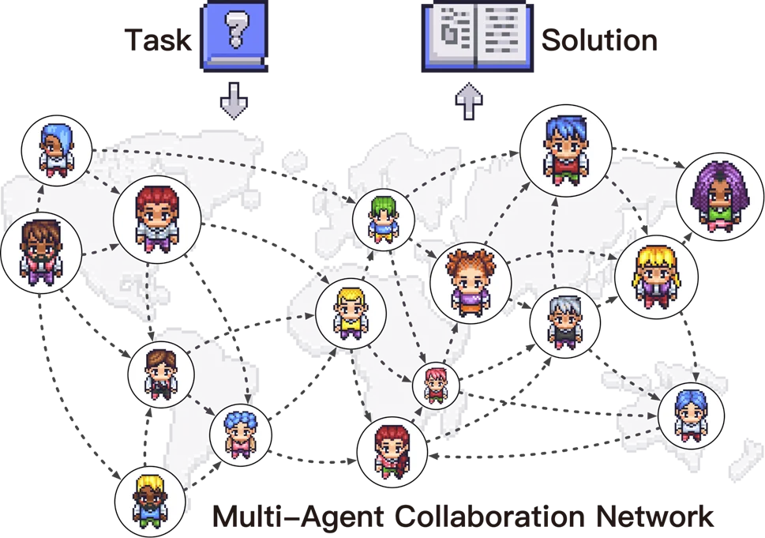

ChatDev integrates LLM agents with various social roles, working autonomously to develop comprehensive software solutions via multi-agent collaboration.

For example, when given a task to create a game, the CEO agent might first analyze requirements and create a project plan, the CTO would design the technical architecture, programmers would implement the code, reviewers would check for issues, and testers would verify functionality - all coordinating through natural language conversations.

The project demonstrates how structured multi-agent systems can tackle complex creative tasks by breaking them down into specialized roles and facilitating effective communication between agents. You can explore ChatDev through:
- [GitHub Repository](https://github.com/OpenBMB/ChatDev)
- [Interactive Demo Platform](https://chatdev.toscl.com/)

### ChemCrow

ChemCrow[^3] is a specialized LLM agent designed for complex chemistry tasks across organic synthesis, drug discovery, and materials design. Rather than relying on general chemistry knowledge, ChemCrow integrates 18 expert-designed chemistry tools that enable it to perform sophisticated chemical analysis and planning.

Key features:
- **Comprehensive Toolset**: Includes tools for molecular analysis, safety checks, reaction prediction, and literature search
- **Safety-First Design**: Automated checks for chemical weapons, explosives, and general safety considerations
- **Multi-Step Planning**: Can design and validate complex synthesis pathways
- **Literature Integration**: Combines web search and scientific paper analysis for up-to-date information
- **Python Integration**: Built-in REPL for computational chemistry tasks

The tools are organized into four main categories:
1. **General Tools**: Web search, literature search, Python REPL
2. **Molecule Tools**: Structure analysis, pricing, patent checking, similarity comparison
3. **Safety Tools**: Chemical weapon checks, explosive detection, safety summaries
4. **Chemical Reaction Tools**: Reaction naming, prediction, and synthesis planning

  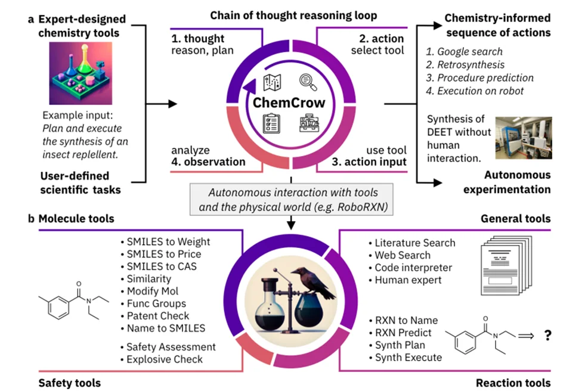

ChemCrow's workflow combines expert tools with LLM reasoning for chemistry tasks

ChemCrow follows a "Thought, Action, Action Input, Observation" workflow where it:
1. Reasons about the current state and goal
2. Selects appropriate chemistry tools
3. Executes actions and observes results
4. Iterates until reaching the solution

The system can integrate with robotic lab systems like IBM's RoboRXN for physical synthesis execution, bridging the gap between computational and experimental chemistry.

  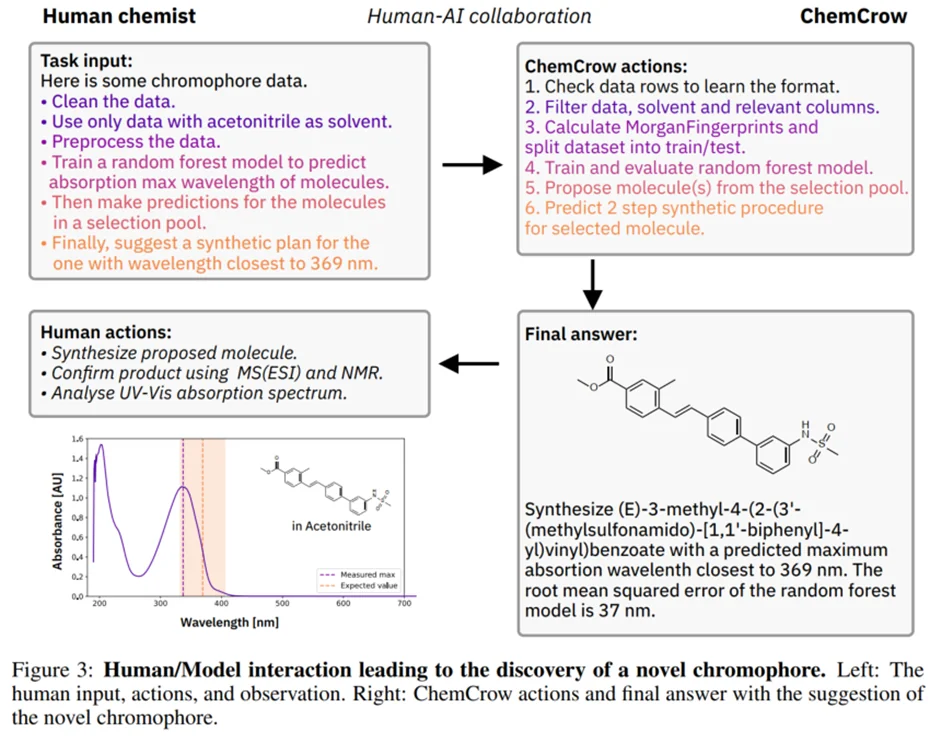

ChemCrow is designed to collaborate with human chemists, combining AI capabilities with expert oversight

[Source: In Silico Chemistry](https://www.insilicochemistry.io/tutorials/foundations/gpt-4-for-chemistry#h.vb7wz0s6qbcr)

### Voyager

Voyager[^4] is a groundbreaking LLM-powered agent that demonstrates autonomous learning and exploration in Minecraft. Unlike traditional game AI that follows predefined objectives, Voyager continuously explores its environment, develops new skills, and makes discoveries without human intervention.

Key components:
- **Automatic Curriculum**: Generates exploration goals based on current skills and world state
- **Skill Library**: Stores and retrieves executable code for complex behaviors
- **Iterative Prompting**: Refines code through environment feedback and self-verification

  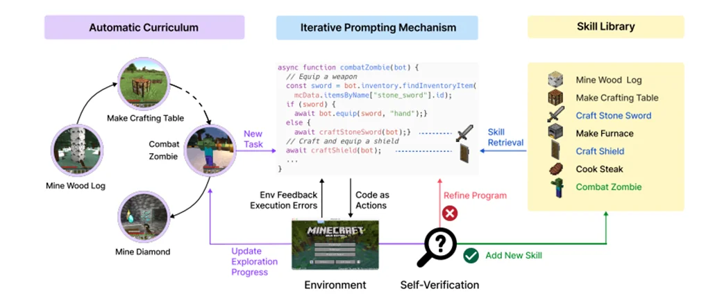

Voyager's curriculum generation process adapts to the agent's current capabilities and environment

The agent demonstrates impressive capabilities:
- Discovers 3.3x more unique items than previous approaches
- Traverses 2.3x longer distances across diverse terrains
- Unlocks tech tree milestones up to 15.3x faster than prior methods
- Successfully transfers skills to new worlds and tasks

  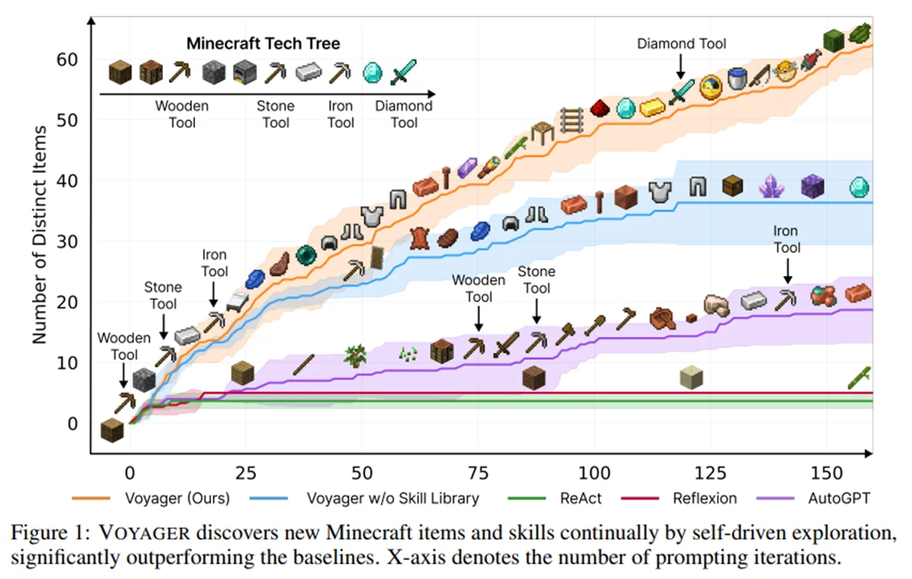

Voyager progressively discovers new technologies and crafting abilities through autonomous exploration

For example, if Voyager finds itself in a desert, it will prioritize learning to harvest sand and cactus before pursuing iron collection. The agent continuously refines its skills based on environmental feedback and stores mastered behaviors in its skill library for future use, much like how human players learn and adapt to the game.

You can explore Voyager through the [project website](https://voyager.minedojo.org/), which includes detailed documentation, examples, and research findings.

## Commercial Agent Applications & Products

The transition from research to production has begun, with companies deploying agent technology in real-world applications. These implementations often combine multiple advanced capabilities like code generation, tool use, and multi-agent collaboration into cohesive products that showcase what's currently possible with LLM agents.

### OS-Copilot

OS-Copilot[^5] breaks new ground by creating a generalist computer agent that can interact with entire operating systems. Its FRIDAY agent interfaces with comprehensive OS elements including the web, terminals, files, and third-party applications through a three-component architecture of Planner, Configurator, and Actor.

  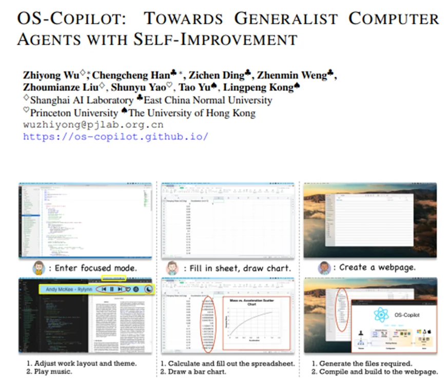

OS-Copilot's architecture enables comprehensive interaction with operating system components through self-improving capabilities

The system implements working, declarative, and procedural memory inspired by human cognition, allowing it to learn from experience. When encountering new tasks, it can generate Python tools on demand and verify their success, storing working solutions for future use. This approach has led to impressive results on the GAIA benchmark and enabled mastery of complex applications like Excel and PowerPoint.

You can explore more through their [project website](https://os-copilot.github.io/).

### Devin

Devin represents the next evolution in AI coding assistants by functioning as a complete development environment. Unlike traditional coding assistants that only suggest snippets, Devin operates autonomously with its own integrated terminal, editor, and browser.

  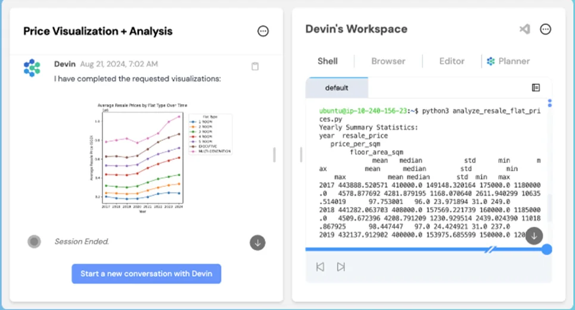

Devin's integrated development environment includes a terminal, editor, and browser for autonomous coding

The system handles diverse engineering tasks from code migrations to CI/CD pipeline management, learning from codebases and adapting to team-specific workflows. For instance, when setting up a Next.js repository, Devin can autonomously clone the repo, understand setup instructions, install dependencies, and resolve any issues that arise.

Learn more at [devin.ai](https://devin.ai/).

### Open-Interpreter

Open-Interpreter takes a different approach by providing a natural language interface to your computer's local capabilities. Unlike cloud-based solutions, it runs code directly on your machine with full system access.

  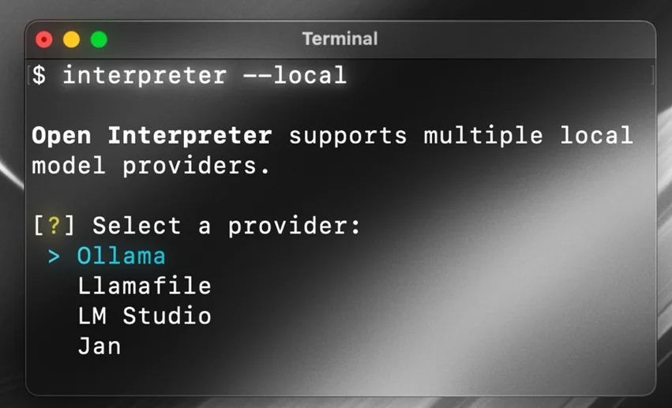

Open-Interpreter provides a natural language interface to your computer's capabilities through local code execution

The system supports multiple programming languages and shell commands, with built-in safety controls through a code review system. Its flexibility enables diverse applications from data analysis to system administration, all through a ChatGPT-like terminal interface. With over 55,000 GitHub stars, it has demonstrated significant community adoption.

Explore the project through their [GitHub repository](https://github.com/OpenInterpreter/open-interpreter).

### Claude Computer Use

Claude 3.5 Sonnet introduces a novel approach to computer interaction by enabling direct control of screens, cursors, and keyboards through visual understanding. This allows Claude to interact with any application through its graphical interface, rather than requiring specific API integrations.

  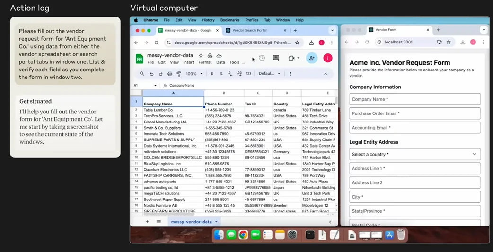

Claude can interact with computers through visual understanding and direct control of mouse and keyboard

The system outperforms other AI systems on the OSWorld benchmark, scoring 14.9% in screenshot-only tasks compared to the next best system's 7.8%. When given more steps, it achieves 22.0% accuracy. The capability is currently in beta and available through Anthropic's API, as detailed in their [announcement](https://www.anthropic.com/news/3-5-models-and-computer-use) and [documentation](https://docs.anthropic.com/en/docs/build-with-claude/computer-use).

### Replit Agent

Replit Agent integrates AI assistance directly into their cloud development environment, enabling end-to-end application development from natural language descriptions to production deployment.

  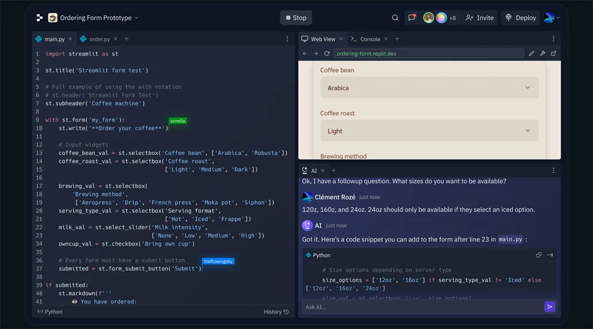

Replit Agent can develop and deploy web applications from natural language descriptions

The system has already enabled impressive real-world applications, from custom health dashboards to interactive campus maps. Available to Replit Core subscribers, it maintains project context across development sessions and even supports mobile development through their app.

Full details are available in their [announcement](https://blog.replit.com/introducing-replit-agent) and [documentation](https://docs.replit.com/replitai/agent).

### AIDE (AI Data Engineer)

AIDE pushes the boundaries of automated data science through its innovative Solution Space Tree Search (SSTS) approach. Unlike linear workflows, AIDE explores multiple solution paths simultaneously while iteratively refining promising approaches.

  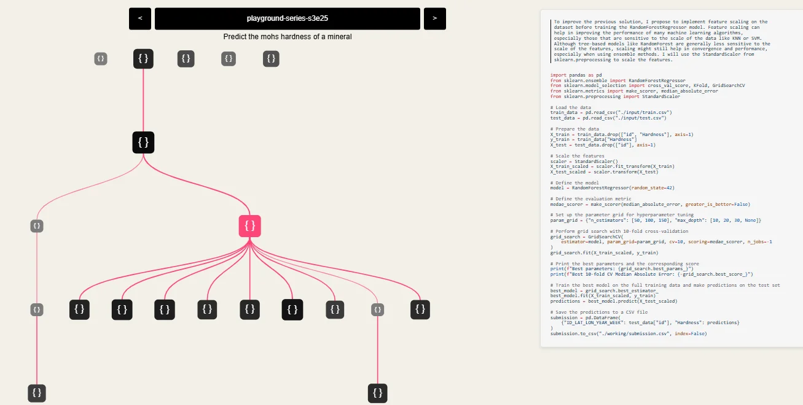

AIDE's Solution Space Tree Search explores multiple solution paths simultaneously

The system has achieved impressive results, reaching top 1% performance on multiple Kaggle competitions while generating novel feature engineering approaches. Its comprehensive pipeline handles everything from data preprocessing to model selection, producing clean, maintainable code throughout the process.

More details can be found in their [technical report](https://www.weco.ai/blog/technical-report).

# Closing Remarks

## References

[^1]: Du, Yilun, et al. "Improving factuality and reasoning in language models through multiagent debate." arXiv preprint arXiv:2305.14325 (2023).
[^2]: Park, Joon Sung, et al. "Generative agents: Interactive simulacra of human behavior." Proceedings of the 36th annual acm symposium on user interface software and technology. 2023.
[^3]: Bran, Andres M., et al. "ChemCrow: Augmenting large-language models with chemistry tools." arXiv preprint arXiv:2304.05376 (2023). [https://arxiv.org/abs/2304.05376](https://arxiv.org/abs/2304.05376)
[^4]: Wang, Guanzhi, et al. "Voyager: An open-ended embodied agent with large language models." arXiv preprint arXiv:2305.16291 (2023). [https://arxiv.org/abs/2305.16291](https://arxiv.org/abs/2305.16291)^
[^5]: OS-Copilot: Towards Generalist Computer Agents with Self-Improvement. [https://arxiv.org/abs/2402.07456](https://arxiv.org/abs/2402.07456)
