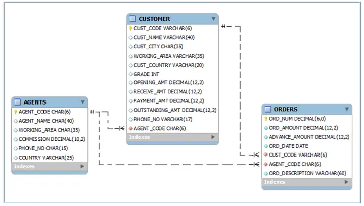
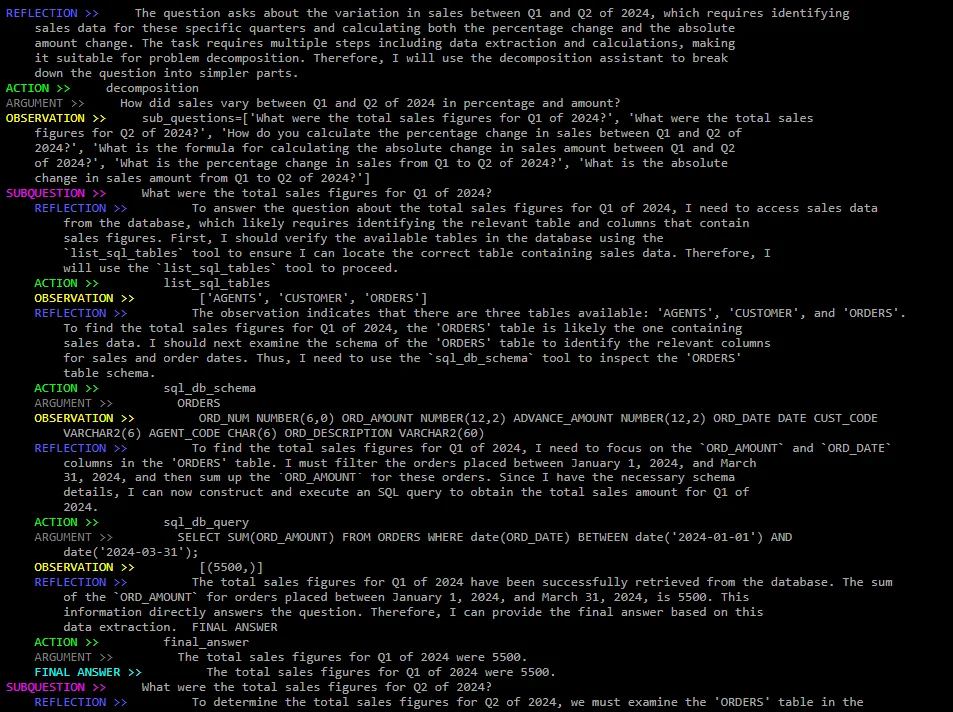
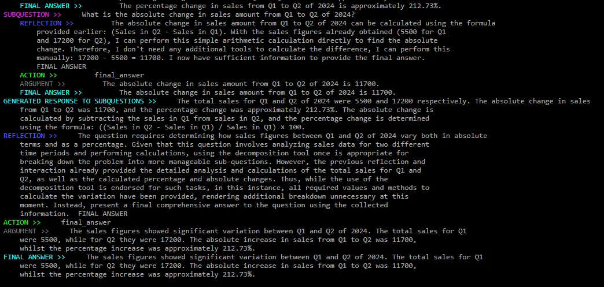

# Reasoning and Action Agents

# Setup

In this implementation of ReAct agents we will only use **standard Python libraries**, **pydantic** for output validations, and an LLM, which can be run locally with **ollama** or using an **API** from OpenAI, Anthropic, Google, etc. Besides, we will also use **ansi2html** to convert the output of the LLM to HTML to display the reasoning trace with colors and **dotenv** for the api key, but they are not necessary.

## Running the LLM with OpenAI

With the OpenAI API we can use the `openai` library. This is the easiest way to get started and the model is way more capable than the ones we can run locally, but you will have to create an account with payments information and pay for the API calls. It is not expensive, for development of this project and some evaluations expect it to cost less than 1USD. Just use the `gpt-4o-mini` model until it is completely implemented and then use the `gpt-4o` model to run it.

In this scenario you would need the following libraries:

```bash
pip install pydantic ansi2html dotenv openai
```

Next, you will have to set the environment variable `OPENAI_API_KEY` with your OpenAI API key. I recommend creating a `.env` file in the root of the project with the following content:

```bash
OPENAI_API_KEY=<your-openai-api-key>
```

Then you can use the following code to load the environment variables and run the LLM:

```python
from dotenv import load_dotenv
from openai import OpenAI

load_dotenv()
client = OpenAI()
response = client.chat.completions.create(
    model="gpt-4o-mini",
    messages=[{"role": "user", "content": "Hello!"}],
)
print(response.choices[0].message.content)
# Hello! How can I assist you today?
```

In the code above, we first import the necessary libraries. The `dotenv` library allows us to load environment variables from the `.env` file, ensuring that our API key is securely stored and easily accessible. By calling `load_dotenv()`, we make the `OPENAI_API_KEY` available to our script.

Next, we create an instance of the OpenAI client. We then use the `chat.completions.create` method to send a message to the model. The `model` parameter specifies which OpenAI model to use—in this case, `gpt-4o-mini`. The `messages` parameter is a list of messages in the conversation; here, we start with a simple user message saying "Hello!".

Finally, we print the assistant's response by accessing `response.choices[0].message.content`. This should output a friendly greeting from the model, demonstrating that our setup is working correctly.

## Running the LLM with Ollama

For running the LLM with **ollama**, which is a lightweight, open-source, and easy-to-use tool to run large language models on your own hardware, you can download it from the [official website](https://ollama.com/download).

Next, you will have to download a model. At the time of writing this post, I recommend downloading the [llama3.2](https://ollama.com/library/llama3.2) model or the [qwen2.5-coder](https://ollama.com/library/qwen2.5-coder) model. Choose one with size 3B if your hardware is not too powerful, otherwise you can use one with around 7B. You can download them with the following command: `ollama pull llama3.2:3b` or `ollama pull qwen2.5-coder:7b`.

You can use the following command to start the server: `ollama serve llama3.2:3b`. This will allow you to use the ollama python library to run the LLM from your script.

In this scenario you would need the following libraries:

```bash
pip install pydantic ansi2html ollama
```

Next, once you have the server running, you can use the following code to run the LLM:

```python
import ollama

response = ollama.chat(
    model="llama3.2:3b",  # or qwen2.5-coder:7b
    messages=[{"role": "user", "content": "Hello!"}],
)
print(response["message"]["content"])
# Hello! How can I assist you today?
```

In this snippet, we import the `ollama` library, which provides an interface to interact with the locally hosted LLM. The `ollama.chat` function sends a message to the model specified by the `model` parameter. We pass a list of messages to simulate a conversation, starting with the user's greeting "Hello!". The model's response is captured in the `response` variable, and we print out the assistant's reply by accessing `response["message"]["content"]`.

By running this code, you're effectively communicating with the LLM running on your local machine, without the need for external API calls. This is particularly useful if you want to avoid API costs or have more control over the model's execution.

In my implementation I have written a simple wrapper around both APIs to allow for a unified interface, that determines which API to use based on the model name.

```python
import os

# Unified Chat API
class UnifiedChatAPI:
    """Unified interface for OpenAI and Ollama chat APIs."""

    def __init__(self, model="gpt-4o-mini", openai_api_key=None):
        self.model = model
        self.api_key = openai_api_key or os.getenv("OPENAI_API_KEY")
        self.api = self._determine_api()
        if self.api == "openai":
            if not self.api_key:
                raise ValueError("OpenAI API key must be provided for OpenAI models.")
            else:
                self.client = openai.OpenAI(api_key=self.api_key)
        elif self.api == "ollama":
            self.client = None

    def _determine_api(self):
        """Determine the API based on the model name."""
        if self.model.startswith("gpt-") or self.model.startswith("o1-"):
            return "openai"
        else:
            return "ollama"

    def chat(self, messages):
        """Wrapper for chat API."""
        if self.api == "openai":
            return self._openai_chat(messages)
        elif self.api == "ollama":
            return self._ollama_chat(messages)
        else:
            raise ValueError("Unsupported API. Please set the API to 'openai' or 'ollama'.")

    def _openai_chat(self, messages):
        response = self.client.chat.completions.create(model=self.model, messages=messages)
        return response.choices[0].message.content

    def _ollama_chat(self, messages):
        response = ollama.chat(model=self.model, messages=messages)
        return response["message"]["content"]
```

This `UnifiedChatAPI` class provides a seamless way to switch between OpenAI and Ollama models based on the model name. In the `__init__` method, we determine which API to use by checking the prefix of the `model` name. If it starts with `gpt-` or `o1-`, we use the OpenAI API; otherwise, we default to Ollama.

The `chat` method acts as a wrapper that directs the chat request to the appropriate underlying API. This abstraction allows the rest of our code to remain agnostic of the backend, making it easier to manage and switch between different models.

I recommend you copy the previous code since I will be using the `UnifiedChatAPI` class with the `chat` method, or at least implement a wrapper with a similar `chat` method for your own use.

# Agent Design

Once we have the LLM running, we can start designing the agent. The first thing we need to do is to define the **toolbox**, the actions that the agent can take. In this case I will give my agent the capabilities to query a structured database using SQL, and use a calculator. In this way it can answer questions about the database and do basic calculations.

For the database I will use a simple SQLite database with three tables: `AGENTS`, `CUSTOMER` and `ORDERS`. You can download the database from the same [repository](https://github.com/miguelvc6/react-agent/blob/main/sql_lite_database.db) or build it by running the `create_database.py` [script](../../media/2024-11-25-reasoning-and-action-agents/create_database.py).

<p align="center">
  
</p>

<p style="text-align:center; font-style: italic;">Database schema.</p>

The diagram above illustrates the structure of our SQLite database, showcasing the relationships between the `AGENTS`, `CUSTOMER`, and `ORDERS` tables. This simple schema allows our agent to interact with real data, perform queries, and answer questions that involve retrieving and processing information from these tables.

By giving the agent access to this database, we enable it to handle more complex tasks such as calculating sales figures, analyzing customer behavior, or summarizing order details. This setup provides a practical context for demonstrating how the agent uses tools to interact with external data sources.

## Tools

To interact with the database I will give the agent the capability to list all the tables, to get the schema of a table and to execute SQL queries and return the results. For the calculator I will give it the capability to perform arithmetic operations with the eval function. A simple implementation of the tools is the following:

```python
import sqlite3

def math_calculator(expression: str) -> float:
    """Evaluate a mathematical expression."""
    result = eval(expression)
    return result


def list_sql_tables() -> list:
    """List all tables in the SQL database."""
    cursor.execute("SELECT name FROM sqlite_master WHERE type='table';")
    result = cursor.fetchall()
    return [table[0] for table in result]


def sql_db_schema(table_name: str) -> str:
    """Return schema of a specific table in the database."""
    cursor.execute(f"PRAGMA table_info({table_name});")
    result = cursor.fetctable_namehall()
    schema = "\n".join([f"{row[1]} {row[2]}" for row in result])
    return schema


def sql_db_query(query: str) -> str:
    """Run an SQL query and return the result."""
    cursor.execute(query)
    result = cursor.fetchall()
    return str(result)
```

In this code, we define four functions that the agent will use as tools:

-   **`math_calculator`**: This function evaluates a mathematical expression passed as a string. It uses Python's built-in `eval()` function to compute the result. While this is sufficient for basic arithmetic, be cautious with `eval()` due to potential security risks if the input is not properly sanitized. A more sophisticated calculator could be implemented using the [sympy](https://www.sympy.org/en/index.html) library for symbolic mathematics.

-   **`list_sql_tables`**: This function retrieves a list of all table names in the SQLite database. It executes a query on the `sqlite_master` table, which stores metadata about the database schema.

-   **`sql_db_schema`**: Given a table name, this function returns the schema of that table. It uses the `PRAGMA table_info` command to get details about each column in the table, such as the column name and data type.

-   **`sql_db_query`**: This function executes an SQL query provided as a string and returns the fetched results. It's a powerful tool that allows the agent to perform custom queries on the database.

By implementing these tools, we equip our agent with the capabilities to interact with the database and perform calculations, enabling it to handle a variety of queries involving data retrieval and processing.

## Reasoning Prompt

Now that we have the tools, we can start designing the prompts. Since it is a ReAct agent, we need to design a prompt for the reasoning step and a prompt for the acting step.

The objective of the **reasoning** step is to plan the action that the agent will take. The prompt should give the agent the capability to plan and reason about the result of its actions. We have to pass the descriptions and arguments of the tools to the agent so it can select the appropriate one, along with an extra `final_answer` tool that will allow the agent to answer the question and finish the task if it has enough information.

This would be enough for our agent, but we can improve it by adding a `decomposition` tool that will allow the agent to break down complex tasks into simpler ones, and then they are recursively solved. This complicates the implementation but we are here to learn.

```python
REFLECTION_SYSTEM_PROMPT = """GENERAL INSTRUCTIONS
Your task is to reflect on the question and context to decide how to solve it.
You must decide whether to use a tool, an assistant, or give the final answer if you have sufficient information.
Write a brief reflection with the indicated response format.
Do not call any actions or tools, return only the reflection.

AVAILABLE TOOLS
- list_sql_tables: {"Description": "Returns a list with the names of tables present in the database", "Arguments": None}
- sql_db_schema: {"Description": "Returns the schema of a specific table in the database", "Arguments": table_name - str}
- sql_db_query: {"Description": "Executes an SQL query in the sqlite3 database and returns the results. \
    Do not use without first observing the table schema", "Arguments": sql_query - str}
- math_calculator: {"Description": "Performs basic mathematical calculations", "Arguments": expression - str}

AVAILABLE ASSISTANTS
- decomposition: {"Description": "Divides a complex question into simpler sub-parts and calls agents \
    to solve them recursively. Use only for complex questions", "Arguments": question - str}

AVAILABLE ACTION
- final_answer: {"Description": "Final answer for the user. Must answer the question asked.", "Arguments": "answer - str"}

RESPONSE FORMAT
REFLECTION >> <Fill>
"""
```

This prompt instructs the agent on how to perform the reasoning step. It includes:

-   **General Instructions**: Guidance on reflecting upon the question and deciding the best course of action.

-   **Available Tools and Assistants**: A detailed list of tools and assistants the agent can use, including their descriptions and required arguments. This helps the agent understand its capabilities.

-   **Response Format**: Specifies that the agent should output its reflection in a particular format (`REFLECTION >> <Fill>`), ensuring consistency and ease of parsing.

By providing these details, we help the agent plan its approach effectively, deciding whether to use a tool, an assistant, or provide the final answer directly.

To test the reasoning step, I have called gpt with `REFLECTION_SYSTEM_PROMPT` as system prompt, and have asked it a question.

```python
import textwrap

reflection = client.chat.completions.create(
    model="gpt-4o-mini",
    messages=[
        {"role": "system", "content": REFLECTION_SYSTEM_PROMPT},
        {"role": "user", "content": "How much did income increase between Q1 2024 and Q2 2024?"},
    ],
)
reflection = reflection.choices[0].message.content
print(textwrap.fill(reflection, width=100))
```

The response is the following:

```output
REFLECTION >> To answer this question, I would need to access the database
that contains the records of income for the specific quarters between 2024.
First, it would be useful to identify the available tables and then check
the schema of the table that contains the income data.
This will allow me to prepare an SQL query that calculates the growth between
the first and second quarter of 2024.
Therefore, I should start by listing the tables in the database.
```

In this output, the agent demonstrates a logical plan to solve the question:

-   **Accessing the Database**: Recognizes the need to retrieve income data from the database.

-   **Identifying Tables**: Decides to list the available tables to find where the income data might be stored.

-   **Checking Table Schema**: Plans to examine the schema of the relevant table to understand its structure.

-   **Preparing SQL Query**: Intends to write an SQL query to calculate the income growth between the specified quarters.

-   **First Step**: Concludes that the initial action should be listing the tables.

This reflection shows that the agent is effectively reasoning about the steps required to answer the question, leveraging the tools at its disposal.

## Action Prompt

In the act step, the agent must take the action decided in the reflection step. The prompt should give the agent the capability to act and use the tools. It is also important to specify a format for the model's response, in this case a JSON format. We will later use pydantic to validate the format.

An important detail is that we don't want our model to be able to use the `decomposition` tool while answering a decomposed subquestion, since it could lead to many nested loops, which could potentially increase our token consumption and waiting time. To avoid this we will only write the tool name in the prompt when we are not in a decomposed subquestion.

```python
ACTION_SYSTEM_PROMPT_01 = """GENERAL INSTRUCTIONS
Your task is to answer questions using an SQL database and performing mathematical calculations.
If you already have enough information, you should provide a final answer.
You must decide whether to use a tool, an assistant, or give the final answer, and return a response following the response format.
Fill with null where no tool or assistant is required.

IMPORTANT:
- The response must be in valid JSON format.
- Ensure all text strings are properly escaped.
- Do not include line breaks within strings.
- If the argument is an SQL query or a mathematical expression, include it on a single line and in double quotes.

AVAILABLE TOOLS
- list_sql_tables: {"Description": "Returns a list with the names of tables present in the database", "Arguments": null}
- sql_db_schema: {"Description": "Returns the schema of a specific table in the database", "Arguments": "table_name" - str}
- sql_db_query: {"Description: "Executes an SQL query in the sqlite3 database and returns the results. \
    Do not use without first observing the table schema", Arguments: sql_query - str}
- math_calculator: {"Description": "Performs basic mathematical calculations", "Arguments": "expression" - str}
"""

ACTION_SYSTEM_PROMPT_DECOMPOSITION = """
AVAILABLE ASSISTANTS
- decomposition: {"Description: "Divides a complex question into simpler sub-parts and calls agents \
    to solve them recursively. Use only for complex questions", Arguments: question - str}
"""

ACTION_SYSTEM_PROMPT_02 = """
AVAILABLE ACTION
- final_answer: {"Description": "Final answer for the user. Must answer the question asked.", "Arguments": "answer - str"}

RESPONSE FORMAT
{
  "request": "<Fill>",
  "argument": "<Fill or null>"
}

EXAMPLES:

1. Using a tool without an argument:
{
  "request": "list_sql_tables",
  "argument": null
}

2. Using a tool with an argument:
{
  "request": "sql_db_schema",
  "argument": "ORDERS"
}

3. Using sql_db_query with an SQL query:
{
  "request": "sql_db_query",
  "argument": "SELECT * FROM ORDERS WHERE date(ORD_DATE) BETWEEN date('2024-01-01') AND date('2024-06-30');"
}

4. Final answer:
{
  "request": "final_answer",
  "argument": "There were a total of 305 orders in 2024."
}
```

Our action prompt will be either `ACTION_SYSTEM_PROMPT_01 + ACTION_SYSTEM_PROMPT_DECOMPOSITION + ACTION_SYSTEM_PROMPT_02` if the agent is working on the main question, or `ACTION_SYSTEM_PROMPT_01 + ACTION_SYSTEM_PROMPT_02` if it is working on a decomposed subquestion.

We have also given some examples of tool calls to gain some few-shot learning performance increase. This could be improved with a vector database that stores tool call examples that are later dynamically retrieved through Retrieval Augmented Generation depending on the context in every Act step.

Let's test the action step with the same question as before.

```python
import json

# Pydantic model for the agent action
class AgentAction(BaseModel):
    request: str
    argument: str | None

agent_action = client.chat.completions.create(
    model="gpt-4o-mini",
    messages=[
        {"role": "system", "content": ACTION_SYSTEM_PROMPT},
        {"role": "user", "content": "¿Cuánto creció el ingreso entre el Q1 de 2024 y el Q2 de 2024?"},
    ],
)
agent_action = json.loads(agent_action.choices[0].message.content)
validated_action = AgentAction.model_validate(agent_action)
print(validated_action)
```

The response is to use the `list_sql_tables` tool with no arguments.

```output
AgentAction(request='list_sql_tables', argument=None)
```

In this test, we simulate the agent's decision-making process during the action step. We define a `AgentAction` pydantic model to validate the assistant's response, ensuring it follows the expected JSON format.

The agent decides to use the `list_sql_tables` tool, which aligns with the reflection where it planned to list the tables first. The absence of an argument (`argument=None`) indicates that this tool doesn't require any additional input.

By validating the response using pydantic, we can catch any formatting errors early and prompt the assistant to correct them, enhancing the robustness of our agent.

These are all the main prompts we are going to use for our agent. They can be stored in a `prompts.py` script and then imported into our main script.

# Implementation

With the prompts ready, we can start implementing the agent. I will use an Object-Oriented approach to implement the agent, its loop of reflection and acting, and the tools.

## Script Setup

First, import the necessary libraries and the prompts.

```python
import json
import os
import sqlite3
import textwrap
from typing import List, Optional

import openai
import ollama
from ansi2html import Ansi2HTMLConverter
from pydantic import BaseModel, ValidationError

from prompts import (
    ACTION_SYSTEM_PROMPT_01,
    ACTION_SYSTEM_PROMPT_02,
    ACTION_SYSTEM_PROMPT_DECOMPOSITION,
    REFLECTION_SYSTEM_PROMPT,
)
```

Here, we import standard Python libraries for handling JSON, operating system interactions, database connections, and text formatting. We also import `openai` and `ollama` for interacting with the respective APIs, `ansi2html` for converting ANSI escape sequences to HTML (useful for saving the reasoning trace), and `pydantic` for data validation.

We import our prompt definitions from the `prompts.py` script, keeping our main script clean and focused on the implementation.

Now you can define the previous `UnifiedChatAPI` class. Next, we implement the pydantic models.

```python
# Pydantic Models for output validation
class DecomposedQuestion(BaseModel):
    sub_questions: List[str]


class AgentAction(BaseModel):
    request: str
    argument: Optional[str]


class AnswersSummary(BaseModel):
    summary: str
```

These pydantic models are used to validate the agent's outputs at different stages:

-   **`DecomposedQuestion`**: Validates the output of the `decomposition` assistant, ensuring we receive a list of sub-questions.

-   **`AgentAction`**: Validates the action the agent decides to take, ensuring it includes a `request` and an optional `argument`.

-   **`AnswersSummary`**: Validates the summary generated after answering decomposed sub-questions.

By enforcing strict output formats, we reduce the risk of errors and make our agent's behavior more predictable.

The `AnswersSummary` model will be used when, after decomposing the question into subquestions, and they have been answered, we want to summarize the answers into a single final answer before continuing with the main task. This will be easily understood later on when we implement the `decomposition` tool.

## Memory

The main memory we will use is the `context` class attribute, which will store the context of the conversation. This will be updated at each iteration of the loop, and it will be used to pass the context to the next iteration. This includes the user question, the tools' outputs and all the text that the agent has generated so far.

Additionally, we implement a long term memory using a simple `agent_memory.json` file to store the pairs of questions and answers for every task. This will allow the agent to learn from previous interactions and if a question is similar to a previous one, it can answer it using the information stored in the memory rather than having to answer it from scratch.

```python
class SimpleMemory:
    """Simple in-memory storage for question and answer traces."""

    def __init__(self):
        self.question_trace = []
        self.answer_trace = []

    def add_interaction(self, question, answer):
        self.question_trace.append(question)
        self.answer_trace.append(answer)

    def get_context(self):
        if not self.question_trace:
            return ""
        else:
            context_lines = [
                "Here are the questions and answers from the previous interactions.",
                "Use them to answer the current question if they are relevant:",
            ]
            for q, a in zip(self.question_trace, self.answer_trace):
                context_lines.append(f"QUESTION: {q}")
                context_lines.append(f"ANSWER: {a}")
            return "\n".join(context_lines)
```

This `SimpleMemory` class provides a way to store and retrieve past interactions. The `add_interaction` method appends new questions and answers to the respective lists, and `get_context` constructs a context string from the stored interactions. This context can then be used by the agent to maintain continuity in the conversation.

This is a simple implementation of a memory that stores the question and answer traces in a list. It is not a sophisticated memory, but it is enough for our purposes.

## Agent Class

We can finally implement the agent class. This will include the loop of reflection and acting, as well as the tools. I will divide the code in different blocks, although it actually is a single class.

First, we define the class and its attributes.

```python
# Big Agent Class
class AgentReAct:
    """Agent class implementing the ReAct framework."""

    def __init__(self, model="gpt-4o-mini", db_path="./sql_lite_database.db", memory_path="agent_memory.json"):
        """Initialize Agent with database path and model."""
        self.model = model # Model to use for the agent
        self.client = UnifiedChatAPI(model=self.model) # Unified chat API
        self.memory = self.load_memory() # Memory
        self.context = "" # Context of the conversation
        self.db_path = db_path # Path to the database
        self.conn = None # Connection to the database
        self.cursor = None # Cursor to the database
        self._connect_db() # Connect to the database
        self.memory_path = memory_path # Path to the memory file
```

In this constructor, we set up the agent's environment:

-   **Model and Client**: Specify which language model to use and initialize the `UnifiedChatAPI` client.

-   **Memory**: Load the agent's memory from a file or initialize a new one.

-   **Database Connection**: Establish a connection to the SQLite database and create a cursor for executing SQL commands.

-   **Context and Paths**: Initialize the conversation context and store paths to the database and memory files.

All the attributes should be self-explanatory, except for the `load_memory` and `_connect_db` methods, which load the memory from the `self.memory_path` file and connect to the database and initialize the cursor. Let's implement the database management logic.

```python
    # Database Management
    def _connect_db(self):
        """Connect to the SQLite database."""
        if not os.path.exists(self.db_path):
            raise RuntimeError(f"Database file not found at: {self.db_path}")
        try:
            self.conn = sqlite3.connect(self.db_path)
            self.cursor = self.conn.cursor()
        except sqlite3.Error as e:
            self._close_db()
            raise RuntimeError(f"Database connection failed: {e}")

    def _close_db(self):
        """Close the database connection."""
        if self.cursor:
            self.cursor.close()
        if self.conn:
            self.conn.close()
        self.cursor = None
        self.conn = None

    def __del__(self):
        """Destructor to ensure the database connection is closed."""
        self._close_db()
```

These methods handle the database lifecycle:

-   **`_connect_db`**: Checks if the database file exists and attempts to connect to it. If the connection fails, it raises an error.

-   **`_close_db`**: Closes the database connection and cursor, ensuring no resources are left open.

-   **`__del__`**: A destructor method that ensures the database connection is closed when the agent is destroyed.

Now we implement a couple methods to load and save the memory to the `agent_memory.json` file.

```python
    # Memory Management
    def load_memory(self):
        """Load the agent memory from a JSON file."""
        if os.path.exists(self.memory_path):
            with open(self.memory_path, "r", encoding="utf-8") as f:
                return json.load(f)
        else:
            return SimpleMemory()

    def save_memory(self):
        """Save the agent memory to a JSON file."""
        with open(self.memory_path, "w", encoding="utf-8") as f:
            json.dump(
                {"question_trace": self.memory.question_trace, "answer_trace": self.memory.answer_trace},
                f,
                indent=4,
            )
```

These methods handle persisting the agent's memory:

-   **`load_memory`**: Attempts to load the memory from a JSON file. If the file doesn't exist, it initializes a new `SimpleMemory` instance.

-   **`save_memory`**: Writes the current memory state to a JSON file, allowing the agent to retain information across sessions.

We can now implement the main loop of the agent. Let's start with the reflection step.

```python
    # Agent Reflections
    def reflection(self, question: str) -> str:
        """Perform an agent reflection."""
        context = self.context or "<No previous questions have been asked>"
        agent_template = f"""CONTEXTUAL INFORMATION
{context}

QUESTION
{question}"""

        assistant_reply = self.client.chat(
            [
                {"role": "system", "content": REFLECTION_SYSTEM_PROMPT},
                {"role": "user", "content": agent_template},
            ]
        )
        return assistant_reply
```

In the `reflection` method, the agent constructs a message containing the context and the question, and sends it to the LLM with the `REFLECTION_SYSTEM_PROMPT`. The assistant's reply is the agent's reflection on how to approach the question.

Now the action step is a little more complex.

In the `action` method, the agent constructs an action prompt similar to the reflection prompt but tailored for decision-making. The method determines whether the agent is in a recursive call (i.e., answering a decomposed subquestion) and adjusts the prompt accordingly to prevent excessive recursion.

```python
    def action(self, question: str, recursion=False, max_retrials: int = 3) -> AgentAction:
        """Determine the next action for the agent."""
        action_system_prompt = (
            ACTION_SYSTEM_PROMPT_01 + (not recursion) * ACTION_SYSTEM_PROMPT_DECOMPOSITION + ACTION_SYSTEM_PROMPT_02
        )

        context = self.context or "<No previous questions have been asked>"
        agent_template = f"""CONTEXTUAL INFORMATION
{context}

QUESTION
{question}"""
```

In this code, the `action_system_prompt` is built by concatenating the appropriate prompts. If the agent is not in a recursive call (`recursion=False`), it includes the `ACTION_SYSTEM_PROMPT_DECOMPOSITION` to allow the use of the `decomposition` tool. The `agent_template` includes the context and the current question.

The agent then enters a loop to attempt parsing the model's response:

```python
    for attempt in range(max_retrials):
        assistant_reply = self.client.chat(
            [
                {"role": "system", "content": action_system_prompt},
                {"role": "user", "content": agent_template},
            ]
        )

        try:
            # Attempt to extract the JSON object from the assistant's reply
            start_index = assistant_reply.find("{")
            end_index = assistant_reply.rfind("}") + 1
            json_str = assistant_reply[start_index:end_index]
            agent_action = json.loads(json_str)
            validated_response = AgentAction.model_validate(agent_action)
            return validated_response
        except (json.JSONDecodeError, ValidationError) as e:
            error_msg = self.format_message(f"Validation error on attempt {attempt + 1}: {e}", "ERROR", 0)
            print(f"Assistant reply on attempt {attempt + 1}:\n{assistant_reply}\n")
            self.context += error_msg
            # Provide feedback to the assistant about the error
            agent_template += (
                "\n\nERROR >> The previous response was not valid JSON or did not follow the expected format."
                " Please respond with a valid JSON object matching the required format."
            )
            continue

    raise RuntimeError("Maximum number of retries reached without successful validation.")
```

Here, the agent tries to extract a JSON object from the assistant's reply, ensuring it matches the expected format. If parsing fails due to a `JSONDecodeError` or validation fails due to a `ValidationError`, it appends an error message to the context and updates the `agent_template` to inform the assistant of the mistake. The process retries up to `max_retrials` times before raising an exception.

This loop helps the agent handle cases where the model's output isn't in the correct format, making the system more robust by allowing the model to correct its response.

Now, we implement the main loop where the agent continuously reflects, decides on actions, and executes them until it reaches a final answer or encounters an error.

```python
    def run_agent(self, question: str, recursion: bool = False, indent_level: int = 0) -> str:
        """Run the ReAct agent to answer a question."""
        if not recursion:
            self.context = self.memory.get_context()
            print("\n")

        while True:
            try:
                self.perform_reflection(question, indent_level)
                action = self.decide_action(question, recursion, indent_level)
                result = self.execute_action(action, question, recursion, indent_level)

                if result is not None:
                    return result

            except Exception as e:
                error_msg = self.format_message(str(e), "ERROR", indent_level)
                self.context += error_msg
                break
```

In the `run_agent` method:

-   **Initialization**: If not in recursion, it resets the context using the agent's memory.
-   **Loop**: It enters a loop where it:
    -   Performs reflection to plan the next steps.
    -   Decides on the next action based on the reflection.
    -   Executes the action and checks if a final result is obtained.
-   **Error Handling**: If an exception occurs, it logs the error and breaks the loop.

The helper methods `perform_reflection`, `decide_action`, and `execute_action` manage specific tasks in the loop.

```python
    def perform_reflection(self, question: str, indent_level: int):
        """Perform reflection and update context."""
        reflection = self.reflection(question=question)
        reflection_msg = self.format_message(reflection.split(">> ")[1], "REFLECTION", indent_level)
        self.context += reflection_msg

    def decide_action(self, question: str, recursion: bool, indent_level: int, max_retrials: int = 3) -> AgentAction:
        """Decide on the next action and update context."""
        action = self.action(question=question, recursion=recursion, max_retrials=max_retrials)
        action_msg = self.format_message(action.request, "ACTION", indent_level)
        self.context += action_msg
        if action.argument:
            arg_msg = self.format_message(action.argument, "ARGUMENT", indent_level)
            self.context += arg_msg
        os.system("cls" if os.name == "nt" else "clear")
        print(self.context)
        return action
```

These methods update the context with the reflection and action, format the messages for readability, and handle indentation levels for nested subquestions.

The `execute_action` method carries out the chosen action:

```python
    def execute_action(self, action: AgentAction, question: str, indent_level: int) -> Optional[str]:
        """Execute the chosen action and handle the result."""
        try:
            result = None
            # Execute the chosen action
            if action.request == "list_sql_tables":
                result = self.list_sql_tables()
            elif action.request == "sql_db_schema":
                result = self.sql_db_schema(action.argument)
            elif action.request == "sql_db_query":
                result = self.sql_db_query(action.argument)
            elif action.request == "math_calculator":
                result = self.math_calculator(action.argument)
            elif action.request == "decomposition":
                self.handle_decomposition(action, indent_level)
                return None  # Continue the loop
            elif action.request == "final_answer":
                self.handle_final_answer(question, action, indent_level)
                return action.argument  # Return the final answer
            else:
                raise ValueError(f"Unknown action request: {action.request}")

            # Append observation to context
            if result is not None:
                obs_msg = self.format_message(str(result), "OBSERVATION", indent_level)
                self.context += obs_msg
        except Exception as e:
            # Append error observation to context
            error_msg = self.format_message(f"Error executing {action.request}: {str(e)}", "ERROR", indent_level)
            self.context += error_msg
        return None  # Continue the loop
```

This method:

-   **Action Execution**: Calls the appropriate tool method based on `action.request`.
-   **Special Cases**: Handles `decomposition` and `final_answer` differently, as they involve recursive behavior or concluding the task.
-   **Context Update**: Adds observations or errors to the context for transparency.
-   **Loop Control**: Returns `None` to continue the loop unless a final answer is reached.

Next, we define the tool methods that the agent can use:

```python
    # Tools
    def math_calculator(self, expression: str) -> Optional[float]:
        """Evaluate a mathematical expression."""
        try:
            result = eval(expression)
            return result
        except Exception as e:
            print(f"Error evaluating expression: {e}")
            return None

    def list_sql_tables(self) -> Optional[List[str]]:
        """List all tables in the SQL database."""
        try:
            self.cursor.execute("SELECT name FROM sqlite_master WHERE type='table';")
            result = self.cursor.fetchall()
            return [table[0] for table in result]
        except Exception as e:
            print(f"Error listing tables: {e}")
            return None

    def sql_db_schema(self, table_name: str) -> Optional[str]:
        """Return schema of a specific table in the database."""
        try:
            self.cursor.execute(f"PRAGMA table_info({table_name});")
            result = self.cursor.fetchall()
            schema = "\n".join([f"{row[1]} {row[2]}" for row in result])
            return schema
        except Exception as e:
            print(f"Error retrieving schema for table {table_name}: {e}")
            return None

    def sql_db_query(self, query: str) -> Optional[str]:
        """Run an SQL query and return the result."""
        try:
            self.cursor.execute(query)
            result = self.cursor.fetchall()
            return str(result)
        except Exception as e:
            print(f"Error executing query: {e}")
            return None
```

These methods implement the functionalities of the tools specified in the prompts, allowing the agent to perform calculations and interact with the database.

We also need to handle the `final_answer` action appropriately:

```python
    # Final Answer Tool
    def handle_final_answer(self, question: str, action: AgentAction, indent_level: int):
        """Handle the final answer action."""
        # Update memory
        self.memory.add_interaction(question, action.argument)
        final_answer_msg = self.format_message(action.argument, "FINAL ANSWER", indent_level)
        self.context += final_answer_msg
        os.system("cls" if os.name == "nt" else "clear")
        print(self.context)
```

This method updates the agent's memory with the question and final answer, formats the answer for display, and updates the context.

To implement the `decomposition` tool, we include methods to decompose complex questions and summarize answers:

```python
    # Assistants
    def decompose_question(self, question: str, max_retrials: int = 3) -> DecomposedQuestion:
        """Decompose a complex question into simpler parts."""
        decomp_system_prompt = """GENERAL INSTRUCTIONS
    You are an expert in the domain of the following question. Your task is to decompose a complex question into simpler parts.

    RESPONSE FORMAT
    {"sub_questions":["<FILL>"]}"""

        for attempt in range(max_retrials):
            assistant_reply = self.client.chat(
                [
                    {"role": "system", "content": decomp_system_prompt},
                    {"role": "user", "content": question},
                ]
            )

            try:
                response_content = json.loads(assistant_reply)
                validated_response = DecomposedQuestion.model_validate(response_content)
                return validated_response
            except (json.JSONDecodeError, ValidationError) as e:
                print(f"Validation error on attempt {attempt + 1}: {e}")

        raise RuntimeError("Maximum number of retries reached without successful validation.")

    def answers_summarizer(self, questions: List[str], answers: List[str], max_retrials: int = 3) -> AnswersSummary:
        """Summarize a list of answers to the decomposed questions."""
        answer_summarizer_system_prompt = """GENERAL INSTRUCTIONS
    You are an expert in the domain of the following questions. Your task is to summarize the answers to the questions into a single response.

    RESPONSE FORMAT
    {"summary": "<FILL>"}"""

        q_and_a_prompt = "\n\n".join(
            [f"SUBQUESTION {i+1}\n{q}\nANSWER {i+1}\n{a}" for i, (q, a) in enumerate(zip(questions, answers))]
        )

        for attempt in range(max_retrials):
            assistant_reply = self.client.chat(
                [
                    {"role": "system", "content": answer_summarizer_system_prompt},
                    {"role": "user", "content": q_and_a_prompt},
                ]
            )

            try:
                response_content = json.loads(assistant_reply)
                validated_response = AnswersSummary.model_validate(response_content)
                return validated_response
            except (json.JSONDecodeError, ValidationError) as e:
                print(f"Validation error on attempt {attempt + 1}: {e}")

        raise RuntimeError("Maximum number of retries reached without successful validation.")
```

These methods enable the agent to break down complex questions into manageable subquestions and then combine the answers into a coherent final response.

Finally, we add utility methods to format messages and save the agent's reasoning trace:

```python
    # Formatting
    def format_message(self, text: str, action: str, indent_level: int) -> str:
        """Format messages with indentation and color."""
        indent = "    " * indent_level
        colored_action = self.color_text(f"{action} >> ", action)
        wrapped_text = textwrap.fill(text, width=100)
        indented_text = textwrap.indent(wrapped_text, "    " * (indent_level + 1))
        return f"{indent}{colored_action}{indented_text}\n"

    def color_text(self, text: str, action: str) -> str:
        """Colorize text based on the action."""
        color_codes = {
            "REFLECTION": "\033[94m",  # Blue
            "ACTION": "\033[92m",  # Green
            "OBSERVATION": "\033[93m",  # Yellow
            "ERROR": "\033[91m",  # Red
            "SUBQUESTION": "\033[95m",  # Magenta
            "FINAL ANSWER": "\033[96m",  # Cyan
            "ARGUMENT": "\033[90m",  # Gray
            "GENERATED RESPONSE TO SUBQUESTIONS": "\033[96m",  # Cyan
        }
        reset_code = "\033[0m"
        color_code = color_codes.get(action, "")
        return f"{color_code}{text}{reset_code}"

    # Saving Trace of Thought
    def save_context_to_html(self, filename="agent_context.html"):
        """Save the agent context to an HTML file."""
        conv = Ansi2HTMLConverter()
        html_content = conv.convert(self.context, full=True)
        with open(filename, "w", encoding="utf-8") as f:
            f.write(html_content)
        print(f"Context saved to {filename}")
```

These methods enhance the readability of the agent's output by adding colors and indentation. The `save_context_to_html` method allows us to export the entire reasoning process to an HTML file, preserving the formatting.

# Testing the Agent

## Running the Agent

```python
if __name__ == "__main__":
    from dotenv import load_dotenv

    load_dotenv()

    GPT_MODEL = "gpt-4o-mini"
    OLLAMA_MODEL = "qwen2.5-coder:7b"

    SELECTED_MODEL = OLLAMA_MODEL

    if SELECTED_MODEL == GPT_MODEL:
        agent = AgentReAct(model=SELECTED_MODEL, db_path="sql_lite_database.db", memory_path="agent_memory_gpt.json")
        question = "How did sales vary between Q1 and Q2 of 2024 in percentage and amount?"
        agent.run_agent(question)
        agent.save_context_to_html("agent_context_gpt.html")
        agent.save_memory()

    elif SELECTED_MODEL == OLLAMA_MODEL:
        agent = AgentReAct(
            model=SELECTED_MODEL, db_path="sql_lite_database.db", memory_path="agent_memory_ollama.json"
        )
        simpler_question = "How many orders were there in 2024?"
        agent.run_agent(simpler_question)
        agent.save_context_to_html("agent_context_ollama.html")
```

In this test script, we initialize the `AgentReAct` class with the desired model and database path. We then define a question for the agent to answer. After running the agent with `run_agent`, we save the reasoning trace to an HTML file and the memory to a JSON file. This allows us to inspect the agent's thought process and verify its performance.

## Observing the Traces

After running the agent, open the generated HTML file to observe the reasoning trace. Mine is in the github repository with the name `agent_context_gpt.html`, which you can download clicking [here](https://github.com/miguelvc6/react-agent/blob/main/agent_context_gpt.html) and open in your browser. You'll see the reflections, actions, observations, and final answers, all color-coded for clarity. This visualization helps in debugging and understanding how the agent arrives at its conclusions.

In the following images you can see the beginning and end of the reasoning trace. I skip most of the subquestions for brevity.

<p align="center">
  
</p>

<p style="text-align:center; font-style: italic;">Beginning of the reasoning trace. We can see how the agent reasons about the question and decomposes it into simpler subquestions. Then it starts to sequentially answer each subquestion.</p>

<p align="center">
  
</p>

<p style="text-align:center; font-style: italic;">End of the reasoning trace. We can see how the agent answers the last subquestion, the summarizer summarizes the subquestion answers, and does a final reasoning and action loop to answer the original question.</p>

After all this, you can see that the agent has answered the question correctly. _"The total sales for Q1 were 5500, while for Q2 they were 17200. The absolute increase in sales from Q1 to Q2 was 11700, whilst the percentage increase was approximately 212.73%."_.

In the json memory file you can see all the pairs of questions and answers. Next time you call the agent with a new task, it will use the memory to answer the question if they are relevant or repeated.

# Conclusion

In this post, we have implemented a reasoning and acting agent using the ReAct framework. The key components and features include:

-   A modular design that separates reasoning and action steps, allowing the agent to plan before executing
-   Integration with both local (Ollama) and cloud-based (OpenAI) language models through a unified interface
-   A set of tools for database interaction and mathematical calculations
-   Question decomposition capabilities for handling complex queries
-   A simple memory persistence to learn from previous interactions
-   Comprehensive error handling and validation
-   Detailed reasoning traces for transparency and debugging

The implementation demonstrates how to:

-   Structure prompts to guide model behavior
-   Use pydantic for robust output validation
-   Handle tool execution safely
-   Manage conversation context and memory
-   Format and visualize the agent's reasoning process

This ReAct agent serves as a foundation that can be extended with additional tools, improved prompting strategies, or more sophisticated memory systems. The modular design makes it easy to add new capabilities or adapt the agent for different use cases.

In my next post I will use a set of agents based on several different implementations to try to get them to expand on my [torch-tracer project](https://github.com/miguelvc6/torch-tracer) by implementing new features without as little human intervention as possible.

As always, you can contact me via mail at [miguel@mvazquez.ai](mailto:miguel@mvazquez.ai) if you have any questions or feedback.

# References

[^1]: Yao, Shunyu, et al. "React: Synergizing reasoning and acting in language models." arXiv preprint arXiv:2210.03629 (2022). [https://arxiv.org/abs/2210.03629](https://arxiv.org/abs/2210.03629)

