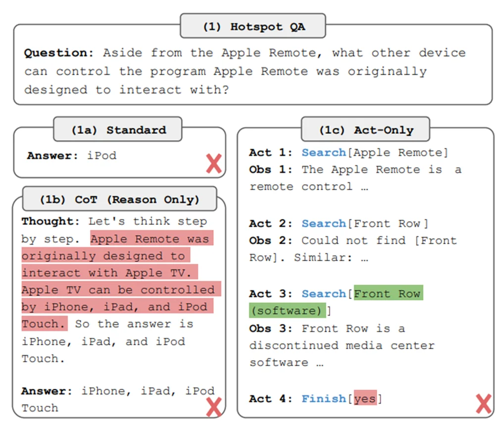

# Reasoning and Action Agents

This post is a step-by-step guide to building ReAct Agents. The full code can be found on my github [repository](https://github.com/miguelvc6/react-agent).

I recommend reading my blog post on [LLM Agents](https://mvazquez.ai/blog/output/2024-11-17-llm-agents/content.html) to understand the fundamentals of LLM Agents, and optionally reading the original paper[^1] for the theory behind ReAct Agents. The following section will be a brief summary of what the previous sources cover, so feel free to skip it if you have already read either the blog post or the paper.

## Introduction to ReAct Agents

### ReAct agents

ReAct agents improve upon earlier LLM-based agents by incorporating reasoning into their actions. Previous LLM-based agents simply observed and acted, but this approach was often ineffective. The ReAct framework, introduced in 2022 by Yao et al., combines reasoning with observation and acting, leading to better performance.

In the paper the setup is an agent with access to three different actions that leverage a "simple Wikipedia web API: (1)**search**\[entity] returns the first 5 sentences from the corresponding _entity_ wiki page if it exists, or else suggests top-5 similar entities from the Wikipedia search engine, (2)**lookup**\[string], which returns the next sentence in the page containing _string_ simulating a ctrl+F command, and (3)**finish**\[answer] which would finish the current task with _answer_."[^3]

With this environment they compare four different approaches: standard zero-shot, chain of thought prompting, act-only agent and Reason + Act agent. The following example from the paper shows how they try to solve a question about the Apple Remote device. Let's review the first three approaches first.

<p align="center">
  
</p>

<p style="text-align:center; font-style: italic;">Example of standard zero-shot, chain of thought prompting, act-only from the ReAct paper. </p>

In (1a) zero-shot the LLM just answers directly and gets it wrong. With (1b) chain-of-thought the LLM is prompted to "think step by step before answering", a technique that improves accuracy of language models[^4], but still gets it wrong. In (1c) we have a simple agentic workflow that acts and observes, and allows to use the Wikipedia tools. This time it actually gets close to the answer, but ends up returning "yes" as its final answer. The problem with this approach is that the model cannot reflect on what tool to use, how to use it or plan how to get the final answer. The only possibility is to act, stating the action and its argument. ReAct was created to address this problem.

<p align="center">
  
</p>

<p style="text-align:center; font-style: italic;">Example of a ReAct agent from the ReAct paper. In this case it manages to get the right answer.</p>

In this last case the agent follows a loop of reason-act-observe that overcomes the previously stated limitations, and it actually gets the correct answer: "keyboard function keys". This example showcases how the model is able to plan and reason about the result of its actions. This is a simple yet extremely powerful workflow, and most state-of-the-art agents follow it, with improvements in the reasoning step and an increase in freedom to act. It leverages the powerful large language models by using them as the "brain" of the agent.

### Actions as tools

To implement agents we need to define a **set of possible actions for the agent to take**, among which the agent will have to decide in each iteration. For example it could have access to the following:

-   Ask the user for information.
-   Search the web.
-   Using an external database.
-   Using a calculator or symbolic programming.
-   Using a Python code interpreter.

These possible actions are commonly referred to as **tools**, and a set of actions is a **toolbox**.

# Setup

In this implementation of ReAct agents we will only use **standard Python libraries**, **pydantic** for output validations, and an LLM, which can be run locally with **ollama** or using an **API** from OpenAI, Anthropic, Google, etc. Besides, we will also use **ansi2html** to convert the output of the LLM to HTML to display the reasoning trace with colors and **dotenv** for the api key, but they are not necessary.

## Running the LLM with OpenAI

With the OpenAI API we can use the `openai` library. This is the easiest way to get started and the model is way more capable than the ones we can run locally, but you will have to create an account with payments information and pay for the API calls. It is not expensive, for development of this project and some evaluations expect it to cost less than 1USD. Just use the `gpt-4o-mini` model until it is completely implemented and then use the `gpt-4o` model to run it.

In this scenario you would need the following libraries:

```bash
pip install pydantic ansi2html dotenv openai
```

Next, you will have to set the environment variable `OPENAI_API_KEY` with your OpenAI API key. I recommend creating a `.env` file in the root of the project with the following content:

```bash
OPENAI_API_KEY=<your-openai-api-key>
```

Then you can use the following code to load the environment variables and run the LLM:

```python
from dotenv import load_dotenv
from openai import OpenAI

load_dotenv()
client = OpenAI()
response = client.chat.completions.create(
    model="gpt-4o-mini",
    messages=[{"role": "user", "content": "Hello!"}],
)
print(response.choices[0].message.content)
# Hello! How can I assist you today?
```

## Running the LLM with Ollama

For running the LLM with **ollama**, which is a lightweight, open-source, and easy-to-use tool to run large language models on your own hardware, you can download it from the [official website](https://ollama.com/download).

Next, you will have to download a model. At the time of writing this post, I recommend downloading the [llama3.2](https://ollama.com/library/llama3.2) model or the [qwen2.5-coder](https://ollama.com/library/qwen2.5-coder) model. Choose one with size 3B if your hardware is not too powerful, otherwise you can use one with around 7B. You can download them with the following command: `ollama pull llama3.2:3b` or `ollama pull qwen2.5-coder:7b`.

You can use the following command to start the server: `ollama serve llama3.2:3b`. This will allow you to use the ollama python library to run the LLM from your script.

In this scenario you would need the following libraries:

```bash
pip install pydantic ansi2html ollama
```

Next, once you have the server running, you can use the following code to run the LLM:

```python
import ollama

response = ollama.chat(
    model="llama3.2:3b",  # or qwen2.5-coder:7b
    messages=[{"role": "user", "content": "Hello!"}],
)
print(response["message"]["content"])
# Hello! How can I assist you today?
```

In my implementation I have written a simple wrapper around both APIs to allow for a unified interface, that determines which API to use based on the model name.

```python
import os

# Unified Chat API
class UnifiedChatAPI:
    """Unified interface for OpenAI and Ollama chat APIs."""

    def __init__(self, model="gpt-4o-mini", openai_api_key=None):
        self.model = model
        self.api_key = openai_api_key or os.getenv("OPENAI_API_KEY")
        self.api = self._determine_api()
        if self.api == "openai":
            if not self.api_key:
                raise ValueError("OpenAI API key must be provided for OpenAI models.")
            else:
                self.client = openai.OpenAI(api_key=self.api_key)
        elif self.api == "ollama":
            self.client = None

    def _determine_api(self):
        """Determine the API based on the model name."""
        if self.model.startswith("gpt-") or self.model.startswith("o1-"):
            return "openai"
        else:
            return "ollama"

    def chat(self, messages):
        """Wrapper for chat API."""
        if self.api == "openai":
            return self._openai_chat(messages)
        elif self.api == "ollama":
            return self._ollama_chat(messages)
        else:
            raise ValueError("Unsupported API. Please set the API to 'openai' or 'ollama'.")

    def _openai_chat(self, messages):
        response = self.client.chat.completions.create(model=self.model, messages=messages)
        return response.choices[0].message.content

    def _ollama_chat(self, messages):
        response = ollama.chat(model=self.model, messages=messages)
        return response["message"]["content"]
```

I recommend you copy the previous code since I will be using the `UnifiedChatAPI` class with the `chat` method, or at least implement a wrapper with a similar `chat` method for your own use.

# Agent Design

Once we have the LLM running, we can start designing the agent. The first thing we need to do is to define the **toolbox**, the actions that the agent can take. In this case I will give my agent the capabilities to query a structured database using SQL, and use a calculator. In this way it can answer questions about the database and do basic calculations.

For the database I will use a simple SQLite database with three tables: `AGENTS`, `CUSTOMER` and `ORDERS`. You can download the database from the same [repository](https://github.com/miguelvc6/react-agent/blob/main/sql_lite_database.db) or build it by running the `create_database.py` [script](../../media/2024-11-29-reasoning-and-action-agents/create_database.py).

<p align="center">
  
</p>

<p style="text-align:center; font-style: italic;">Database schema.</p>

## Tools

To interact with the database I will give the agent the capability to list all the tables, to get the schema of a table and to execute SQL queries and return the results. For the calculator I will give it the capability to perform arithmetic operations with the eval function. A more sophisticated calculator could be implemented using the [sympy](https://www.sympy.org/en/index.html) library for symbolic mathematics. A simple implementation of the tools is the following:

```python
import sqlite3

def math_calculator(expression: str) -> float:
    """Evaluate a mathematical expression."""
    result = eval(expression)
    return result


def list_sql_tables() -> list:
    """List all tables in the SQL database."""
    cursor.execute("SELECT name FROM sqlite_master WHERE type='table';")
    result = cursor.fetchall()
    return [table[0] for table in result]


def sql_db_schema(table_name: str) -> str:
    """Return schema of a specific table in the database."""
    cursor.execute(f"PRAGMA table_info({table_name});")
    result = cursor.fetctable_namehall()
    schema = "\n".join([f"{row[1]} {row[2]}" for row in result])
    return schema


def sql_db_query(query: str) -> str:
    """Run an SQL query and return the result."""
    cursor.execute(query)
    result = cursor.fetchall()
    return str(result)
```

## Reasoning Prompt

Now that we have the tools, we can start designing the prompts. Since it is a ReAct agent, we need to design a prompt for the reasoning step and a prompt for the acting step.

The objective of the **reasoning** step is to plan the action that the agent will take. The prompt should give the agent the capability to plan and reason about the result of its actions. We have to pass the descriptions and arguments of the tools to the agent so it can select the appropriate one, along with an extra `final_answer` tool that will allow the agent to answer the question and finish the task if it has enough information.

This would be enough for our agent, but we can improve it by adding a `decomposition` tool that will allow the agent to break down complex tasks into simpler ones, and then they are recursively solved. This complicates the implementation but we are here to learn.

```python
REFLECTION_SYSTEM_PROMPT = """GENERAL INSTRUCTIONS
Your task is to reflect on the question and context to decide how to solve it.
You must decide whether to use a tool, an assistant, or give the final answer if you have sufficient information.
Write a brief reflection with the indicated response format.
Do not call any actions or tools, return only the reflection.

AVAILABLE TOOLS
- list_sql_tables: {"Description": "Returns a list with the names of tables present in the database", "Arguments": None}
- sql_db_schema: {"Description": "Returns the schema of a specific table in the database", "Arguments": table_name - str}
- sql_db_query: {"Description": "Executes an SQL query in the sqlite3 database and returns the results. \
    Do not use without first observing the table schema", "Arguments": sql_query - str}
- math_calculator: {"Description": "Performs basic mathematical calculations", "Arguments": expression - str}

AVAILABLE ASSISTANTS
- decomposition: {"Description": "Divides a complex question into simpler sub-parts and calls agents \
    to solve them recursively. Use only for complex questions", "Arguments": question - str}

AVAILABLE ACTION
- final_answer: {"Description": "Final answer for the user. Must answer the question asked.", "Arguments": "answer - str"}

RESPONSE FORMAT
REFLECTION >> <Fill>
"""
```

To test the reasoning step, I have called gpt with `REFLECTION_SYSTEM_PROMPT` as system prompt, and have asked it a question.

```python
import textwrap

reflection = client.chat.completions.create(
    model="gpt-4o-mini",
    messages=[
        {"role": "system", "content": REFLECTION_SYSTEM_PROMPT},
        {"role": "user", "content": "How much did income increase between Q1 2024 and Q2 2024?"},
    ],
)
reflection = reflection.choices[0].message.content
print(textwrap.fill(reflection, width=100))
```

The response is the following:

```output
REFLECTION >> To answer this question, I would need to access the database 
that contains the records of income for the specific quarters between 2024. 
First, it would be useful to identify the available tables and then check 
the schema of the table that contains the income data.
This will allow me to prepare an SQL query that calculates the growth between 
the first and second quarter of 2024. 
Therefore, I should start by listing the tables in the database.
```

## Action Prompt

In the act step, the agent must take the action decided in the reflection step. The prompt should give the agent the capability to act and use the tools. It is also important to specify a format for the model's response, in this case a JSON format. We will later use pydantic to validate the format.

An important detail is that we don't want our model to be able to use the `decomposition` tool while answering a decomposed subquestion, since it could lead to many nested loops, which could potentially increase our token consumption and waiting time. To avoid this we will only write the tool name in the prompt when we are not in a decomposed subquestion.

```python
ACTION_SYSTEM_PROMPT_01 = """GENERAL INSTRUCTIONS
Your task is to answer questions using an SQL database and performing mathematical calculations.
If you already have enough information, you should provide a final answer.
You must decide whether to use a tool, an assistant, or give the final answer, and return a response following the response format.
Fill with null where no tool or assistant is required.

IMPORTANT:
- The response must be in valid JSON format.
- Ensure all text strings are properly escaped.
- Do not include line breaks within strings.
- If the argument is an SQL query or a mathematical expression, include it on a single line and in double quotes.

AVAILABLE TOOLS
- list_sql_tables: {"Description": "Returns a list with the names of tables present in the database", "Arguments": null}
- sql_db_schema: {"Description": "Returns the schema of a specific table in the database", "Arguments": "table_name" - str}
- sql_db_query: {"Description: "Executes an SQL query in the sqlite3 database and returns the results. \
    Do not use without first observing the table schema", Arguments: sql_query - str}
- math_calculator: {"Description": "Performs basic mathematical calculations", "Arguments": "expression" - str}
"""

ACTION_SYSTEM_PROMPT_DECOMPOSITION = """
AVAILABLE ASSISTANTS
- decomposition: {"Description: "Divides a complex question into simpler sub-parts and calls agents \
    to solve them recursively. Use only for complex questions", Arguments: question - str}
"""

ACTION_SYSTEM_PROMPT_02 = """
AVAILABLE ACTION
- final_answer: {"Description": "Final answer for the user. Must answer the question asked.", "Arguments": "answer - str"}

RESPONSE FORMAT
{
  "request": "<Fill>",
  "argument": "<Fill or null>"
}

EXAMPLES:

1. Using a tool without an argument:
{
  "request": "list_sql_tables",
  "argument": null
}

2. Using a tool with an argument:
{
  "request": "sql_db_schema",
  "argument": "ORDERS"
}

3. Using sql_db_query with an SQL query:
{
  "request": "sql_db_query",
  "argument": "SELECT * FROM ORDERS WHERE date(ORD_DATE) BETWEEN date('2024-01-01') AND date('2024-06-30');"
}

4. Final answer:
{
  "request": "final_answer",
  "argument": "There were a total of 305 orders in 2024."
}
"""
```

Our action prompt will be either `ACTION_SYSTEM_PROMPT_01 + ACTION_SYSTEM_PROMPT_DECOMPOSITION + ACTION_SYSTEM_PROMPT_02` if the agent is working on the main question, or `ACTION_SYSTEM_PROMPT_01 + ACTION_SYSTEM_PROMPT_02` if it is working on a decomposed subquestion.

We have also given some examples of tool calls to gain some few-shot learning performance increase. This could be improved with a vector database that stores tool call examples that are later dynamically retrieved through Retrieval Augmented Generation depending on the context in every Act step.

Let's test the action step with the same question as before.

```python
import json

# Pydantic model for the agent action
class AgentAction(BaseModel):
    request: str
    argument: str | None

agent_action = client.chat.completions.create(
    model="gpt-4o-mini",
    messages=[
        {"role": "system", "content": ACTION_SYSTEM_PROMPT},
        {"role": "user", "content": "¿Cuánto creció el ingreso entre el Q1 de 2024 y el Q2 de 2024?"},
    ],
)
agent_action = json.loads(agent_action.choices[0].message.content)
validated_action = AgentAction.model_validate(agent_action)
print(validated_action)
```

The response is to use the `list_sql_tables` tool with no arguments.

```output
AgentAction(request='list_sql_tables', argument=None)
```

The AgentAction class is a pydantic model that validates the response format. If the response is not in the correct format, the model will raise an error. We can then use a try except block to handle the error with, for example, some retries while passing the error trace to the model, so it can learn from its mistakes.

We can now use this validated action to call the appropriate tool with previously defined functions.

These are all the main prompts we are going to use for our agent. They can be stored in a `prompts.py` script and then imported into our main script.

# Implementation

With the prompts ready, we can start implementing the agent. I will use an Object-Oriented approach to implement the agent, its loop of reflection and acting, and the tools.

## Script Setup

First, import the necessary libraries and the prompts.

```python
import json
import os
import sqlite3
import textwrap
from typing import List, Optional

import openai
import ollama
from ansi2html import Ansi2HTMLConverter
from pydantic import BaseModel, ValidationError

from prompts import (
    ACTION_SYSTEM_PROMPT_01,
    ACTION_SYSTEM_PROMPT_02,
    ACTION_SYSTEM_PROMPT_DECOMPOSITION,
    REFLECTION_SYSTEM_PROMPT,
)
```

Now define the previous `UnifiedChatAPI` class. Next, we implement the pydantic models.

```python
# Pydantic Models for output validation
class DecomposedQuestion(BaseModel):
    sub_questions: List[str]


class AgentAction(BaseModel):
    request: str
    argument: Optional[str]


class AnswersSummary(BaseModel):
    summary: str
```

The `AnswersSummary` model will be used when, after decomposing the question into subquestions, and they have been answered, we want to summarize the answers into a single final answer before continuing with the main task. This will be easily understood later on when we implement the `decomposition` tool.

## Memory

The main memory we will use is the `context` class attribute, which will store the context of the conversation. This will be updated at each iteration of the loop, and it will be used to pass the context to the next iteration. This includes the user question, the tools' outputs and all the text that the agent has generated so far.

Additionally, we implement a long term memory using a simple `agent_memory.json` file to store the pairs of questions and answers for every task. This will allow the agent to learn from previous interactions and if a question is similar to a previous one, it can answer it using the information stored in the memory rather than having to answer it from scratch.

```python
class SimpleMemory:
    """Simple in-memory storage for question and answer traces."""

    def __init__(self):
        self.question_trace = []
        self.answer_trace = []

    def add_interaction(self, question, answer):
        self.question_trace.append(question)
        self.answer_trace.append(answer)

    def get_context(self):
        if not self.question_trace:
            return ""
        else:
            context_lines = []
            for q, a in zip(self.question_trace, self.answer_trace):
                context_lines.append(f"QUESTION: {q}")
                context_lines.append(f"ANSWER: {a}")
            return "\n".join(context_lines)
```

This is a simple implementation of a memory that stores the question and answer traces in a list. It is not a sophisticated memory, but it is enough for our purposes.

## Agent Class

We can finally implement the agent class. This will include the loop of reflection and acting, as well as the tools. I will divide the code in different blocks, although it actually is a single class.

First, we define the class and its attributes.

```python
# Big Agent Class
class AgentReAct:
    """Agent class implementing the ReAct framework."""

    def __init__(self, model="gpt-4o-mini", db_path="./sql_lite_database.db", memory_path="agent_memory.json"):
        """Initialize Agent with database path and model."""
        self.model = model # Model to use for the agent
        self.client = UnifiedChatAPI(model=self.model) # Unified chat API
        self.memory = self.load_memory() # Memory
        self.context = "" # Context of the conversation
        self.db_path = db_path # Path to the database
        self.conn = None # Connection to the database
        self.cursor = None # Cursor to the database
        self._connect_db() # Connect to the database
        self.memory_path = memory_path # Path to the memory file
```

All the attributes should be self-explanatory, except for the `load_memory` and `_connect_db` methods, which load the memory from the `self.memory_path` file and connect to the database and initialize the cursor. Let's implement the database management logic.

```python
    # Database Management
    def _connect_db(self):
        """Connect to the SQLite database."""
        if not os.path.exists(self.db_path):
            raise RuntimeError(f"Database file not found at: {self.db_path}")
        try:
            self.conn = sqlite3.connect(self.db_path)
            self.cursor = self.conn.cursor()
        except sqlite3.Error as e:
            self._close_db()
            raise RuntimeError(f"Database connection failed: {e}")

    def _close_db(self):
        """Close the database connection."""
        if self.cursor:
            self.cursor.close()
        if self.conn:
            self.conn.close()
        self.cursor = None
        self.conn = None

    def __del__(self):
        """Destructor to ensure the database connection is closed."""
        self._close_db()
```

This involves a method to connect to the sqlite database, a method to close the connection and a destructor to ensure the connection is closed when the object is deleted.

Now we implement a couple methods to load and save the memory to the `agent_memory.json` file.

```python
    # Memory Management
    def load_memory(self):
        """Load the agent memory from a JSON file."""
        if os.path.exists(self.memory_path):
            with open(self.memory_path, "r", encoding="utf-8") as f:
                return json.load(f)
        else:
            return SimpleMemory()

    def save_memory(self):
        """Save the agent memory to a JSON file."""
        with open(self.memory_path, "w", encoding="utf-8") as f:
            json.dump(
                {"question_trace": self.memory.question_trace, "answer_trace": self.memory.answer_trace},
                f,
                indent=4,
            )
```

We can now implement the main loop of the agent. Let's start with the reflection step.

```python
    # Agent Reflections
    def reflection(self, question: str) -> str:
        """Perform an agent reflection."""
        context = self.context or "<No previous questions have been asked>"
        agent_template = f"""CONTEXTUAL INFORMATION
{context}

QUESTION
{question}"""

        assistant_reply = self.client.chat(
            [
                {"role": "system", "content": REFLECTION_SYSTEM_PROMPT},
                {"role": "user", "content": agent_template},
            ]
        )
        return assistant_reply
```

This method takes the user question and the context of the conversation and uses the reflection prompt to generate a response. This response is the agent's plan to answer the question. Since the answer does not need a specific format, we do not need to validate it with a pydantic model.

Now the action step is a little more complex.

```python
    # Agent Actions
    def action(self, question: str, recursion=False, max_retrials: int = 3) -> AgentAction:
        """Determine the next action for the agent."""
        action_system_prompt = (
            ACTION_SYSTEM_PROMPT_01 + (not recursion) * ACTION_SYSTEM_PROMPT_DECOMPOSITION + ACTION_SYSTEM_PROMPT_02
        )

        context = self.context or "<No previous questions have been asked>"
        agent_template = f"""CONTEXTUAL INFORMATION
{context}

QUESTION
{question}"""

        for attempt in range(max_retrials):
            assistant_reply = self.client.chat(
                [
                    {"role": "system", "content": action_system_prompt},
                    {"role": "user", "content": agent_template},
                ]
            )

            try:
                # Attempt to extract the JSON object from the assistant's reply
                start_index = assistant_reply.find("{")
                end_index = assistant_reply.rfind("}") + 1
                json_str = assistant_reply[start_index:end_index]
                agent_action = json.loads(json_str)
                validated_response = AgentAction.model_validate(agent_action)
                return validated_response
            except (json.JSONDecodeError, ValidationError) as e:
                error_msg = self.format_message(f"Validation error on attempt {attempt + 1}: {e}", "ERROR", 0)
                print(f"Assistant reply on attempt {attempt + 1}:\n{assistant_reply}\n")
                self.context += error_msg
                # Provide feedback to the assistant about the error
                agent_template += (
                    "\n\nERROR >> The previous response was not valid JSON or did not follow the expected format."
                    " Please respond with a valid JSON object matching the required format."
                )
                continue

        raise RuntimeError("Maximum number of retries reached without successful validation.")
```

The `action` method in the `AgentReAct` class is responsible for determining the next action the agent should take based on the current question and context. Here's a breakdown of how it works:

1. **Prompt Construction**: 
   - The method constructs an action system prompt by combining predefined prompt segments. If the agent is not in a recursive call (i.e., not handling a decomposed subquestion), it includes the `ACTION_SYSTEM_PROMPT_DECOMPOSITION` to allow the use of the `decomposition` tool.

2. **Context Preparation**:
   - It prepares a template that includes the current context of the conversation and the question being asked. This context is used to inform the model about the current state and what has been discussed so far.

3. **Model Interaction**:
   - It sends the constructed prompt to the model using the `UnifiedChatAPI` and receives a response.

4. **Response Parsing and Validation**:
   - The method attempts to extract a JSON object from the model's response. It looks for the JSON structure within the response string.
   - It then tries to parse this JSON and validate it against the `AgentAction` pydantic model. This ensures the response is in the correct format and contains the necessary fields.

5. **Error Handling**:
   - If the response is not valid JSON or does not match the expected format, the method appends an error message to the context and provides feedback to the model, asking it to try again with a valid JSON response.
   - This is one of the reasons why the pydantic model is used, to allow the model to try again until it provides a valid response while also providing feedback to the model about the error.
   - This process is repeated for `max_retrials` number of retries. If all attempts fail, a `RuntimeError` is raised and the task is aborted.

6. **Return**:
   - If a valid action is determined, it is returned as an `AgentAction` object, which includes the action request and any necessary arguments.

This method is crucial for the agent's decision-making process, allowing it to choose the appropriate tool or action to take based on the current task and context.

With the reflection and action methods implemented, we can now implement the main loop of the agent.

```python
    def run_agent(self, question: str, recursion: bool = False, indent_level: int = 0) -> str:
        """Run the ReAct agent to answer a question."""
        if not recursion:
            self.context = self.memory.get_context()
            print("\n")

        while True:
            try:
                self.perform_reflection(question, indent_level)
                action = self.decide_action(question, recursion, indent_level)
                result = self.execute_action(action, question, recursion, indent_level)

                if result is not None:
                    return result

            except Exception as e:
                error_msg = self.format_message(str(e), "ERROR", indent_level)
                self.context += error_msg
                break
```

This method uses a while loop to keep the agent running until it has either found the final answer or an error occurs. Three steps are repeated in the loop: reflection, action and execution. The reflection step is used to generate a plan to answer the question, the action step is used to determine the next action to take and the execution step is used to actually execute the action. The first two steps are just the reflection and action methods we implemented earlier with a little formatting to add to the context.

```python
    # Helper Methods
    def perform_reflection(self, question: str, indent_level: int):
        """Perform reflection and update context."""
        reflection = self.reflection(question=question)
        reflection_msg = self.format_message(reflection.split(">> ")[1], "REFLECTION", indent_level)
        self.context += reflection_msg

    def decide_action(self, question: str, recursion: bool, indent_level: int, max_retrials: int = 3) -> AgentAction:
        """Decide on the next action and update context."""
        action = self.action(question=question, recursion=recursion, max_retrials=max_retrials)
        action_msg = self.format_message(action.request, "ACTION", indent_level)
        self.context += action_msg
        if action.argument:
            arg_msg = self.format_message(action.argument, "ARGUMENT", indent_level)
            self.context += arg_msg
        os.system("cls" if os.name == "nt" else "clear")
        print(self.context)
        return action
```

We can now implement the execution of the action. This method takes the output of the `decide_action` method to call the appropriate tool with the correct arguments.

```python
    def execute_action(self, action: AgentAction, question: str, indent_level: int) -> Optional[str]:
        """Execute the chosen action and handle the result."""
        try:
            result = None
            # Execute the chosen action
            if action.request == "list_sql_tables":
                result = self.list_sql_tables()
            elif action.request == "sql_db_schema":
                result = self.sql_db_schema(action.argument)
            elif action.request == "sql_db_query":
                result = self.sql_db_query(action.argument)
            elif action.request == "math_calculator":
                result = self.math_calculator(action.argument)
            elif action.request == "decomposition":
                self.handle_decomposition(action, indent_level)
                return None  # Continue the loop
            elif action.request == "final_answer":
                self.handle_final_answer(question, action, indent_level)
                return action.argument  # Return the final answer
            else:
                raise ValueError(f"Unknown action request: {action.request}")

            # Append observation to context
            if result is not None:
                obs_msg = self.format_message(str(result), "OBSERVATION", indent_level)
                self.context += obs_msg
        except Exception as e:
            # Append error observation to context
            error_msg = self.format_message(f"Error executing {action.request}: {str(e)}", "ERROR", indent_level)
            self.context += error_msg
        return None  # Continue the loop
```

We can now write the tools. These will be methods similar to the functions we defined at the beginning of the post, with a little of error handling added.

```python
    # Tools
    def math_calculator(self, expression: str) -> Optional[float]:
        """Evaluate a mathematical expression."""
        try:
            result = eval(expression)
            return result
        except Exception as e:
            print(f"Error evaluating expression: {e}")
            return None

    def list_sql_tables(self) -> Optional[List[str]]:
        """List all tables in the SQL database."""
        try:
            self.cursor.execute("SELECT name FROM sqlite_master WHERE type='table';")
            result = self.cursor.fetchall()
            return [table[0] for table in result]
        except Exception as e:
            print(f"Error listing tables: {e}")
            return None

    def sql_db_schema(self, table_name: str) -> Optional[str]:
        """Return schema of a specific table in the database."""
        try:
            self.cursor.execute(f"PRAGMA table_info({table_name});")
            result = self.cursor.fetchall()
            schema = "\n".join([f"{row[1]} {row[2]}" for row in result])
            return schema
        except Exception as e:
            print(f"Error retrieving schema for table {table_name}: {e}")
            return None

    def sql_db_query(self, query: str) -> Optional[str]:
        """Run an SQL query and return the result."""
        try:
            self.cursor.execute(query)
            result = self.cursor.fetchall()
            return str(result)
        except Exception as e:
            print(f"Error executing query: {e}")
            return None
```

We also need to implement the methods to handle the final answer. The model can call the `final_answer` tool when it considers that it is able to answer the question.

```python
    # Final Answer Tool
    def handle_final_answer(self, question: str, action: AgentAction, indent_level: int):
        """Handle the final answer action."""
        # Update memory
        self.memory.add_interaction(question, action.argument)
        final_answer_msg = self.format_message(action.argument, "FINAL ANSWER", indent_level)
        self.context += final_answer_msg
        os.system("cls" if os.name == "nt" else "clear")
        print(self.context)
```

With this we could finish the implementation of the `AgentReAct` class. But we are going to add the decomposition tool, which is used to decompose complex questions into simpler subquestions. This will make the agent more powerful and able to handle more complex questions.

```python
    # Assistants
    def decompose_question(self, question: str, max_retrials: int = 3) -> DecomposedQuestion:
        """Decompose a complex question into simpler parts."""
        decomp_system_prompt = """GENERAL INSTRUCTIONS
You are an expert in the domain of the following question. Your task is to decompose a complex question into simpler parts.

RESPONSE FORMAT
{"sub_questions":["<FILL>"]}"""

        for attempt in range(max_retrials):
            assistant_reply = self.client.chat(
                [
                    {"role": "system", "content": decomp_system_prompt},
                    {"role": "user", "content": question},
                ]
            )

            try:
                response_content = json.loads(assistant_reply)
                validated_response = DecomposedQuestion.model_validate(response_content)
                return validated_response
            except (json.JSONDecodeError, ValidationError) as e:
                print(f"Validation error on attempt {attempt + 1}: {e}")

        raise RuntimeError("Maximum number of retries reached without successful validation.")

    def answers_summarizer(self, questions: List[str], answers: List[str], max_retrials: int = 3) -> AnswersSummary:
        """Summarize a list of answers to the decomposed questions."""
        answer_summarizer_system_prompt = """GENERAL INSTRUCTIONS
You are an expert in the domain of the following questions. Your task is to summarize the answers to the questions into a single response.

RESPONSE FORMAT
{"summary": "<FILL>"}"""

        q_and_a_prompt = "\n\n".join(
            [f"SUBQUESTION {i+1}\n{q}\nANSWER {i+1}\n{a}" for i, (q, a) in enumerate(zip(questions, answers))]
        )

        for attempt in range(max_retrials):
            assistant_reply = self.client.chat(
                [
                    {"role": "system", "content": answer_summarizer_system_prompt},
                    {"role": "user", "content": q_and_a_prompt},
                ]
            )

            try:
                response_content = json.loads(assistant_reply)
                validated_response = AnswersSummary.model_validate(response_content)
                return validated_response
            except (json.JSONDecodeError, ValidationError) as e:
                print(f"Validation error on attempt {attempt + 1}: {e}")

        raise RuntimeError("Maximum number of retries reached without successful validation.")
```

Here we can see the two assistants that are used to decompose the question and summarize the answers. When the question is decomposed, the agent will recursively call itself to answer the subquestions. Once all subquestions are answered, the answers are summarized and the final answer is returned. With this agent has the ability to use a divide and conquer strategy to answer complex questions.

Finally, we write some utility methods to format the messages and to export the reasoning traces to a file for later analysis and our enjoyment.

```python
    # Formatting
    def format_message(self, text: str, action: str, indent_level: int) -> str:
        """Format messages with indentation and color."""
        indent = "    " * indent_level
        colored_action = self.color_text(f"{action} >> ", action)
        wrapped_text = textwrap.fill(text, width=100)
        indented_text = textwrap.indent(wrapped_text, "    " * (indent_level + 1))
        return f"{indent}{colored_action}{indented_text}\n"

    def color_text(self, text: str, action: str) -> str:
        """Colorize text based on the action."""
        color_codes = {
            "REFLECTION": "\033[94m",  # Blue
            "ACTION": "\033[92m",  # Green
            "OBSERVATION": "\033[93m",  # Yellow
            "ERROR": "\033[91m",  # Red
            "SUBQUESTION": "\033[95m",  # Magenta
            "FINAL ANSWER": "\033[96m",  # Cyan
            "ARGUMENT": "\033[90m",  # Gray
            "GENERATED RESPONSE TO SUBQUESTIONS": "\033[96m",  # Cyan
        }
        reset_code = "\033[0m"
        color_code = color_codes.get(action, "")
        return f"{color_code}{text}{reset_code}"

    # Saving Trace of Thought
    def save_context_to_html(self, filename="agent_context.html"):
        """Save the agent context to an HTML file."""
        conv = Ansi2HTMLConverter()
        html_content = conv.convert(self.context, full=True)
        with open(filename, "w", encoding="utf-8") as f:
            f.write(html_content)
        print(f"Context saved to {filename}")
```

# Testing the Agent

## Running the Agent

```python
if __name__ == "__main__":
    from dotenv import load_dotenv

    load_dotenv()

    GPT_MODEL = "gpt-4o-mini"
    OLLAMA_MODEL = "qwen2.5-coder:7b"

    SELECTED_MODEL = OLLAMA_MODEL

    if SELECTED_MODEL == GPT_MODEL:
        agent = AgentReAct(model=SELECTED_MODEL, db_path="sql_lite_database.db", memory_path="agent_memory_gpt.json")
        question = "How did sales vary between Q1 and Q2 of 2024 in percentage and amount?"
        agent.run_agent(question)
        agent.save_context_to_html("agent_context_gpt.html")
        agent.save_memory()

    elif SELECTED_MODEL == OLLAMA_MODEL:
        agent = AgentReAct(
            model=SELECTED_MODEL, db_path="sql_lite_database.db", memory_path="agent_memory_ollama.json"
        )
        simpler_question = "How many orders were there in 2024?"
        agent.run_agent(simpler_question)
        agent.save_context_to_html("agent_context_ollama.html")
```

## Observing the traces


# References

[^1]: Yao, Shunyu, et al. "React: Synergizing reasoning and acting in language models." arXiv preprint arXiv:2210.03629 (2022). [https://arxiv.org/abs/2210.03629](https://arxiv.org/abs/2210.03629)
